# DaVinci Configurator 配置架构设计文档（TC364 电机工程）

> 工程：`last364.dpa`（AURIX TC364，Vector MICROSAR 4.2.2，Infineon MCAL 20.10.0，TASKING TriCore v6.2r2）
> 定位：本文档说明**配置的架构**——AUTOSAR 分层、DaVinci 配置工程组织、模块间引用关系、双核划分、生成/构建链路、数据流，以及按架构层归纳的**问题解决总结**。
> 逐模块“怎么配”请见姊妹文档 [DaVinci_Motor_Config_Guide.md](DaVinci_Motor_Config_Guide.md)；
> 每个模块另有独立配置文档（操作步骤 + 截图），入口见 [DaVinci_Modules/README.md](DaVinci_Modules/README.md)。

---

## 目录

1. [文档目的与读者](#1-文档目的与读者)
2. [AUTOSAR 分层与工具链架构](#2-autosar-分层与工具链架构)
3. [配置工程文件架构](#3-配置工程文件架构)
4. [模块配置架构（ECUC 组织与引用关系）](#4-模块配置架构ecuc-组织与引用关系)
5. [双核配置架构](#5-双核配置架构)
6. [电机控制数据流架构](#6-电机控制数据流架构)
7. [生成与构建架构](#7-生成与构建架构)
8. [关键设计决策与约定](#8-关键设计决策与约定)
9. [问题解决总结（按架构层归类）](#9-问题解决总结按架构层归类)
10. [配置核查清单](#10-配置核查清单)
11. [文档索引](#11-文档索引)

---

## 1. 文档目的与读者

本工程是一套“双核 AUTOSAR + 电机 FOC”系统：Core0 跑 BSW/CAN，Core1 跑 10 kHz 电机快速环与 1 ms 电机主循环。所有 BSW/MCAL 行为都由 DaVinci Configurator 的 ECUC 配置驱动，再生成代码、链接、上板。

本文档回答四类问题：

1. 配置怎么组织：`last364.dpa`、`Config/ECUC/*.arxml`、`BSW364/MCAL364/Appl GenData` 之间是什么关系；
2. 模块之间怎么互相引用：时钟、资源、通道、通知、任务/事件等配置依赖；
3. 双核架构在配置侧如何落地：ResourceM、Os、EcuM、X-Signal、初始化顺序；
4. 出问题时先查哪一层：把历史问题按“配置 / 生成 / 构建 / 运行 / 电机功能”分层归类，并给出解决总结与详细文档入口。

读者：接手本工程并需要在 DaVinci Configurator 中改配置、或排查配置相关问题的嵌入式工程师。

### 1.1 图片插入约定

本文档预留了若干“📷 图片位”占位块，方便把 DaVinci 界面截图直接补进对应章节：

- 顶层文档图片统一放在 `last364/note/image/<文档名>/`；模块文档图片放在 `last364/note/Config/DaVinci_Modules/image/DaVinci_<模块名>/`（完整规范见 [note README](../README.md)）。
- 文档内一律以本文档所在目录为基准写相对路径，保证整目录打包后仍可渲染。
- 插入方式：把占位块内 `<!--` 与 `-->` 之间的 `` 行取消注释，放好图片后删除占位说明。

---

## 2. AUTOSAR 分层与工具链架构

### 2.1 分层总览

```text
┌─────────────────────────────────────────────────────────────────────┐
│ 应用层 SW-C（RTE 运行实体）                                          │
│   StartApp（Core0）│ MotorControll（Core1，1ms）│ MotorCdd（Core1）  │
└───────────────────────────────┬─────────────────────────────────────┘
                                │ RTE 端口/事件（Rte_*.c/h）
┌───────────────────────────────▼─────────────────────────────────────┐
│ RTE（生成于 Appl/GenData）                                           │
└───────────────────────────────┬─────────────────────────────────────┘
                                │ 标准接口 / 回调
┌───────────────────────────────▼─────────────────────────────────────┐
│ BSW 服务层（Vector MICROSAR，生成于 BSW364）                         │
│ EcuM│BswM│Os│CanSM│ComM│Com│CanIf│PduR│IpduM│NvM│MemIf│Fee│Det│E2EXf│Sbc│vBRS
└───────────────────────────────┬─────────────────────────────────────┘
                                │ MCAL API（Adc_Spi_Pwm_Dio_Mcu_Port…）
┌───────────────────────────────▼─────────────────────────────────────┐
│ MCAL 层（Infineon，生成于 MCAL364）                                  │
│ Mcu│Port│Dio│Pwm_17_GtmCcu6│Adc│Spi│Irq│Dma│Fls_17_Dmu│Crc│McalLib   │
└───────────────────────────────┬─────────────────────────────────────┘
                                │ 寄存器/SFR
┌───────────────────────────────▼─────────────────────────────────────┐
│ 硬件 TC364：GTM(ATOM0)│EVADC(G0/G2/G3/G8)│QSPI1/2/3│MCAN0│STM0/1│DFlash
└─────────────────────────────────────────────────────────────────────┘
```

📷 **图片位 1**：DaVinci BSW Editor 左侧模块树截图，对应 2.1 分层总览。

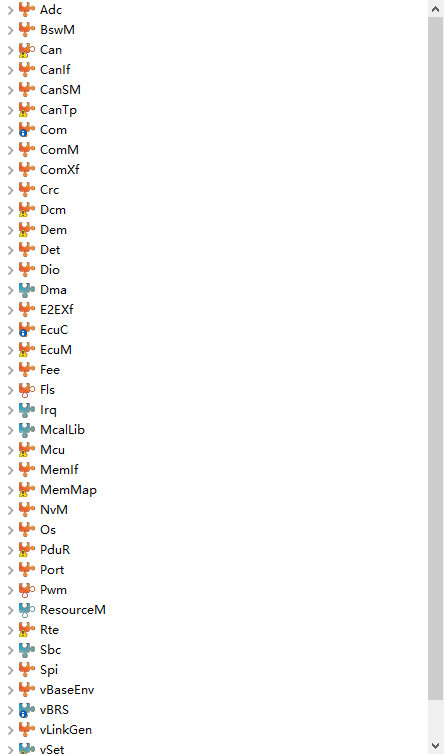


### 2.2 工具链与各工具职责

| 工具 | 职责 | 本工程产出 |
| --- | --- | --- |
| DaVinci Configurator（DConfig） | ECUC 模块配置、校验、生成 BSW/MCAL/RTE/Os | `Config/ECUC/*.arxml` → `BSW364`、`MCAL364`、`Appl/GenData` |
| DaVinci Developer（可选） | SW-C 接口/运行实体设计 | `Config/ApplicationComponents`、`InternalBehavior` 等 |
| CAN 工具（CANoe/Vector） | DBC 制作/导入、仿真调试 | `Config_Vector/CANFD364.dbc`、`MyEcu.cdd` |
| vLinkGen / vBRS | 链接脚本生成 + 启动代码 | `Appl/GenData/vLinkGen_Lcfg.c`、`vBrs_Lcfg.c`、`Appl/Source/vLinkGen_Template.lsl` |
| TASKING TriCore | 编译/链接/烧录 | `Debug/*.elf/.hex`，`.cproject` 控制 |
| UDE / TRACE32 | 调试、变量观测 | — |

### 2.3 本工程的特殊点

- 使用 **vBRS（Vector Basic Runtime System）** 启动，替代 TASKING 默认 `cstart`/`Autosar_Startup.c`；链接脚本由 **vLinkGen** 生成模板 `vLinkGen_Template.lsl`。
- 双核（Core0/Core1）由 Os + EcuM + ResourceM 三处配置共同决定。
- 电机快速环不在 RTE 里跑，而是挂在 **ADC 中断**（CAT1）里直接执行，RTE 仅承载 1 ms 慢环与数据镜像。

---

## 3. 配置工程文件架构

### 3.1 目录地图

```text
last364/
├── last364.dpa                     # DaVinci Configurator 工程主文件
├── last364.wsx / last364*.wsx      # DaVinci 工作区/快照（含历史版本）
├── DConfig / MConfig / OConfig     # DaVinci / MCAL / OS 集成标记文件
├── Config/
│   ├── ECUC/                       # ★ 每个 BSW/MCAL 模块的 ECUC 配置（arxml，配置的“源代码”）
│   │   ├── last364_Mcu_Mcu_ecuc.arxml
│   │   ├── last364_Port_Port_ecuc.arxml
│   │   ├── last364_Pwm_/Adc_/Spi_/Dio_/Irq_/Os_/EcuM_/BswM_/Can_/Com_/NvM_/Fee_/Fls_…
│   │   └── last364.ecuc.Initial.arxml   # 初始配置快照
│   ├── AUTOSAR/                    # 平台类型定义（PlatformTypes_AR4.arxml）
│   ├── ApplicationComponents/      # 应用 SW-C（MotorControll/MotorCdd/StartApp）
│   ├── ServiceComponents/          # BSW 服务 SW-C（EcuM/BswM/ComM/NvM/Det/Os）
│   ├── InternalBehavior/           # 运行实体/事件/端口映射（*_ib_bswmd.arxml）
│   ├── System/ McData/ Developer/ TimingExtensions/   # 系统/数据/时序扩展
│   └── ECUC/ 之外                 # Rte 配置、MemMap、vLinkGen、vBRS、vSet 等
├── Config_Vector/
│   ├── CANFD364.dbc / CAN.ini      # CAN 矩阵（Com/CanIf 信号来源）
│   └── MyEcu.cdd                   # 通讯/诊断配置描述
├── Appl/
│   ├── Source/                     # 应用代码 + vBRS 启动 + 直读驱动
│   │   ├── MotorControll.c         # 1ms 电机状态机（RTE 模板）
│   │   ├── StartApp.c              # Core0 周期任务（RTE 模板）
│   │   ├── CDD/MotorFoc/           # FOC：快速环/开环/零位/保护/ADC 采样
│   │   ├── CDD/TLE9180/            # 栅驱驱动（SPI 直发 24bit）
│   │   ├── CDD/TLE5012/            # 角度传感器（QSPI2 SFR 直读）
│   │   ├── Brs*.c / vLinkGen_Template.lsl  # vBRS 启动 + vLinkGen 链接脚本
│   │   └── EcuM_Callout_Stubs.c    # 多核初始化 callout（★ 关键）
│   ├── GenData/                    # RTE + Os + MCAL 生成头文件/源码
│   │   ├── Rte_*.c/h               # RTE
│   │   ├── Os_*.c/h                # OS（含 X-Signal、ISR 表）
│   │   ├── vBrs_Lcfg.c / vLinkGen_Lcfg.c
│   │   └── inc/（Adc_Cfg.h、Spi_Cfg.h、Pwm_Cfg.h…）
│   └── Include/                    # 应用头文件（含 BrsCompiler_Cfg.h）
├── BSW364/                         # MICROSAR BSW 生成代码
├── MCAL364/                        # Infineon MCAL 生成代码
├── Debug/                          # TASKING 构建输出
└── note/                           # 本文档 + 各专题文档
```

📷 **图片位 2**：工程目录/工作区截图，对应 3.1 目录地图。

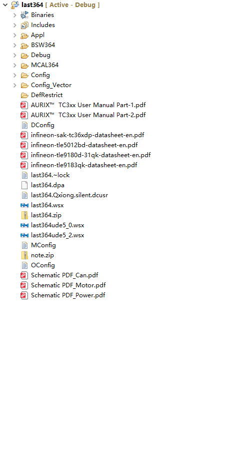


### 3.2 配置的“源代码”与再生

- **`Config/ECUC/*.arxml` 是配置的源代码**，必须纳入版本管理；`.dpa` 与 `.wsx` 是工程/工作区文件。
- DaVinci “Generate” 会**覆盖** `BSW364`、`MCAL364`、`Appl/GenData` 中的生成文件。
- 手工修改过生成文件的工程（如 SBC 兼容补丁，见 §9-B4）在重新生成后**必须复查**，否则补丁丢失。
- 建议保留 `.wsx` 历史快照（工程里已有 `last364_*.wsx`），便于回滚配置状态。

---

## 4. 模块配置架构（ECUC 组织与引用关系）

### 4.1 模块分组

| 组 | 模块 | 电机相关职责 |
| --- | --- | --- |
| 基础 MCAL | `Mcu` | 时钟/PLL、GTM 通道、ADC 触发、资源分配 |
| | `Port` / `Dio` | 引脚复用、初始电平、控制脚 |
| | `Pwm_17_GtmCcu6` | ATOM0 CH1/2/3 周期/中心对齐初始化 |
| | `Adc` | EVADC G0/G2/G3 同步采样、GTM 硬件触发、通知 |
| | `Spi` | QSPI1（SBC）/QSPI2（TLE5012）/QSPI3（TLE9180） |
| | `Irq` / `Dma` / `Crc` / `McalLib` | 中断、搬运、校验、库 |
| 存储 | `Fls_17_Dmu` → `Fee` → `NvM` / `MemIf` | 零位标定持久化 |
| 通信 | `Can` → `CanIf` → `PduR` → `Com`，`CanSM`/`ComM` | CAN/CAN-FD、0x511 调试帧 |
| 系统服务 | `EcuM` / `BswM` / `Os` / `Det` / `E2EXf` | 启动、模式、任务/ISR、错误 |
| 电源 | `Sbc_30_Tlf35584` | TLF35584（QSPI1） |
| 工具模块 | `MemMap` / `vLinkGen` / `vBRS` / `vSet` / `vBaseEnv` | 段映射、链接、启动、集合 |

### 4.2 模块间引用关系（配置依赖图）

```text
                    ┌──────────── Mcu ────────────┐
                    │ 时钟参考点        GTM/资源分配 │
                    ▼                 ▼            ▼
             McuClockReferencePoint_Pwm   McuGtmAtomChannelAllocationConf_0..3
                    │                        │          │
      ┌─────────────┼────────────┐           │          │
      ▼             ▼            ▼           ▼          ▼
   Pwm(100MHz)   Adc(SYS CLK)  Spi(QSPI)  Pwm 通道    Adc GtmTriggerTimer
      │             │            │        (IH1/2/3)   (ATOM0 CH7, 10000 ticks)
      │             │            │           │            │
      │             │            │      ┌────┴────┐       ▼
      │             │            │      │ GTM CH0 │  AdcGroup_9183Sense
      │             │            │      │(9180REF)│  (VO1/VRO + Notification)
      │             │            │      └─────────┘       │
      │             │            ▼                        ▼
      │             │      SpiChannel/Job/Sequence    GtmTriggerForAdc_0=TRIG_8
      │             │      (9183/5012/35584)          (Mcu 侧)
      │             ▼
      │        Irq(ADC0 SR0: CAT1/83/CPU1)
      │             ▲
      └─────────────┘ ResourceM：ADC0/2/3、PWM、QSPI2/3 → Core1

   Can(M_CAN0 500k/FD2M) → CanIf(0x511 FD DLC32) → PduR → Com(信号/组)
        ▲ CanIfTxPduCanId=1297                        │
        └──────────────── MotorFoc_OpenLoopCan 直发 ──┘（停 Com 组，避免冲突）

   Fls(DFlash 0xAF000000) → Fee(块16/17/32) → NvM(块1/块2) → MotorZeroCal

   Os：SystemTimer(STM0) / SystemTimer1(STM1)、MotorTask、AdcIsr_G0
        ├→ EcuM（DriverInitList 按核执行）
        └→ BswM（初始化动作表 + CAN PDU 组规则）

   Rte：MotorControll ↔ MotorCdd 数据镜像（Mode/Id/Iq/Angle）
```

📷 **图片位 3**：Mcu 时钟参考点 / GTM 资源分配截图参考对应的mcu 模块配置。


### 4.3 容易“断链”的引用

| 引用 | 断裂后果 | 一致性要求 |
| --- | --- | --- |
| `PwmMcuClockReferencePoint` → `McuClockReferencePoint_Pwm` | PWM 周期换算错误 | 100 MHz |
| Pwm 通道 `GtmTimerUsed` → Mcu ATOM 分配 | 生成报错/通道冲突 | `McuGtmAtomChannelAllocationConf_1/2/3` |
| Adc `GtmTriggerTimerConfig` → `McuGtmAtomChannelAllocationConf_7` | ADC 无硬件触发 | ATOM0 CH7 = `USED_BY_ADC` |
| Adc 组 `AdcNotification` 名字 | 通知回调不执行 | 与应用实现函数名完全一致 |
| Spi 外设 CS/引脚 与 Port 复用 | 片选错/无时钟 | QSPI2→P14.6/P15.5-7，QSPI3→P22.0-3 |
| CanIf Tx PDU 与 Com PDU 引用 | 发送/接收失效 | PduR/Com/CanIf 三处 ID 一致 |
| NvM 块 → Fee 块 → Fls 扇区 | 读写失败/CRC 错 | 块号、长度、CRC 一致 |
| Os 报警/事件 → 任务 | 事件丢失/ErrorHook | `Rte_Al_*` ↔ `Rte_Ev_*` ↔ Task |

---

### 4.4 逐模块配置文档入口

电机工程涉及的各模块均有一份独立配置文档（DaVinci 路径、参数表、引用关系、注意事项、截图位），可在总指南中按模块直接打开：

| 模块 | 详细配置文档 | 配置要点 |
| --- | --- | --- |
| Mcu | [DaVinci_Mcu.md](DaVinci_Modules/DaVinci_Mcu.md) | 时钟/PLL、GTM 通道、ADC 触发、资源分配 |
| Port | [DaVinci_Port.md](DaVinci_Modules/DaVinci_Port.md) | 引脚复用、初始电平 |
| Pwm | [DaVinci_Pwm.md](DaVinci_Modules/DaVinci_Pwm.md) | ATOM0 CH1/2/3 周期/中心对齐 |
| Adc | [DaVinci_Adc.md](DaVinci_Modules/DaVinci_Adc.md) | G0/G2/G3 同步采样、GTM 触发、通知 |
| Spi | [DaVinci_Spi.md](DaVinci_Modules/DaVinci_Spi.md) | QSPI1/2/3 外设、通道、Job/Sequence |
| Dio | [DaVinci_Dio.md](DaVinci_Modules/DaVinci_Dio.md) | 9183 控制脚、CAN/LED |
| Irq | [DaVinci_Irq.md](DaVinci_Modules/DaVinci_Irq.md) | 中断类别/优先级/核归属 |
| Os | [DaVinci_Os.md](DaVinci_Modules/DaVinci_Os.md) | 双核任务/报警/ISR/X-Signal |
| EcuM | [DaVinci_EcuM.md](DaVinci_Modules/DaVinci_EcuM.md) | 启动序列、驱动初始化列表、callout |
| BswM | [DaVinci_BswM.md](DaVinci_Modules/DaVinci_BswM.md) | 初始化动作表、CAN PDU 组规则 |
| Can | [DaVinci_Can.md](DaVinci_Modules/DaVinci_Can.md) | MCAN0 波特率/FD |
| CanIf | [DaVinci_CanIf.md](DaVinci_Modules/DaVinci_CanIf.md) | PDU（0x511/0x200/0x210）、Tx 缓冲 |
| Com | [DaVinci_Com.md](DaVinci_Modules/DaVinci_Com.md) | 信号/IPdu 组、0x511 映射 |
| NvM | [DaVinci_NvM.md](DaVinci_Modules/DaVinci_NvM.md) | NvM 块（MotorZeroCal） |
| Fee | [DaVinci_Fee.md](DaVinci_Modules/DaVinci_Fee.md) | Fee 块/页/扇区 |
| Fls | [DaVinci_Fls.md](DaVinci_Modules/DaVinci_Fls.md) | DFlash 基址/容量/模式 |
| ResourceM | [DaVinci_ResourceM.md](DaVinci_Modules/DaVinci_ResourceM.md) | MCAL 资源 → Core0/Core1 |
| Sbc | [DaVinci_Sbc.md](DaVinci_Modules/DaVinci_Sbc.md) | TLF35584 SPI 引用、ERR 监控 |
| Rte | [DaVinci_Rte.md](DaVinci_Modules/DaVinci_Rte.md) | SW-C 映射、事件/数据一致性 |

## 5. 双核配置架构

### 5.1 核职责

| | Core0 | Core1 |
| --- | --- | --- |
| 角色 | BSW 主核（Master） | 电机控制核（Slave） |
| 业务 | StartApp 周期、Com/CanSM/ComM、EcuM 主函数 | MotorControll/MotorCdd、10 kHz 快速环、零位标定 |
| OS 定时器 | `SystemTimer`（STM0 Ch0，1 ms） | `SystemTimer1`（STM1 Ch0，1 ms） |
| 关键任务 | `Default_Appl_Task`、`Default_BSW_ASync_Task_10ms` | `MotorTask`（优先级 100）、`BswCore1Task`（20） |
| 关键 ISR | `CounterIsr_SystemTimer`、`AdcIsr_G8`、`CanIsr_0` | `CounterIsr_SystemTimer1`、`AdcIsr_G0`（CAT1/83） |
| MCAL 归属（ResourceM） | ADC8、QSPI1（SBC） | ADC0/2/3、PWM、QSPI2/3 |
| 启动入口 | `_start_tc0`（自启动） | `brsStartupEntry`（由 Core0 拉起） |

### 5.2 配置侧落地点

| 架构点 | 配置位置 |
| --- | --- |
| 核归属 | `ResourceM`（MCAL 资源→核）+ `Os`（`OsCore0/OsCore1`、Application、Partition） |
| 跨核 API | `Os` X-Signal：`XSignalChl_OsCore1`→`XSignalIsr_OsCore1`（GPSR0 SR0，源 2448）、`XSignalChl_OsCore0`→`XSignalIsr_OsCore0`（GPSR1 SR0，源 2480） |
| 初始化顺序 | `EcuM`：`DriverInitListZero/One` + `EcuM_AL_DriverInitOne` 按 `GetCoreID()` 分核执行 |
| 启动竞态 | `BrsMain.c` Core0 `Default_Init_Task` 等待 `Rte_InitState_1==INIT`（ESCAN00078832），`OsTaskSchedule=FULL` |
| 定时一致性 | `SystemTimer` 与 `SystemTimer1` 均 `OsCounterTicksPerBase=100000`、`OsSecondsPerTick=0.001` |

📷 **图片位 4**：Os 双核配置截图（任务/ISR/X-Signal），对应 5.2/5.3。
Task
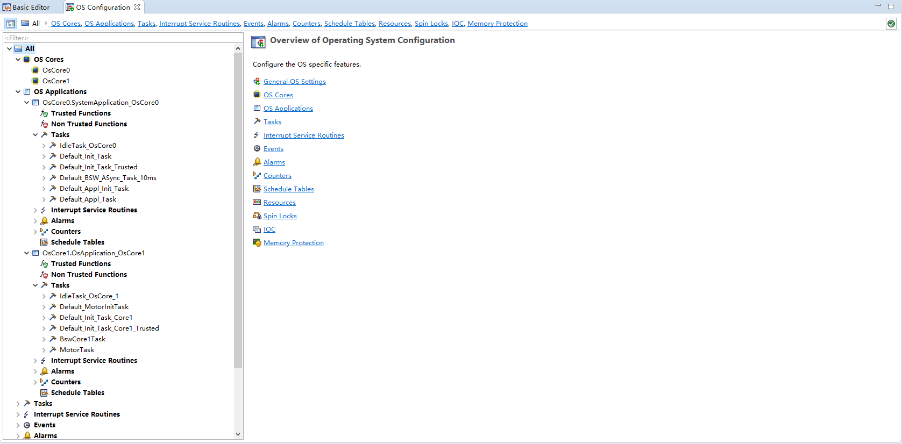

Isr
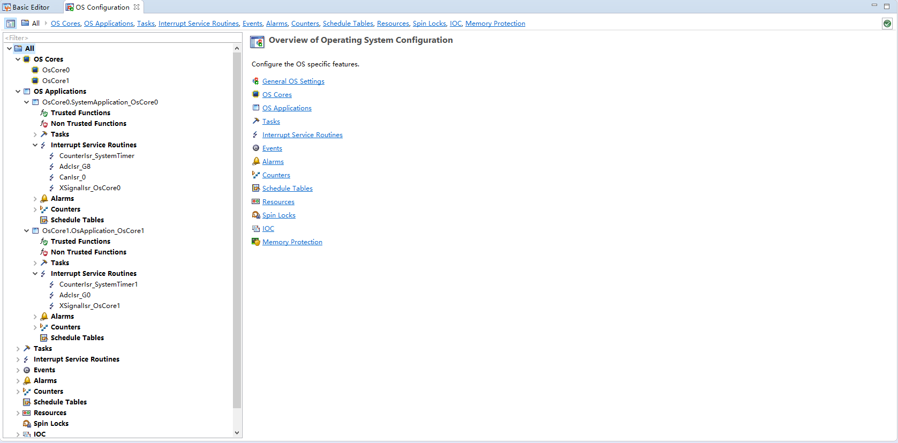

X-Signal
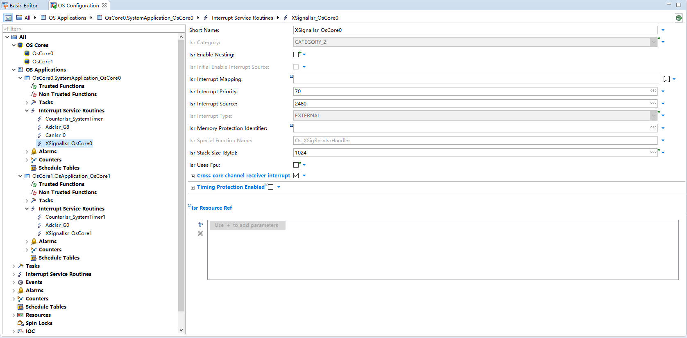

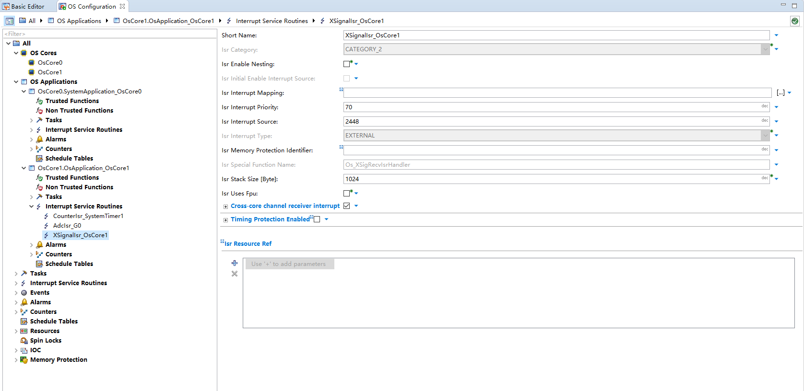
### 5.3 双核初始化顺序（配置→运行）

```text
两核：EcuM_Init → EcuM_AL_DriverInitOne（按核）→ StartOS

Core1：
  Default_Init_Task_Core1 → EcuM_StartupTwo → Rte_Start
    → ActivateTask(Default_MotorInitTask) / ActivateTask(MotorTask)
    → Rte_InitState_1 = RTE_STATE_INIT
  Default_Init_Task_Core1_Trusted → Os_InitialEnableInterruptSources(FALSE)

Core0：
  Default_Init_Task → while(Rte_InitState_1 != INIT) Schedule()   ← 等 Core1
    → EcuM_StartupTwo → Rte_Start
    → SetRelAlarm(MotorTask, SystemTimer1)          ← 跨核，走 X-Signal
    → SetRelAlarm(StartApp 1ms/10ms/…)
  Default_Init_Task_Trusted → Os_InitialEnableInterruptSources(FALSE)
```

---

## 6. 电机控制数据流架构

### 6.1 10 kHz 快速环（中断路径）

```text
GTM ATOM0 CH7（CMU0=100MHz，10000 ticks）
  → EVADC G0/G2/G3 同步触发（主 G0 / 从 G2、G3）
  → Adc_9183SenseVo1andVro_Notification（ADC0 SR0，CAT1，优先级 83，CPU1）
  → MotorCdd_AdcGroup0Notification → MotorCdd_AdcRunFastLoop
      · 直读 RES 寄存器：VO1/VRO/VO2/VINV/VO3
      · 电流换算 i=(VRO−VOx−offset)×K；滤波 alpha=0.3857
  → MotorCdd_FocFastLoop
      · QSPI2 直读 TLE5012 电角度（32-bit 帧）
      · 电流环：保护 → Clarke/Park → PI → SVPWM
      · 写 GTM ATOM0 CH1/2/3 SR0/SR1（中心对齐，三相影子更新）
      · 互补输出 IL1/2/3 由 GTM CDTM（DTM4，死区 200 ticks）生成
```

📷 **图片位 5**：Adc 组 / GtmTriggerTimer 与 Pwm 通道配置截图，对应 6.1 快速环链路。
Trigger select:
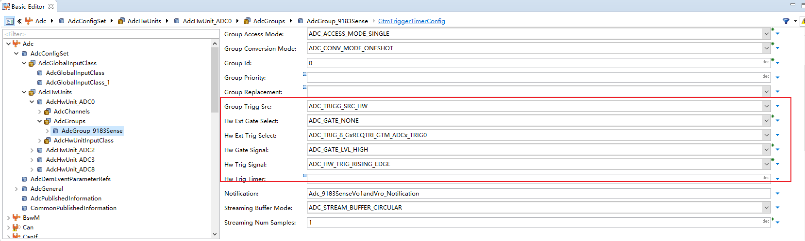

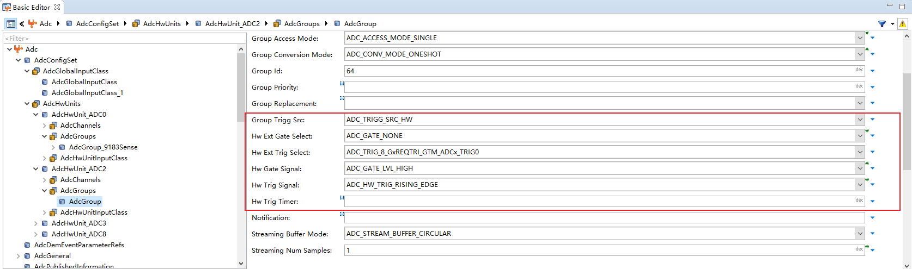

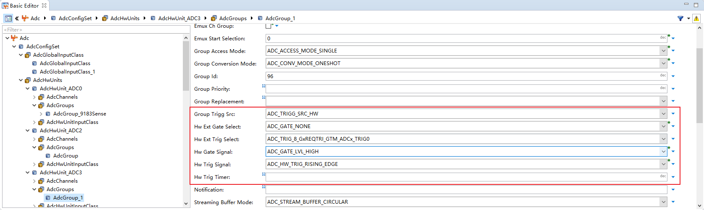

GtmTriggerTimer
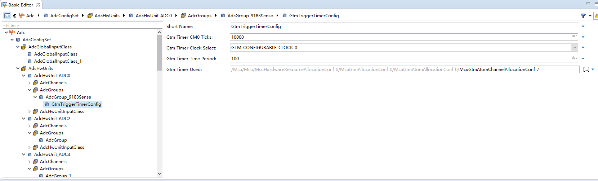
只用设置adc0 。

pwm GtmTriggerTimer:
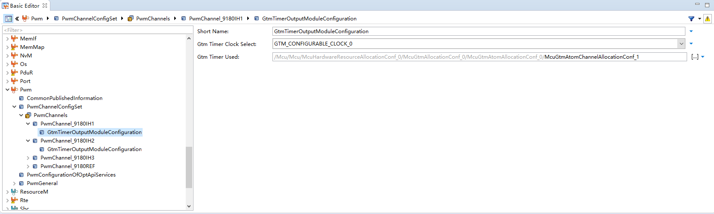

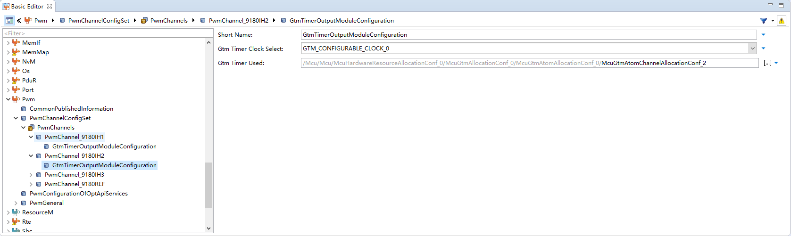

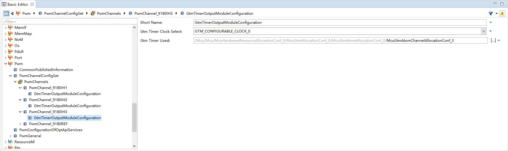

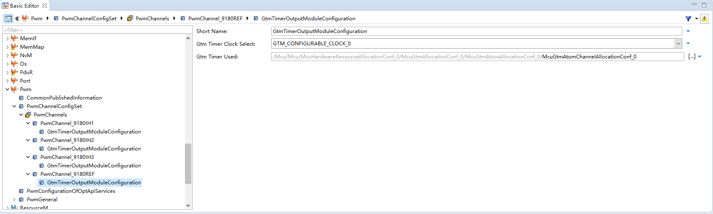
### 6.2 1 ms 慢环（任务路径）

```text
SystemTimer1（1ms）→ Alarm → SetEvent(MotorTask)
  → MotorControll_MainFunction（模式判定/切换/参考计算/输出门控）
  → Rte 写 MotorMode / Id_Ref / Iq_Ref 镜像
  → MotorCdd_MainFunction（TLE9180 轮询、零位标定、反馈发布）
  → 快速环读镜像（volatile 解耦，无锁）
```

### 6.3 外设链路

| 链路 | 配置 | 运行 |
| --- | --- | --- |
| 栅驱 TLE9180 | QSPI3（24-bit，4 MHz，CS P22.2）+ Dio（INH/ENA/SOFF/ERR） | `Spi_SetupEB` + `Spi_SyncTransmit` |
| 角度 TLE5012 | QSPI2（32-bit，CS P14.6） | 应用直接操作 QSPI2 SFR（BACON CS=2） |
| 电流/母线 | EVADC G0/G2/G3 | 硬件触发 + 通知 |
| 调试/指令 | MCAN0（500k / FD 2M） | `CanIf_Transmit` 直发 0x511（DLC 32） |
| 零位 | Fls→Fee→NvM 块 2 | `NvM_ReadBlock/WriteBlock`（StartApp 1ms 轮询） |
| 电源 | QSPI1 + Sbc | `Sbc_30_Tlf35584` 初始化 |

---

## 7. 生成与构建架构

### 7.1 配置 → 生成 → 构建

```text
DaVinci Configurator
  Validate（一致性校验：引用、时钟、资源冲突）
     ↓ Generate（按依赖顺序）
  MCAL 生成（Adc/Spi/Pwm/Port/Mcu/Irq/Dma/Fls…）
  BSW 生成（EcuM/BswM/Can/CanIf/Com/NvM/Fee/Os/Rte…）
  vLinkGen/vBRS 生成（LSL、_Lcfg）
     ↓
TASKING 构建（.cproject）
  编译（nearSize=0；BRS_COMP_TASKING；--default-near-size 关闭）
  链接（LSL=vLinkGen_Template.lsl；--user-provided-initialization-code；
        --no-default-libraries；-lc_fpu -lfp_fpu -lrt）
     ↓
last364.elf / .hex → UDE 下载调试
```

📷 **图片位 6**：DaVinci Generate 日志 / TASKING 构建输出截图，对应 7.1/7.2。

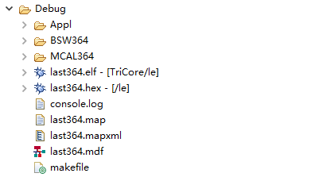


### 7.2 构建关键设置（`.cproject`）

| 项 | 设置 | 原因 |
| --- | --- | --- |
| `nearSize` | 0 | 避免生成 LSL 未定义的 near 段（address space 3 报错） |
| Linker script | `Appl/Source/vLinkGen_Template.lsl` | vLinkGen 双核段映射 |
| Do not use standard copy table | true（`--user-provided-initialization-code`） | vBRS 负责 ROM→RAM/BSS 初始化，避免 `ltc E123` |
| Link default libraries | false | 防止链接 `cstart_tc1.o` 覆盖 `_start_tc1` |
| Libraries | `-lc_fpu -lfp_fpu -lrt`（手动） | 提供 FPU 库/运行时 |
| Defined symbols | `BRS_COMP_TASKING`、`BRS_PLATFORM_AURIX` | vBRS 识别编译器/平台 |

### 7.3 生成顺序与手工补丁风险

- 生成顺序上，**MemMap/vLinkGen 依赖全部模块的 MSR 段**，通常在最后生成；`Os` 与 `Rte` 相互引用（事件/报警），需成对生成。
- 下列位置属于“生成后手工维护”，重新生成会覆盖，必须纳入复查清单：
  - `BSW364/_Common/Implementation/_MemMap.h`（SBC_30_TLF35584 段映射）
  - `BSW364/_Common/Implementation/_Compiler_Cfg.h`（SBC memory class）
  - `BSW364/Sbc_30_Tlf35584/Implementation/Sbc_30_Tlf35584.c`（`Spi_DataBufferType`）
  - `Appl/Source/vLinkGen_Template.lsl` 末尾 Core1 near 符号块
  - `EcuM_Callout_Stubs.c`（分核初始化、`SRC_VADC_G0_SR0.SRE=1`）

---

## 8. 关键设计决策与约定

### 8.1 为什么互补 PWM/死区不在 DaVinci 配

Pwm 模块只配 ATOM0 CH1/2/3 三个通道（中心对齐、周期 10000）。下桥 IL1/2/3（ATOM0 CH4/5/6）和死区（CDTM0/DTM4，200 ticks ≈ 2 µs）由应用层 `MotorCdd_PwmComplementaryInit()` 直接写 GTM 寄存器。原因：FOC 需要逐拍（10 kHz）直接写 SR0/SR1 做 SVPWM，走 MCAL `Pwm_SetDutyCycle` 有开销且不够“三相同拍”。

### 8.2 为什么 TLE5012 绕过 MCAL SPI

10 kHz 快速环里每拍都要读角度，MCAL SPI 同步发送的队列/等待机制会引入抖动；应用改用 QSPI2 SFR 直读（BACON LAST=1 单帧），并在 `Spi_Init` 后按 MCAL 配置值（ECON/SSOC/GLOBALCON）校准寄存器。因此 DaVinci 里 `SpiJob_5012BD` 的意义是“把 QSPI2 硬件配置成与应用常量一致”。

### 8.3 为什么 0x511 调试帧直发 CanIf

调试帧 32 字节、1 ms 节奏、内容由电机状态实时组帧，走 Com 周期发送不灵活；应用在初始化与发送前 `Com_IpduGroupStop(MyECU_oCAN00_Tx)` 停掉 Com 组，直接 `CanIf_Transmit`。注意：Com 里仍有同名 0x511 信号映射（供标定/分析），两者靠 PDU 组启停隔离。

### 8.4 为什么 ADC 要二次初始化

ADC0/2/3 归属 Core1，但 `Adc_Init` 第一次发生在 Core0（EcuM）。Core1 的 `MotorCdd_AdcInit()` 必须再次 `Adc_Init(&Adc_Config)` + `SetupResultBuffer` + `EnableHardwareTrigger` + `EnableGroupNotification`，并确保 `SRC_VADC_G0_SR0.SRE=1`，否则 MCAL 侧状态机停在 ADC_UNINIT、触发与中断不工作。

### 8.5 为什么 10 kHz 采样点放周期中心

中心对齐 PWM 下，开关沿在周期两端，周期中心是“平均电流”采样窗口。`GtmTimerCM0Ticks=10000`、默认采样点 5000（可 UDE 调，限幅 400~9600），并带 400 ticks 消隐，避开开关噪声。

---

## 9. 问题解决总结（按架构层归类）

> 说明：以下为工程历史问题总结（现象 → 根因 → 解决），按“配置/生成 → 构建/链接 → 运行/多核 → 电机功能”分层。详细过程见对应文档。

> 📌 提示：可在各问题条目（A~E 表）后自插错误日志/现场截图（如 `ltc E123`、Trap、ErrorHook 现场），图片统一放 `../image/DaVinci_Config_Architecture/`。

### A. 配置/生成层（DaVinci ECUC）

| # | 问题 | 现象 | 根因 | 解决 | 详见 |
| --- | --- | --- | --- | --- | --- |
| A1 | X-Signal 中断源错误 | Os 初始化后 Trap Class 3 | `XSignalIsr_OsCore0/1` 的 `OsIsrInterruptSource=1`（写坏 SRC） | 改为 GPSR：Core0 用 2480（`SRC_GPSR10`）、Core1 用 2448（`SRC_GPSR00`） | 双核总结 §12 |
| A2 | 跨核 SetRelAlarm 失败 | `E_OS_SYS_FUNCTION_UNAVAILABLE` | `OS_CFG_XSIGNAL=STD_OFF` | Os 配置 X-Signal 双向 Channel + ISR + `SetRelAlarm` API | 双核总结 §11 |
| A3 | Alarm 对 SUSPENDED 任务 SetEvent | ErrorHook `E_OS_STATE(7)` | Core0 `Rte_Start` 早于 Core1 `ActivateTask(MotorTask)` | Core0 `Default_Init_Task` 等 `Rte_InitState_1`，且改 **FULL** 抢占 | 双核总结 §13 |
| A4 | Core1 计数器异常/1ms 事件乱 | Counter 百万级、WaitEvent 不阻塞 | `SystemTimer1 OsCounterTicksPerBase=1` | 改为 **100000**（与 Core0 一致） | 双核总结 §15 |
| A5 | ADC 触发/中断不工作 | 快速环不跑 | 缺 G0 中断使能/归属错/通知名错 | `SRC_VADC_G0_SR0.SRE=1`；ResourceM 归 Core1；通知名一致 | 配置指南 §4 |
| A6 | PWM 周期/频率错 | 输出频率异常 | 时钟参考点或 GTM 时钟选择不一致 | `PwmMcuClockReferencePoint`=100 MHz、`GTM_CONFIGURABLE_CLOCK_0`、Cluster ÷2 | 配置指南 §1/§3 |
| A7 | SBC 段未映射（生成后） | `#error No MemMap section found` | 生成器未输出 `SBC_30_TLF35584_*` 映射 | 手工补 `_MemMap.h`/`_Compiler_Cfg.h`（重生成后复查） | SBC 修复记录 |

### B. 构建/链接层（TASKING + vLinkGen/vBRS）

| # | 问题 | 现象 | 根因 | 解决 | 详见 |
| --- | --- | --- | --- | --- | --- |
| B1 | 拷贝表冲突 | `ltc E123 _lc_ub_table` | Tasking 默认 init 表与 vBRS 冲突 | 链接器勾选 “Do not use standard copy table for initialization” | 双核总结 §3 |
| B2 | near 段缺失 | `ltc E157: cannot find address space 3` | `--default-near-size=8` 生成 near 段，LSL 不支持 | `.cproject nearSize=0`；`MemMapGeneratePragmasForNearAddressing=false` | 双核总结 §2/§5 |
| B3 | `_SMALL_DATA_TC1` 等 unresolved | 链接失败 | LSL 定义 `_start_tc1` 后拉入 `cstart_tc1.o` | 保留 LSL 末尾 Core1 near 符号块；`--no-default-libraries` | 双核总结 §2/§5 |
| B4 | SBC 编译语法错误 | `syntax error near Sbc_30_Tlf35584_DeviceConfiguration` | `SBC_30_TLF35584_CONST` 等宏未定义 | 补 `_Compiler_Cfg.h` memory class；`Sbc_SpiDataType→Spi_DataBufferType` | SBC 修复记录 |
| B5 | 符号重复/缺失 | SchM 重复、`ApplCanInterruptDisable` unresolved | 多源提供同一符号 | 保留 `TSC_SchM_*.c`；Can callout 补实现；Endinit 只在 `BrsHw.c` | 双核总结 §2/§6 |

### C. 运行/多核层（启动、调度、ISR）

| # | 问题 | 现象 | 根因 | 解决 | 详见 |
| --- | --- | --- | --- | --- | --- |
| C1 | Core1 启动卡死 | `Rte_InitState_1` ~20s 才变 3 | Core1 启动异常（Timer 配错/ErrorHook） | 修 `TicksPerBase`；Trusted 只开中断；等 Core1 完成 | 双核总结 §15 |
| C2 | `WaitEvent` 报 DISABLEDINT | MotorTask ErrorHook | 中断未开就调度任务 | 遵循 Init→Trusted 开中断→应用任务顺序 | 双核总结 §15 |
| C3 | Trusted 重复激活任务 | `Os_TrapTaskMissingTerminateTask` | Trusted 里再 ActivateTask/SetRelAlarm | 删除，仅 `Os_InitialEnableInterruptSources` | 双核总结 §15.4 |
| C4 | Core1 MPU 空指针 | `0x00010006` | Core1 调了只在 Core0 初始化的 ADC | callout 加 `GetCoreID()` 守卫 | 双核总结 §12 |

### D. 电机功能层（配置联动）

| # | 问题 | 现象 | 排查/解决要点 | 详见 |
| --- | --- | --- | --- | --- |
| D1 | PWM 无输出 | IH 无波形 | Port ALT1、ATOM 分配、周期/时钟、应用 DTM/TOUTSEL | 配置指南 §3 |
| D2 | 只有上桥无下桥 | IL 无波形 | GTM CDTM 路径/死区未使能（应用层） | 配置指南 §3、MotorCdd.c |
| D3 | 相电流采样错/抖动 | 电流波形毛刺 | 采样点（5000 ticks）、零偏未采集、滤波 alpha、PWM-ADC 同步 | FOC 开环文档、CurrentLoop 保护文档 |
| D4 | 欠压误报 | 使能即报欠压 | 母线阈值 6V/20 拍/迟滞 1V；检查 ADC 系数与供电 | CurrentLoop_Protection.md |
| D5 | 角度读不到/错 | 转速反馈异常 | QSPI2 帧格式、CS 极性、`Spi_Init` 后寄存器校准 | 配置指南 §5 |
| D6 | 零位存不住 | 重启后需重新标定 | Fee 是否 COMPLETE、NvM 块/CRC、`NvM_WriteBlock` 在 1ms 任务处理 | MotorZeroCal_DFlash.md |
| D7 | 0x511 发不出/冲突 | 调试帧丢 | Com 组未停、FD DLC、总线波特率、CanIf 配置 | 配置指南 §11 |

### E. 问题排查的“第一刀”建议

```text
现象
 ├─ 编译/链接报错      → B 层（.cproject/LSL/SchM/MemMap）
 ├─ 生成后代码异常      → A 层（ECUC 引用/通知名/时钟参考点）+ 复查手工补丁
 ├─ 上板即 trap/卡死    → C 层（Os/EcuM 多核顺序、X-Signal、TicksPerBase）
 ├─ 电机不转/波形不对   → D 层（Port/Pwm/Adc/Spi 联动 + 应用驱动）
 └─ 一切正常但偶发      → 查 UDE 观测变量（故障快照/计数器），再回到 A/D
```

---

## 10. 配置核查清单

### 10.1 每次改配置/重新生成后

- [ ] `Config/ECUC/*.arxml` 已纳入版本管理；生成前备份 `.wsx` 快照
- [ ] 手工补丁复查：`_MemMap.h`、`_Compiler_Cfg.h`、`Sbc_30_Tlf35584.c`、LSL 末尾符号块
- [ ] Validate 无红字；`Generate` 顺序：MCAL → BSW → Os/Rte → MemMap/vLinkGen
- [ ] 生成后检查 `Os_Hal_Interrupt_Lcfg.c`：XSignal Source = `0x990`/`0x9B0`（不是 `0x1`）
- [ ] 生成后检查 `Os_Hal_Cfg.h`：`OSTICKSPERBASE_SystemTimer/SystemTimer1 = 100000`
- [ ] `.cproject`：nearSize=0、LSL 指向 vLinkGen、user-provided-init-code、库列表

### 10.2 上板后

- [x] `Rte_InitState_1` 快速到 3；`StartApp_Cyclic1msCounter` 与 `MotorCdd_Os1msCounter` 约 1:1 增长
- [ ] `SetRelAlarm(Rte_Al_TE_MotorTask_0_1ms)` 返回 `E_OK`；无 ErrorHook
- [ ] ADC0 SR0（10 kHz）计数正常；PWM 10 kHz 波形、互补死区正确
- [ ] 0x511 调试帧周期可达；零位读写成功（`NvLastResult=NVM_REQ_OK`）

---

## 11. 文档索引

| 文档 | 内容 |
| --- | --- |
| [DaVinci_Motor_Config_Guide.md](DaVinci_Motor_Config_Guide.md) | 逐模块配置参数（Mcu/Port/Pwm/Adc/Spi/Dio/Irq/Os/EcuM/BswM/Can/Com/NvM/Fee/Fls/ResourceM/Sbc/Rte） |
| [DaVinci_Modules/README.md](DaVinci_Modules/README.md) | 逐模块配置文档索引（19 个模块，每模块一份独立配置说明） |
| [note 目录管理与图片规范](../README.md) | note 目录结构、更新流程与本地图片存放规范 |
| `Config/ECUC/*.arxml` | 配置“源代码”，最终以实际 arxml 为准 |


