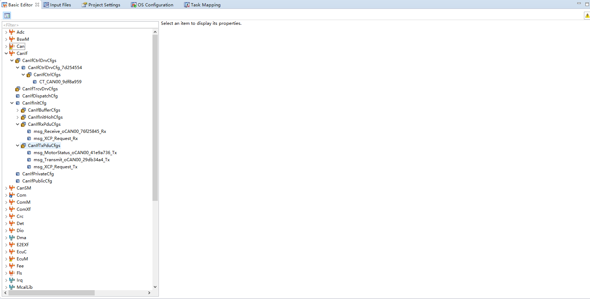
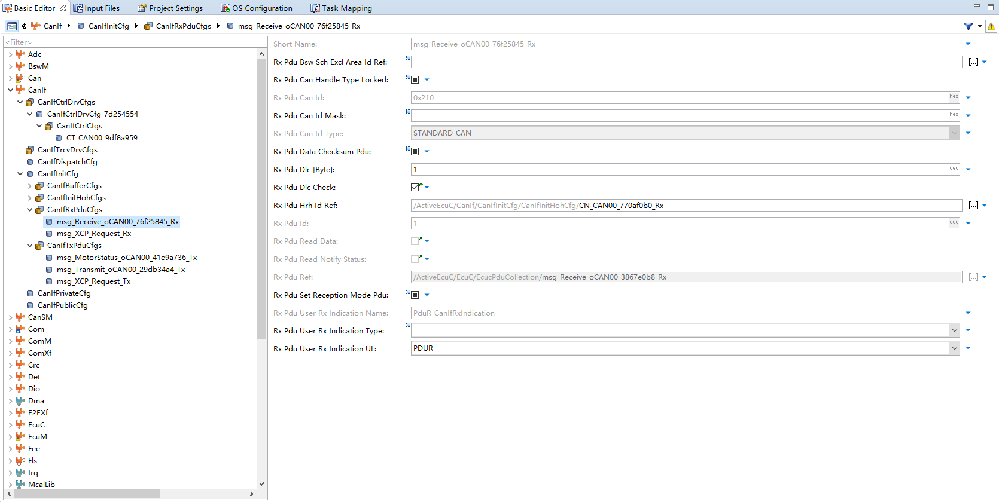
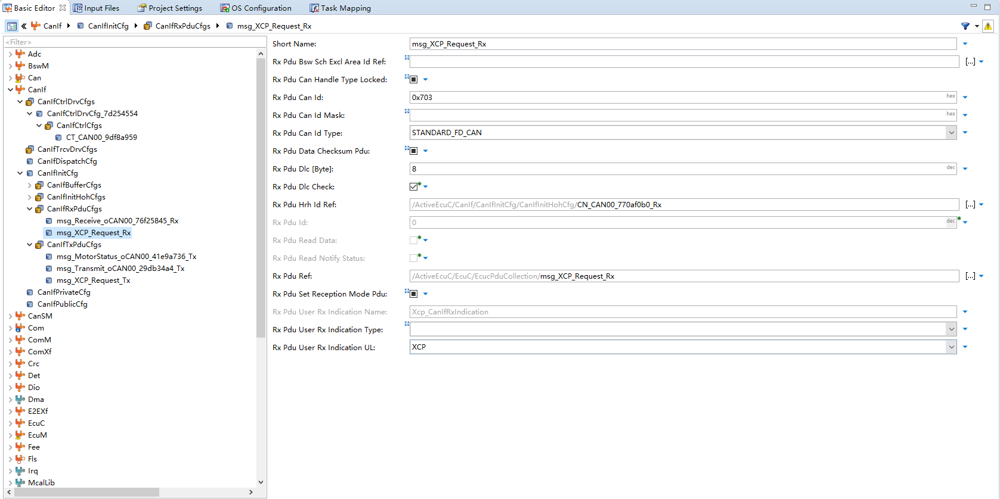
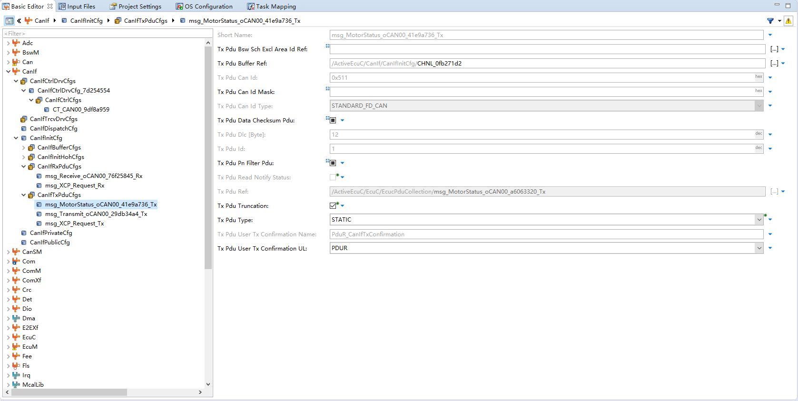
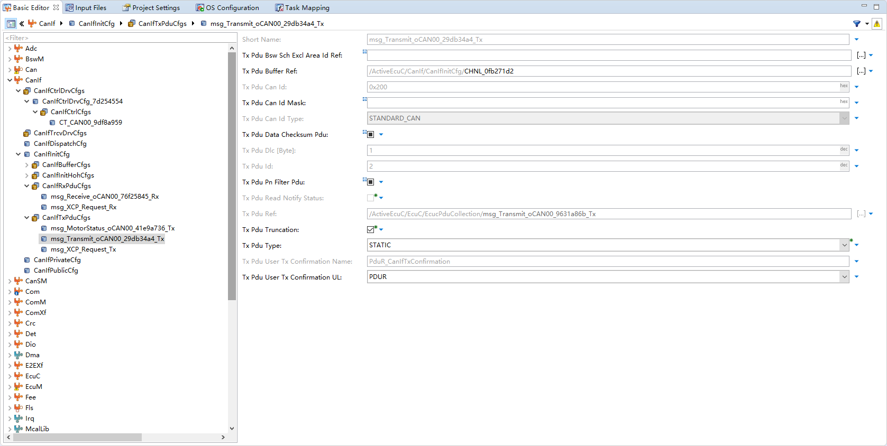
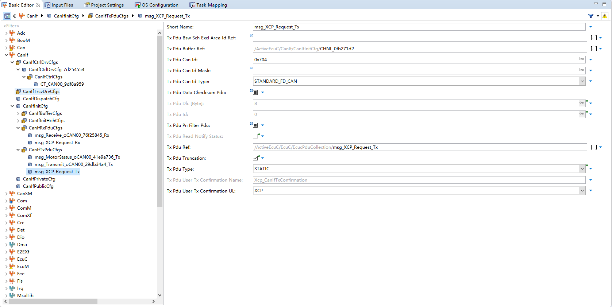
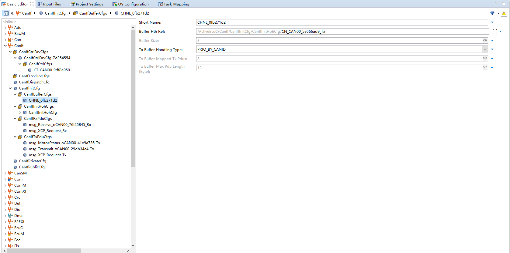

<!--
 * @Author: qinXiong
 * @Date: 2026-08-05 11:34:47
 * @LastEditors: xiong&&2307975018@qq.com
 * @LastEditTime: 2026-08-05 16:21:47
 * @Description: 
-->
# DaVinci 配置：CanIf 模块

> 工程：`last364.dpa`（AURIX TC364 + Vector MICROSAR 4.2.2 + Infineon MCAL 20.10.0）
> 模块类型：BSW（CAN 接口层）
> DaVinci 路径：`CanIf`
> 配置源文件：`Config/ECUC/last364_CanIf_CanIf_ecuc.arxml`
> 从属：[返回模块索引](README.md) · [模块参数总指南](../../Config/DaVinci_Motor_Config_Guide.md) · [架构文档](../../Config/DaVinci_Config_Architecture.md)

---

## 1. 模块作用

CanIf 定义 CAN/CAN-FD 的 Tx/Rx PDU：ID、DLC、类型、缓冲。电机工程关键 PDU：

- `0x511`（FD，DLC 32）：电机调试/观测帧，应用层 `CanIf_Transmit` 直发；
- `0x200`（经典 CAN，DLC 1）：Com 周期发送；
- `0x210`（经典 CAN，DLC 1）：Com 接收。

---

## 2. 配置步骤

### 2.1 打开模块

BSW Editor → 模块树选择 `CanIf` → Tx/Rx PDU 列表。

📷 图片位 F1：模块树选中 `CanIf` 的截图。

### 2.2 PDU 配置

| PDU | 类型 | CAN ID | DLC | 用途 |
| --- | --- | --- | --- | --- |
| `msg_MyECU_Lamp_oCAN00_41befc25_Tx` | STANDARD_FD_CAN | **0x511（1297）** | **32** | 电机调试/观测帧（应用直发） |
| `msg_Transmit_oCAN00_29db34a4_Tx` | STANDARD_CAN | 0x200（512） | 1 | Com 周期发送 |
| `msg_Receive_oCAN00_76f25845_Rx` | STANDARD_CAN | 0x210（528） | 1 | Com 接收 |

Tx 缓冲：`CHNL_0fb271d2`（size 2、最大 PDU 长度 32、`PRIO_BY_CANID`）。

📷 图片位 F2：Tx/Rx PDU 列表截图。
Rx PDU

Tx PDU:

📷 图片位 F3：Tx 缓冲通道 `CHNL_0fb271d2` 截图。

---

## 3. 与其它模块的引用关系

| 引用 | 方向 | 说明 |
| --- | --- | --- |
| PDU 路由 | CanIf ↔ PduR ↔ Com | 三处 PDU/ID 必须一致 |
| `CanIf_Transmit` | CanIf ↔ 应用 | `MotorFoc_OpenLoopCan_Init/Transmit()` 直发 0x511 |
| CAN 控制器 | CanIf → Can | 挂到 `CT_CAN00_9df8a959` |

---

## 4. 注意事项

- 0x511 与 Com 中同名 PDU 靠 IPdu 组启停隔离：应用先 `Com_IpduGroupStop(MyECU_oCAN00_Tx_1ae5d671)` 再 `CanIf_Transmit`。
- FD PDU 的 DLC/类型（STANDARD_FD_CAN）与总线 FD 配置必须一致，否则对端解析失败。
- 若想走 Com 发送 0x511，需去掉 `Com_IpduGroupStop` 与直发逻辑，并把 `ComTxMode` 周期配好。

---

## 5. 截图清单（用户自插）

| 图片位 | 建议文件名 | 截图内容 |
| --- | --- | --- |
| F1 | `12_canif_module_tree.png` | 模块树选中 CanIf |
| F2 | `12_canif_pdu.png` | Tx/Rx PDU 列表 |
| F3 | `12_canif_tx_buffer.png` | Tx 缓冲通道 |

## 6. 相关文档

- [DaVinci_Can.md](DaVinci_Can.md) / [DaVinci_Com.md](DaVinci_Com.md)（链路一致性）
- [DaVinci_BswM.md](DaVinci_BswM.md)（IPdu 组规则）
- [DaVinci_Motor_Config_Guide.md 第 11 节](../../Config/DaVinci_Motor_Config_Guide.md)
