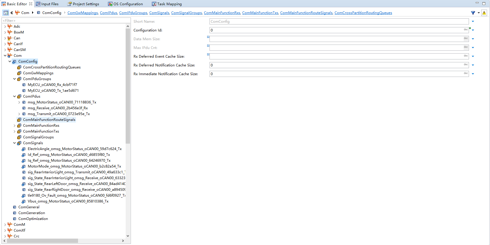
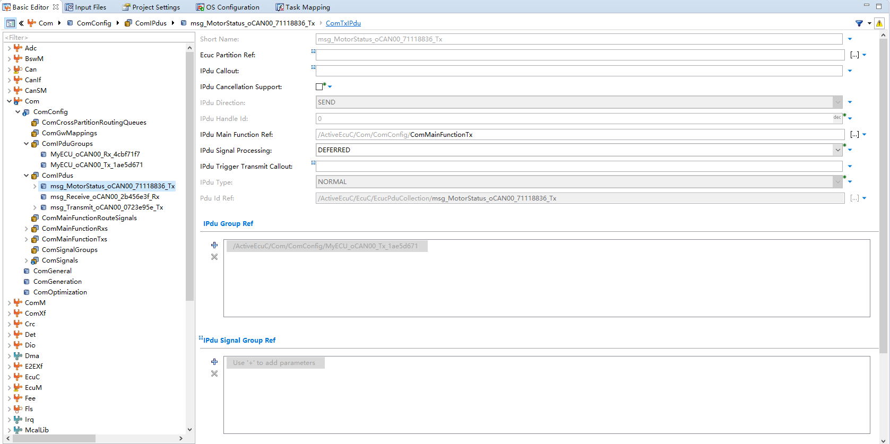
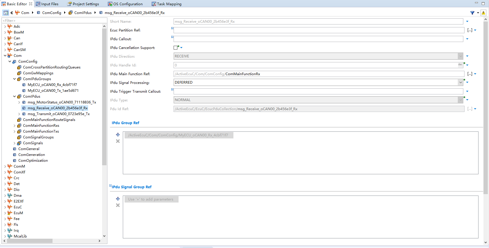
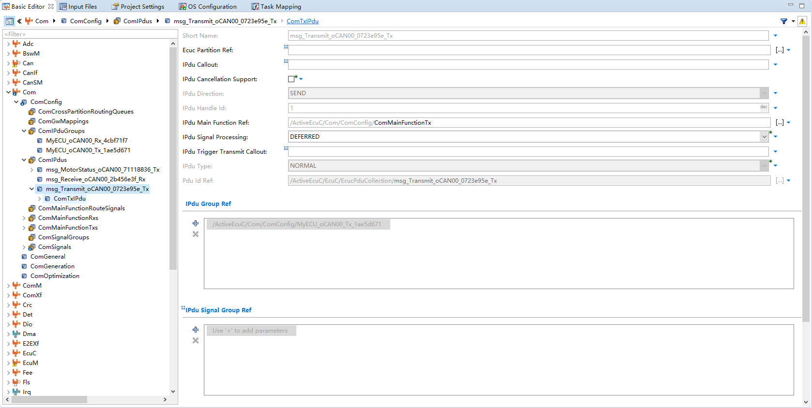
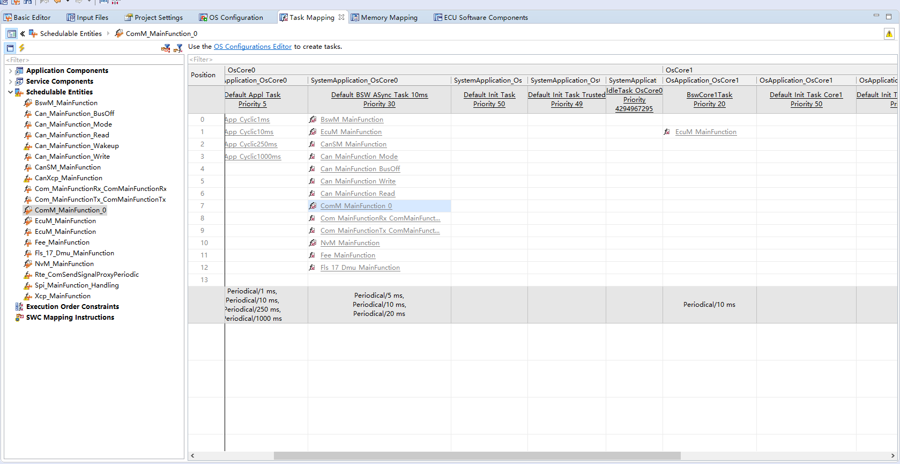

<!--
 * @Author: qinXiong
 * @Date: 2026-08-05 11:34:51
 * @LastEditors: xiong&&2307975018@qq.com
 * @LastEditTime: 2026-08-05 16:24:55
 * @Description: 
-->
# DaVinci 配置：Com 模块

> 工程：`last364.dpa`（AURIX TC364 + Vector MICROSAR 4.2.2 + Infineon MCAL 20.10.0）
> 模块类型：BSW（通信层）
> DaVinci 路径：`Com`
> 配置源文件：`Config/ECUC/last364_Com_Com_ecuc.arxml`；信号来源：`Config_Vector/CANFD364.dbc`
> 从属：[返回模块索引](README.md) · [模块参数总指南](../../Config/DaVinci_Motor_Config_Guide.md) · [架构文档](../../Config/DaVinci_Config_Architecture.md)

---

## 1. 模块作用

Com 模块管理信号与 IPdu 组：

- `0x511` IPdu 组内映射 MotorFoc 观测信号（`MotorFoc_IuRaw_A`、`MotorFoc_Iv_A`、`MotorFoc_FaultIv_A` 等），供 RTE/标定侧分析；
- 0x200 周期发送、0x210 接收；
- 应用实际用 `CanIf_Transmit` 直发 0x511，Com 组在直发前被 `Com_IpduGroupStop` 停掉。

---

## 2. 配置步骤

### 2.1 打开模块

BSW Editor → 模块树选择 `Com` → `ComConfig`（信号/PDU 一般由 DBC 导入，也可手动建）。

📷 图片位 M1：模块树选中 `Com` 的截图。

### 2.2 IPdu 组与信号

- 0x511 组：`msg_MyECU_Lamp_oCAN00_*_Tx`，映射 MotorFoc 观测信号；
- IPdu 组名：`MyECU_oCAN00_Tx` / `MyECU_oCAN00_Tx_1ae5d671` / `MyECU_oCAN00_Rx`（应用层 `Com_IpduGroupStop` 用到的名字必须与这里一致）。

📷 图片位 M2：Com IPdu/信号列表截图。

### 2.3 MainFunction 周期

- `ComMainFunctionTx` 事件挂到 `Default_BSW_ASync_Task_10ms`（10 ms 报警 `Rte_Al_TE_Com_Com_MainFunctionTx_ComMainFunctionTx`）。

📷 图片位 M3：Com MainFunction 事件/报警截图。

---

## 3. 与其它模块的引用关系

| 引用 | 方向 | 说明 |
| --- | --- | --- |
| PDU/ID | Com ↔ CanIf ↔ PduR | 0x511/0x200/0x210 三处一致 |
| IPdu 组启停 | Com ↔ 应用/BswM | `Com_IpduGroupStop` / BswM 使能规则 |
| MainFunction | Com ↔ Os/Rte | 挂 `Default_BSW_ASync_Task_10ms` |

---

## 4. 注意事项

- 0x511 与 Com 周期发送冲突（丢帧/发不出）：确认直发前 `Com_IpduGroupStop(MyECU_oCAN00_Tx_1ae5d671)` 已执行，且 IPdu 组名一致。
- DBC 重新导入后，信号名/组名可能变化，应用层引用的字符串要同步更新。
- 若 Com 侧启用 0x511 周期发送，需把 `ComTxMode` 周期配好并去掉直发逻辑。

---

## 5. 截图清单（用户自插）

| 图片位 | 建议文件名 | 截图内容 |
| --- | --- | --- |
| M1 | `13_com_module_tree.png` | 模块树选中 Com |
| M2 | `13_com_ipdu_groups.png` | IPdu 组与信号 |
| M3 | `13_com_mainfunction.png` | MainFunction 事件 |

## 6. 相关文档

- [DaVinci_Can.md](DaVinci_Can.md) / [DaVinci_CanIf.md](DaVinci_CanIf.md)（链路一致性）
- [DaVinci_BswM.md](DaVinci_BswM.md)（IPdu 组使能规则）
- [DaVinci_Motor_Config_Guide.md 第 11 节](../../Config/DaVinci_Motor_Config_Guide.md)
