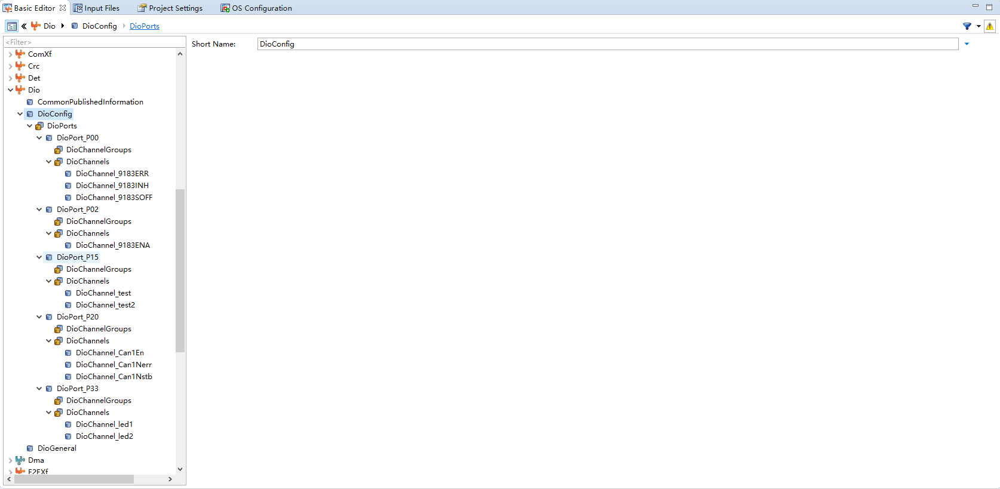
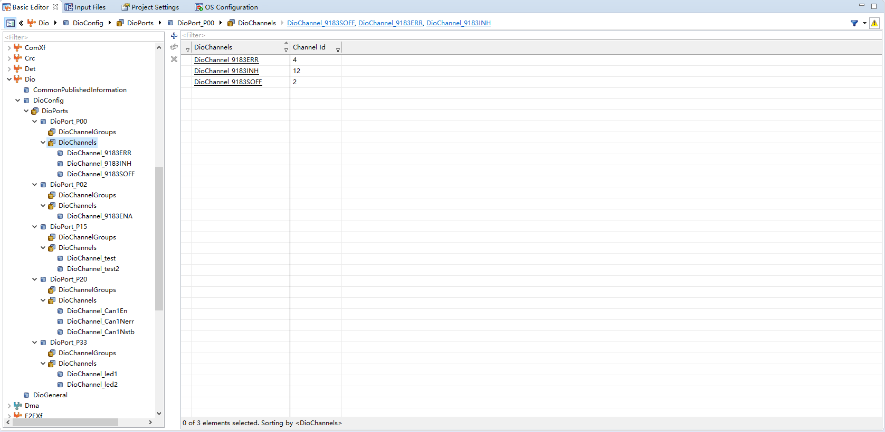
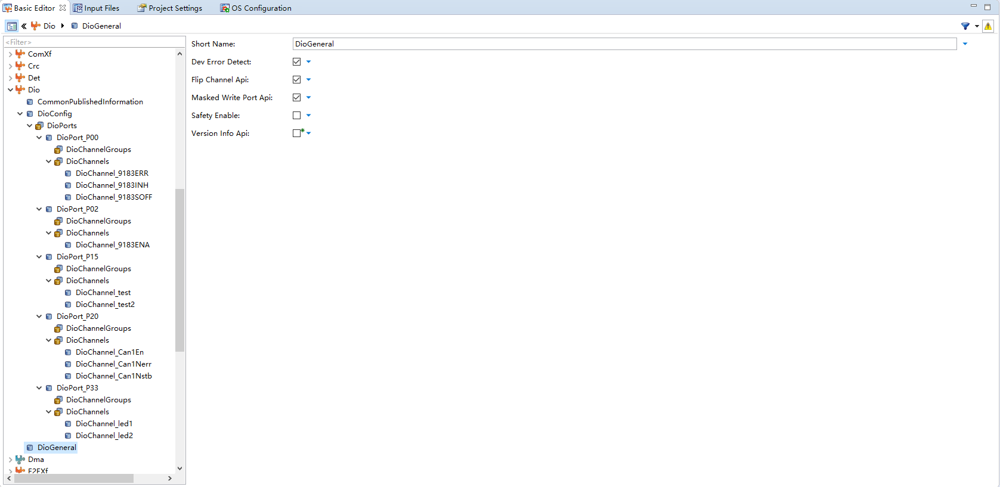

<!--
 * @Author: qinXiong
 * @Date: 2026-08-05 11:33:16
 * @LastEditors: xiong&&2307975018@qq.com
 * @LastEditTime: 2026-08-05 15:31:40
 * @Description: 
-->
# DaVinci 配置：Dio 模块

> 工程：`last364.dpa`（AURIX TC364 + Vector MICROSAR 4.2.2 + Infineon MCAL 20.10.0）
> 模块类型：MCAL
> DaVinci 路径：`Dio > DioConfig`
> 配置源文件：`Config/ECUC/last364_Dio_Dio_ecuc.arxml`
> 从属：[返回模块索引](README.md) · [模块参数总指南](../../Config/DaVinci_Motor_Config_Guide.md) · [架构文档](../../Config/DaVinci_Config_Architecture.md)

---

## 1. 模块作用

Dio 模块管理数字输入/输出通道，本工程主要用于：

- TLE9180 栅极驱动控制脚：INH（Inhibit）、SOFF（Safe-Off）、ERR（错误输入）、ENA（输出使能）；
- CAN 收发器控制：NSTB / EN / NERR；
- 调试测试点与状态灯：test / test2 / led1 / led2。

> 注意：Dio 通道与 Port 引脚是同一物理脚，方向/模式在 Port 配置，Dio 只负责运行时读写。

---

## 2. 配置步骤

### 2.1 打开模块

BSW Editor → 模块树选择 `Dio` → `DioConfig`。

📷 图片位 D1：模块树选中 `Dio` 的截图。

### 2.2 通道配置

| Dio 通道 | 端口.引脚 | 方向 | 用途 |
| --- | --- | --- | --- |
| `DioChannel_9183INH` | P00.12 | OUT | 9183 Inhibit |
| `DioChannel_9183SOFF` | P00.2 | OUT | 9183 Safe-Off |
| `DioChannel_9183ERR` | P00.4 | IN | 9183 错误输入 |
| `DioChannel_9183ENA` | P02.8 | OUT | 9183 输出使能 |
| `DioChannel_test` / `DioChannel_test2` | P15.2 / P15.3 | OUT | 测试点 |
| `DioChannel_led1` / `DioChannel_led2` | P33.0 / P33.1 | OUT | 状态灯 |
| `DioChannel_Can1Nstb` / `Can1En` / `Can1Nerr` | P20.6 / P20.9 / P20.10 | OUT/OUT/IN | CAN 收发器控制 |

`DioGeneral`：

| 参数 | 值 |
| --- | --- |
| `DioFlipChannelApi` | true |
| `DioDevErrorDetect` | true |

📷 图片位 D2：Dio 通道列表截图。

p00.2 channel id 为2 就是对应的通道 

📷 图片位 D3：`DioGeneral` 公共参数截图。

---

## 3. 与其它模块的引用关系

| 引用 | 方向 | 说明 |
| --- | --- | --- |
| 同一引脚 | Dio ↔ Port | 9183/CAN/LED 脚的 GPIO 模式在 Port 配置 |
| `Dio_WriteChannel/ReadChannel` | Dio ↔ 应用 | `Tle9180_Port_Activate/DeactivateInhibit/Enable/SafeOff()`、`Tle9180_Port_GetErrorState()` |

---

## 4. 注意事项

- 9183 控制时序：上电 SOFF 保持 HIGH（安全关断无效）、INH 低、ENA 低；驱动初始化后再按顺序拉高。
- `DioChannel_9183ERR` 是输入，高有效；应用层用 `Dio_ReadChannel` 读取。
- 若 Dio 通道和 Port 引脚对不上（例如 Port 里模式改成了 ALT），运行时会异常，先查 Port。

---

## 5. 截图清单（用户自插）

| 图片位 | 建议文件名 | 截图内容 |
| --- | --- | --- |
| D1 | `06_dio_module_tree.png` | 模块树选中 Dio |
| D2 | `06_dio_channels.png` | Dio 通道列表 |
| D3 | `06_dio_general.png` | DioGeneral |

## 6. 相关文档

- [DaVinci_Port.md](DaVinci_Port.md)（引脚模式/初始电平）
- [DaVinci_Motor_Config_Guide.md 第 6 节](../../Config/DaVinci_Motor_Config_Guide.md)
