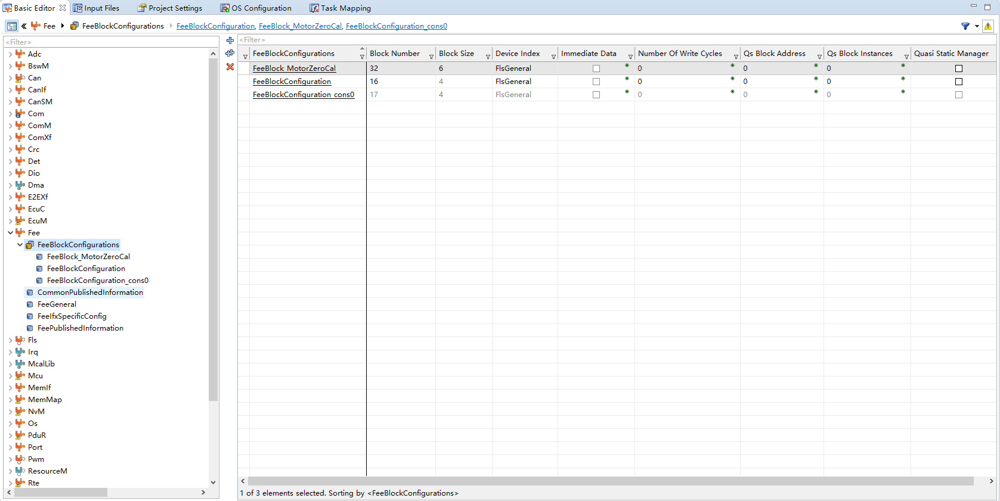
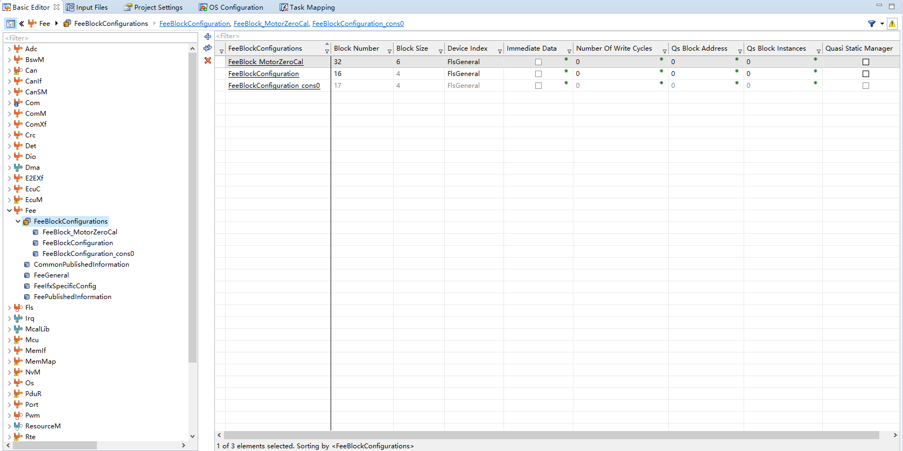
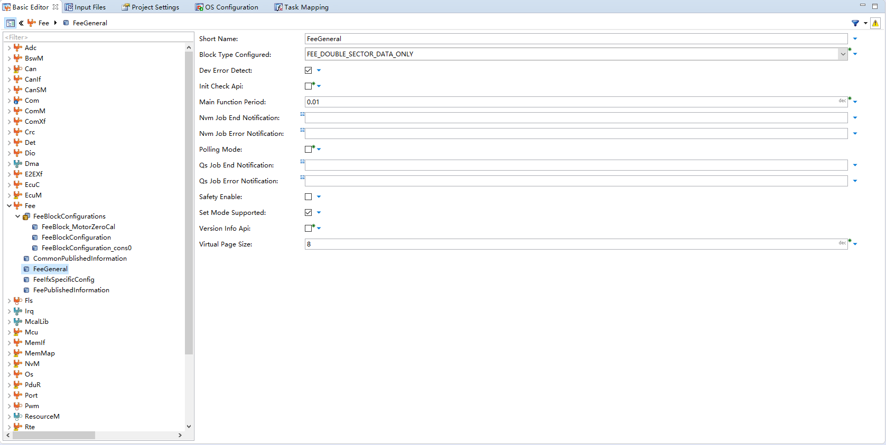

<!--
 * @Author: qinXiong
 * @Date: 2026-08-05 11:34:58
 * @LastEditors: xiong&&2307975018@qq.com
 * @LastEditTime: 2026-08-05 16:32:03
 * @Description: 
-->
# DaVinci 配置：Fee 模块

> 工程：`last364.dpa`（AURIX TC364 + Vector MICROSAR 4.2.2 + Infineon MCAL 20.10.0）
> 模块类型：BSW（Flash EEPROM 模拟）
> DaVinci 路径：`Fee`
> 配置源文件：`Config/ECUC/last364_Fee_Fee_ecuc.arxml`
> 从属：[返回模块索引](README.md) · [模块参数总指南](../../Config/DaVinci_Motor_Config_Guide.md) · [零位标定文档](../../Guides/MotorZeroCal_DFlash.md)

---

## 1. 模块作用

Fee 在 DFlash 上模拟 EEPROM：把 NvM 块映射为 Fee 块，管理页/扇区/一致性副本。

---

## 2. 配置步骤

### 2.1 打开模块

BSW Editor → 模块树选择 `Fee` → `FeeBlockConfiguration` / `FeeGeneral`。

📷 图片位 E1：模块树选中 `Fee` 的截图。

### 2.2 Fee 块

| Fee 块 | `FeeBlockNumber` | 大小 | 说明 |
| --- | --- | --- | --- |
| `FeeBlockConfiguration` | 16 | 4 B | 通用块（对应 NvMConfigBlock） |
| `FeeBlockConfiguration_cons0` | 17 | 4 B | 通用块一致性副本 |
| `FeeBlock_MotorZeroCal` | 32 | 6 B | **电机零位角度**（NvMBlock_MotorZeroCal） |

`FeeGeneral`：

| 参数 | 值 |
| --- | --- |
| `FeeVirtualPageSize` | 8 |
| `FeeBlockTypeConfigured` | `FEE_DOUBLE_SECTOR_DATA_ONLY` |
| `FeePollingMode` | false（Fee 主函数 10 ms） |

📷 图片位 E2：Fee 块列表截图。

📷 图片位 E3：`FeeGeneral` 参数截图。

---

## 3. 与其它模块的引用关系

| 引用 | 方向 | 说明 |
| --- | --- | --- |
| NvM ↔ Fee | NvM ↔ Fee | 块号/长度/CRC 必须一致 |
| Fee → Fls | Fee ↔ Fls | DFlash 扇区/页来自 Fls 配置 |
| 通知 | Fee ↔ Fls | `Fee_JobEndNotification` / `Fee_JobErrorNotification` |

---

## 4. 注意事项

- `FeeBlock_MotorZeroCal` 块大小 6 B，但 NvM 块 `NvMBlock_MotorZeroCal` 只读写 4 B，两者按 NvM 侧为准。
- Fee 上电完成标志：`FeeInitGCState == COMPLETE`，应用等它后再 `NvM_ReadBlock`。
- 重新生成后若 Fee 块号变了，NvM 引用会断，零位会“存不住”。

---

## 5. 截图清单（用户自插）

| 图片位 | 建议文件名 | 截图内容 |
| --- | --- | --- |
| E1 | `15_fee_module_tree.png` | 模块树选中 Fee |
| E2 | `15_fee_blocks.png` | Fee 块列表 |
| E3 | `15_fee_general.png` | FeeGeneral |

## 6. 相关文档

- [DaVinci_NvM.md](DaVinci_NvM.md) / [DaVinci_Fls.md](DaVinci_Fls.md)（存储链路）
- [MotorZeroCal_DFlash.md](../../Guides/MotorZeroCal_DFlash.md)
- [DaVinci_Motor_Config_Guide.md 第 12 节](../../Config/DaVinci_Motor_Config_Guide.md)
