<!--
 * @Author: qinXiong
 * @Date: 2026-08-05 11:33:56
 * @LastEditors: xiong&&2307975018@qq.com
 * @LastEditTime: 2026-08-05 15:44:11
 * @Description: 
-->
# DaVinci 配置：Irq 模块

> 工程：`last364.dpa`（AURIX TC364 + Vector MICROSAR 4.2.2 + Infineon MCAL 20.10.0）
> 模块类型：MCAL（中断控制器）
> DaVinci 路径：`Irq > IrqAdcConfig_0 / IrqCanConfig_0 / IrqStmConfig_0 / IrqQSPIConfig_0`
> 配置源文件：`Config/ECUC/last364_Irq_Irq_ecuc.arxml`
> 从属：[返回模块索引](README.md) · [模块参数总指南](../../Config/DaVinci_Motor_Config_Guide.md) · [架构文档](../../Config/DaVinci_Config_Architecture.md)

---

## 1. 模块作用

Irq 模块配置中断源的类别（CAT1/CAT2）、优先级与目标核（TOS）。电机工程中最关键的一条：

- **ADC0 SR0（电机采样/FOC 快速环）必须是 CAT1、优先级 83、CPU1**，与 Core1 的 OS ISR `AdcIsr_G0` 匹配。

---

## 2. 配置步骤

### 2.1 打开模块

BSW Editor → 模块树选择 `Irq`，按外设分组配置（`IrqAdcConfig_0`、`IrqCanConfig_0`、`IrqStmConfig_0`、`IrqQSPIConfig_0` 等）。

📷 图片位 I1：模块树选中 `Irq` 的截图。

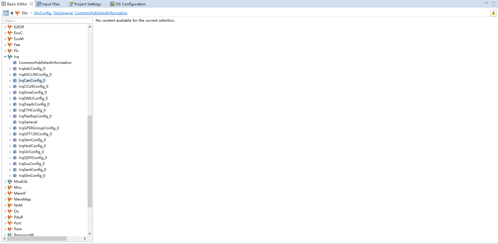
### 2.2 中断配置表

| 中断 | 配置项 | 当前值 |
| --- | --- | --- |
| ADC0 SR0（电机采样/FOC） | `IrqAdc0SR0Cat` / `Prio` / `Tos` | CAT1 / 83 / **CPU1** |
| ADC8 SR0（电池检测） | `IrqAdc8SR0Cat` / `Prio` / `Tos` | CAT2 / 78 / CPU0 |
| CAN0 SR0 | `IrqCanSR0*` | CPU0（OS 侧优先级 60） |
| STM1（Core1 系统定时器） | `IrqStm1SR0*` | CPU1 |
| QSPI 各中断 | `IrqQspi*` | CAT1 / 0 / CPU0（未使用） |
| GTM ATOM | `IrqGtmATOM*` | CAT1 / 0 / CPU0（未使用） |

📷 图片位 I2：`IrqAdcConfig_0`（ADC0/ADC8 SR0）截图。
adc0
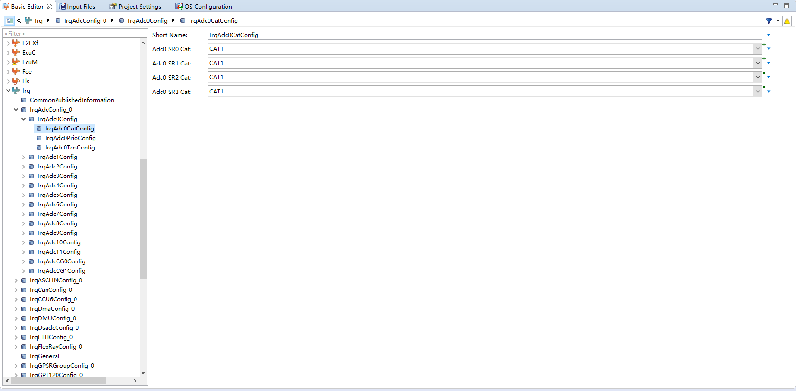

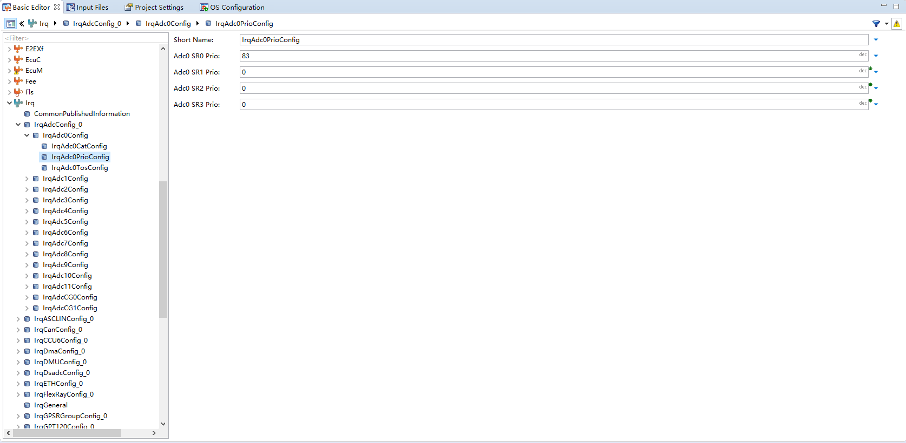

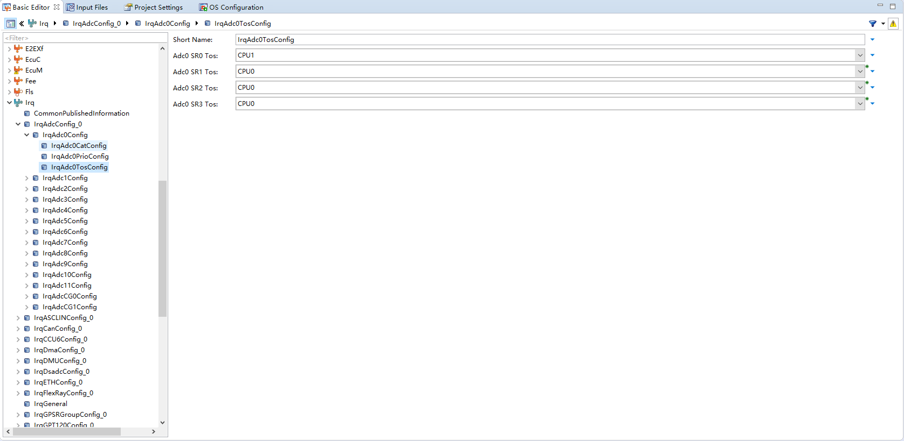

adc2和adc3都是通过adc0中断触发所以这些都是原始值
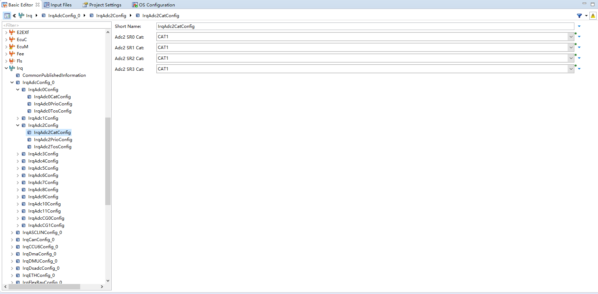

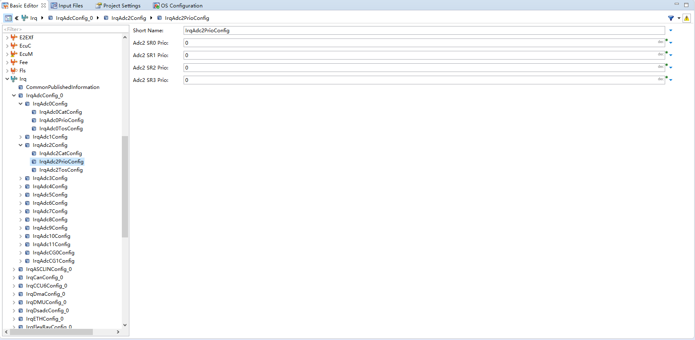
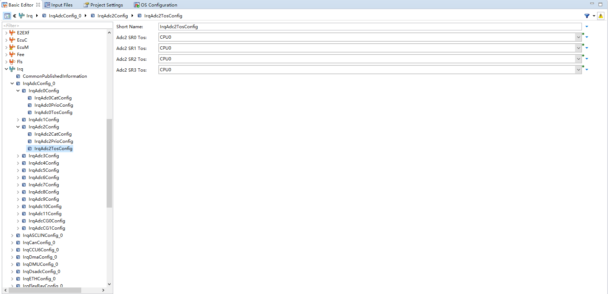

📷 图片位 I3：`IrqStmConfig_0` / `IrqCanConfig_0` 截图。
IrqStm0Config：
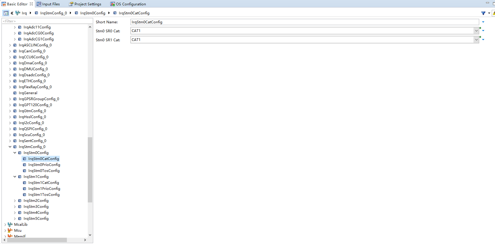

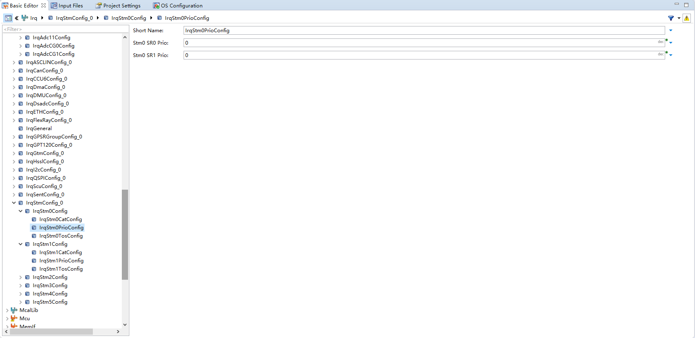

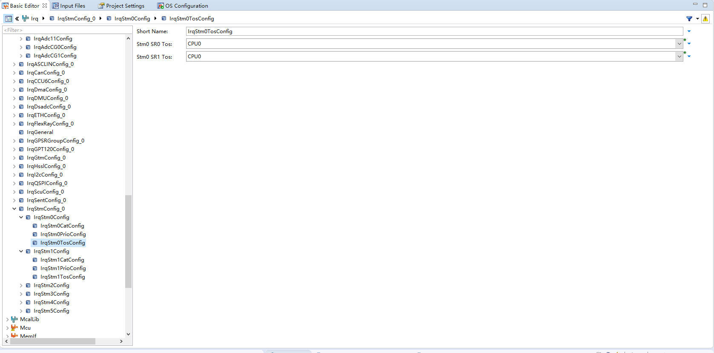
IrqStm1Config：
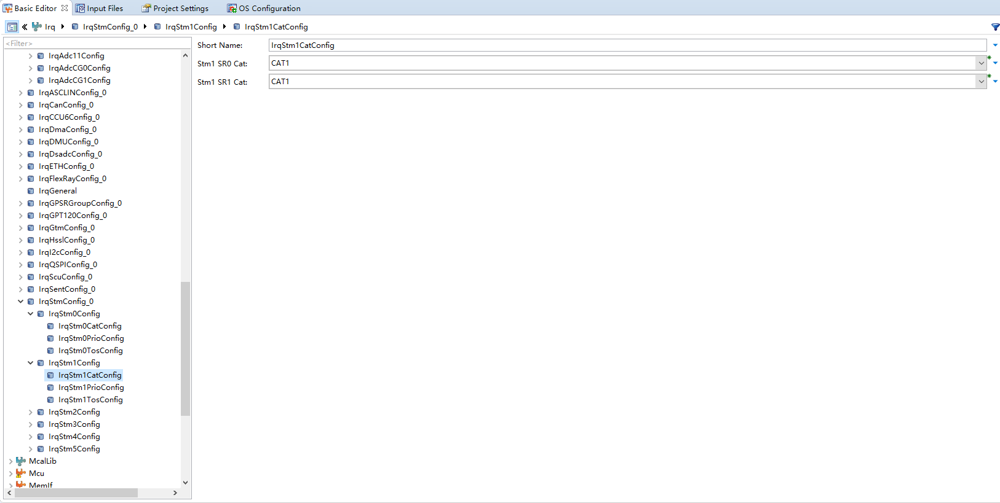

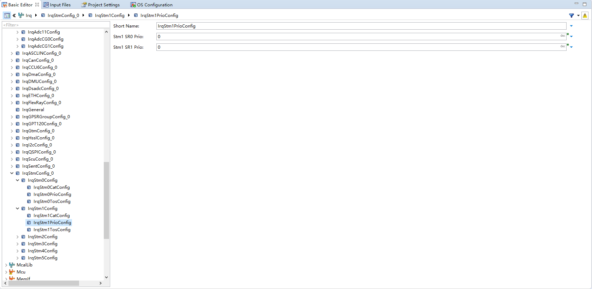

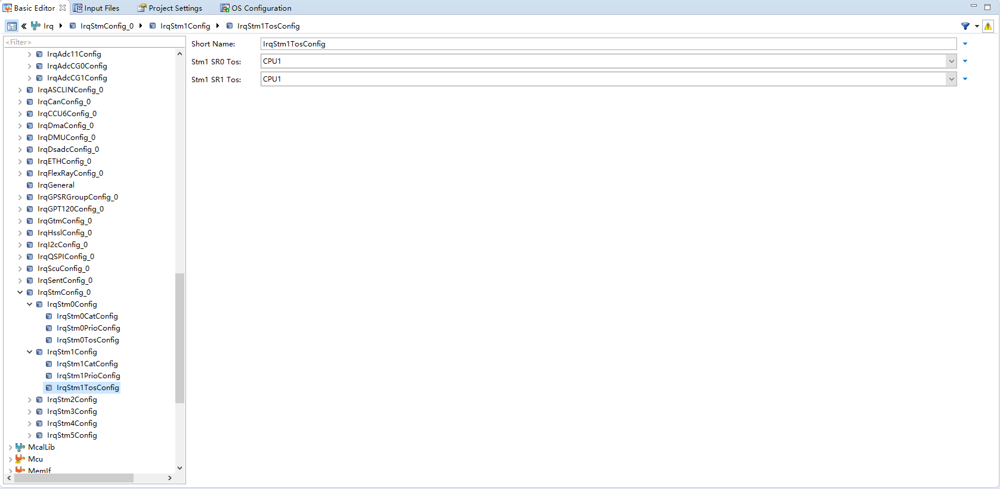

IrqCan0Config：

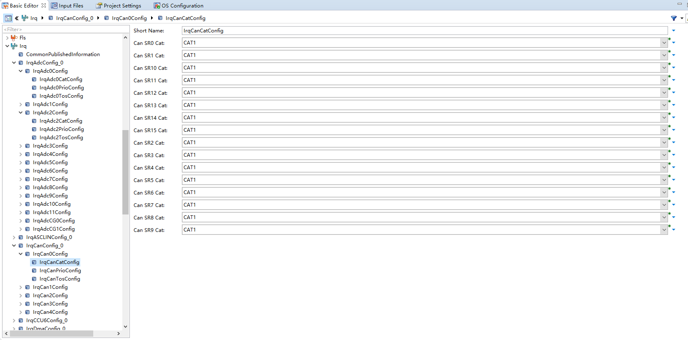

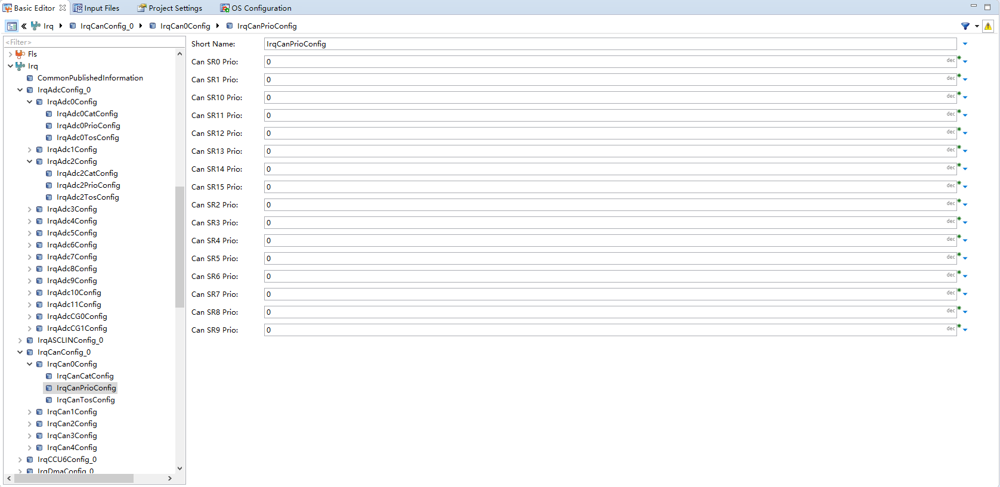

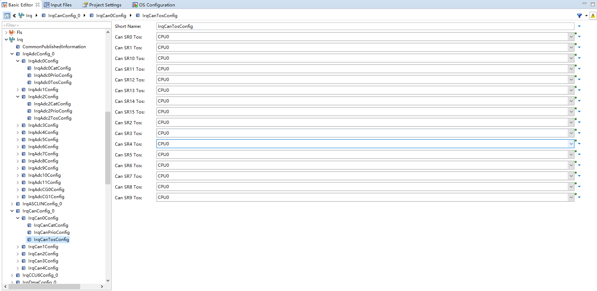
---

## 3. 与其它模块的引用关系

| 引用 | 方向 | 说明 |
| --- | --- | --- |
| ADC0 SR0 | Irq ↔ Adc | Adc G0 通知在中断里执行 |
| ADC0 SR0 优先级/核 | Irq ↔ Os | Os 中 `AdcIsr_G0` 必须与 Irq 的 CAT1/83/CPU1 一致 |
| STM1 | Irq ↔ Os | Os `SystemTimer1`（Core1 1 ms） |
| `IrqAdc_Init()` | Irq ↔ EcuM | Core0 `EcuM_AL_DriverInitOne` 调用，之后置 `SRC_VADC_G0_SR0.SRE=1` |

---

## 4. 注意事项

- ADC0 SR0 必须 TOS=CPU1，才能与 Core1 的 `AdcIsr_G0`（OS）和快速环匹配；配错核会导致快速环不跑或 Trap。
- `IrqAdc_Init()` 在 Core0 执行，之后需在 `EcuM_AL_DriverInitOne` 中显式置 `SRC_VADC_G0_SR0.SRE = 1`，否则 G0 中断不触发（工程里已有该处理）。
- 电机侧不依赖 QSPI 中断（TLE5012 用轮询直读、TLE9180 用同步发送）。
- Core1 计数器中断 `CounterIsr_SystemTimer1` 在 Os 里登记，Irq 侧 `IrqStm1SR0*` 归属 CPU1。

---

## 5. 截图清单（用户自插）

| 图片位 | 建议文件名 | 截图内容 |
| --- | --- | --- |
| I1 | `07_irq_module_tree.png` | 模块树选中 Irq |
| I2 | `07_irq_adc.png` | ADC0/ADC8 SR0 配置 |
| I3 | `07_irq_can_stm.png` | STM/CAN 中断配置 |

## 6. 相关文档

- [DaVinci_Adc.md](DaVinci_Adc.md)（G0 通知/中断链路）
- [DaVinci_Os.md](DaVinci_Os.md)（ISR 登记）
- [DaVinci_EcuM.md](DaVinci_EcuM.md)（`IrqAdc_Init` 与 SRE 置位）
- [DaVinci_Motor_Config_Guide.md 第 7 节](../../Config/DaVinci_Motor_Config_Guide.md)
