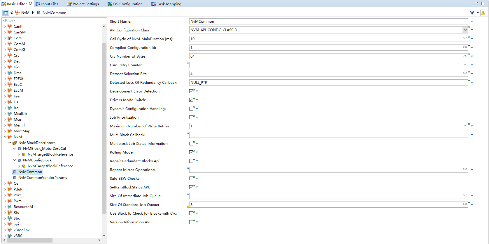
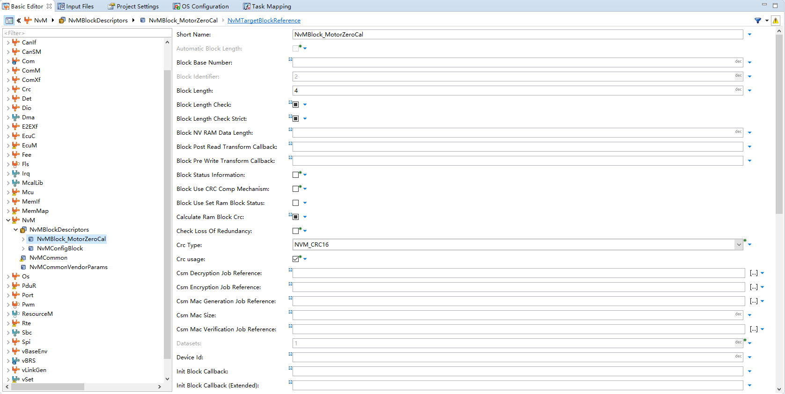
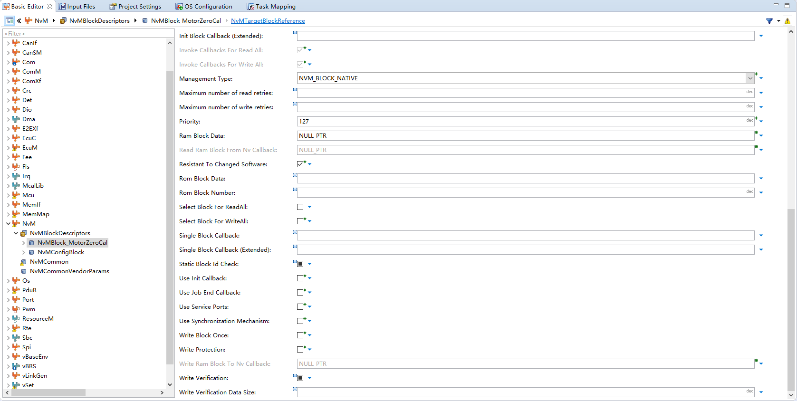
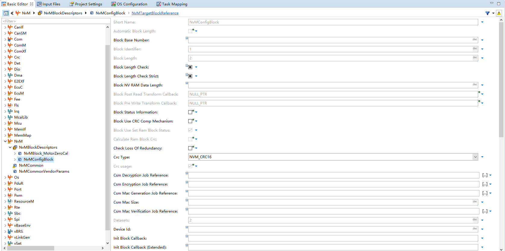
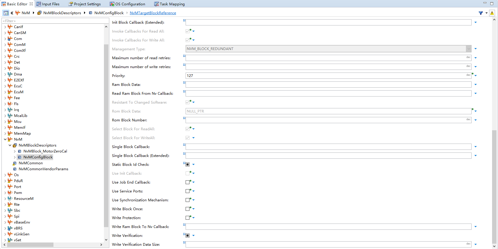
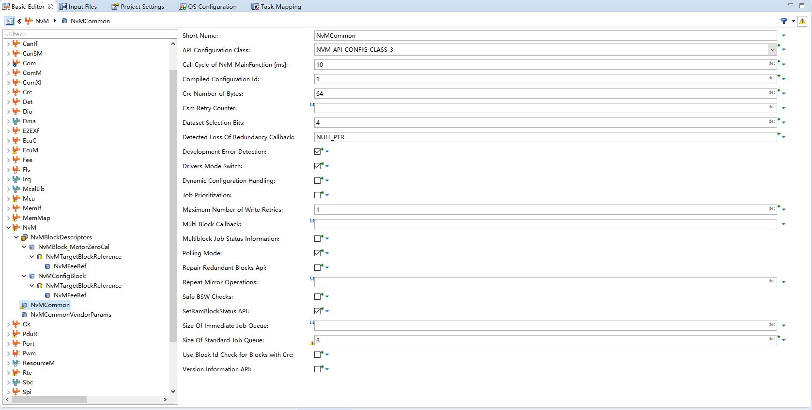

<!--
 * @Author: qinXiong
 * @Date: 2026-08-05 11:34:54
 * @LastEditors: xiong&&2307975018@qq.com
 * @LastEditTime: 2026-08-05 16:28:34
 * @Description: 
-->
# DaVinci 配置：NvM 模块

> 工程：`last364.dpa`（AURIX TC364 + Vector MICROSAR 4.2.2 + Infineon MCAL 20.10.0）
> 模块类型：BSW（非易失存储管理）
> DaVinci 路径：`NvM`
> 配置源文件：`Config/ECUC/last364_NvM_NvM_ecuc.arxml`
> 从属：[返回模块索引](README.md) · [模块参数总指南](../../Config/DaVinci_Motor_Config_Guide.md) · [零位标定文档](../../Guides/MotorZeroCal_DFlash.md)

---

## 1. 模块作用

NvM 管理持久化数据块，本工程用于**电机零位标定角度**（`NvMBlock_MotorZeroCal`）与通用配置块（`NvMConfigBlock`）。上层由 Fls（DFlash）→ Fee（扇区管理）提供存储。

---

## 2. 配置步骤

### 2.1 打开模块

BSW Editor → 模块树选择 `NvM` → `NvMBlockDescriptor` / `NvMCommon`。

📷 图片位 N1：模块树选中 `NvM` 的截图。

### 2.2 NvM 块

| 块 | Block Id | 类型 | 长度 | CRC |
| --- | --- | --- | --- | --- |
| `NvMBlock_MotorZeroCal` | 2 | `NVM_BLOCK_NATIVE` | 4 B | CRC16 |
| `NvMConfigBlock` | 1 | `NVM_BLOCK_REDUNDANT` | 2×2 B | CRC16 |

`NvMCommon`：

| 参数 | 值 |
| --- | --- |
| `NvMPollingMode` | true |
| `NvMMainFunctionPeriod` | 0.01 |
| `NvMDrvModeSwitch` | true |

📷 图片位 N2：NvM 块列表截图。

📷 图片位 N3：`NvMCommon` 参数截图。

---

## 3. 与其它模块的引用关系

| 引用 | 方向 | 说明 |
| --- | --- | --- |
| NvM 块 → Fee 块 | NvM ↔ Fee | `NvMBlock_MotorZeroCal` ↔ `FeeBlock_MotorZeroCal`（块 32） |
| Fee → Fls | Fee ↔ Fls | DFlash 底层驱动 |
| 读写 API | NvM ↔ 应用 | `NvM_ReadBlock/WriteBlock`（StartApp 1 ms 轮询） |

---

## 4. 注意事项（应用使用）

- 上电：等 `Fee_GetStatus()==MEMIF_IDLE` 且 `FeeInitGCState==COMPLETE` 后 `NvM_ReadBlock` 恢复 ANG_BASE。
- 标定成功：`NvM_WriteBlock(NvMBlock_MotorZeroCal, ...)`（在 StartApp 1 ms 任务中排队，不在 MotorTask 中直接调用）。
- 写前 `NvM_CancelJobs` 清队列，写后 `NvM_GetErrorStatus` 确认。
- 零位存不住时：查 Fee 是否 COMPLETE、NvM 块大小/CRC 是否一致、`NvM_WriteBlock` 是否在 1 ms 任务轮询中被处理。

---

## 5. 截图清单（用户自插）

| 图片位 | 建议文件名 | 截图内容 |
| --- | --- | --- |
| N1 | `14_nvm_module_tree.png` | 模块树选中 NvM |
| N2 | `14_nvm_blocks.png` | NvM 块列表 |
| N3 | `14_nvm_common.png` | NvMCommon |

## 6. 相关文档

- [DaVinci_Fee.md](DaVinci_Fee.md) / [DaVinci_Fls.md](DaVinci_Fls.md)（存储链路）
- [MotorZeroCal_DFlash.md](../../Guides/MotorZeroCal_DFlash.md)
- [DaVinci_Motor_Config_Guide.md 第 12 节](../../Config/DaVinci_Motor_Config_Guide.md)
