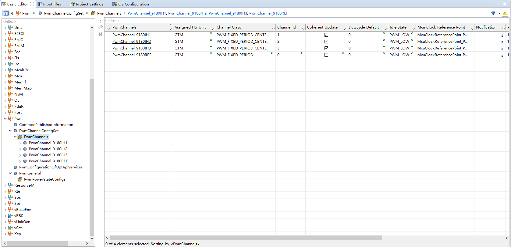
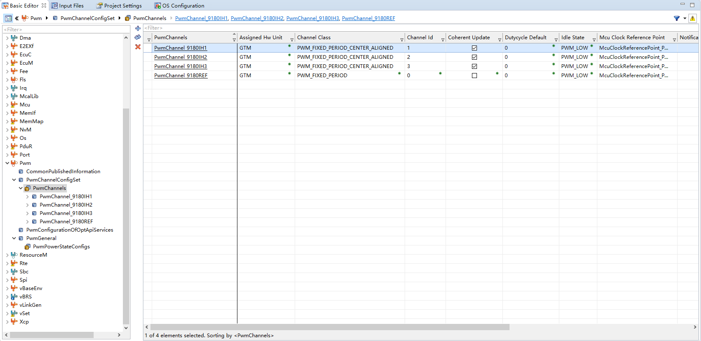
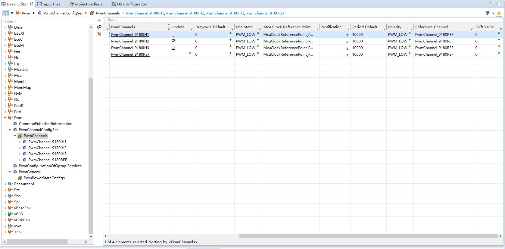
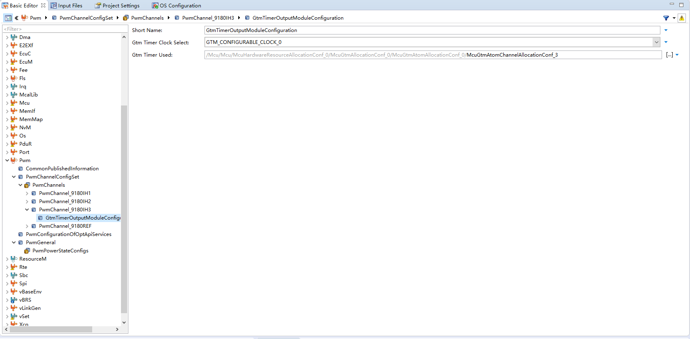
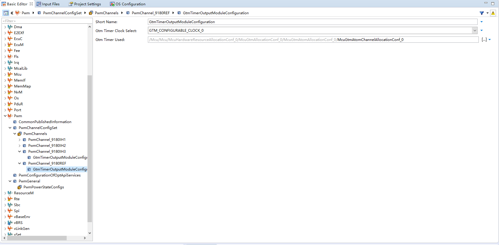
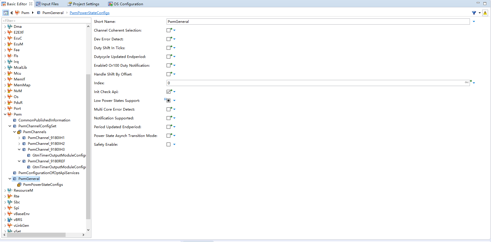

# DaVinci 配置：Pwm 模块（Pwm_17_GtmCcu6）

> 工程：`last364.dpa`（AURIX TC364 + Vector MICROSAR 4.2.2 + Infineon MCAL 20.10.0）
> 模块类型：MCAL（GTM）
> DaVinci 路径：`Pwm > PwmChannelConfigSet`
> 配置源文件：`Config/ECUC/last364_Pwm_17_GtmCcu6_*_ecuc.arxml`
> 从属：[返回模块索引](README.md) · [模块参数总指南](../../Config/DaVinci_Motor_Config_Guide.md) · [架构文档](../../Config/DaVinci_Config_Architecture.md)

---

## 1. 模块作用

本项目 Pwm 模块只做一件事：**初始化 GTM ATOM0 CH0~CH3 的周期与中心对齐方式**（PBCfg 0x2710 = 10000）。

- CH0：参考通道（`PwmChannel_9180REF`，固定周期）；
- CH1/2/3：三相上桥 IH1/2/3，中心对齐、相干更新；
- 下桥 IL1/2/3（ATOM0 CH4/5/6）与死区（CDTM0/DTM4）**不在 DaVinci 配置**，由应用层 `MotorCdd_PwmComplementaryInit()` 直接写 GTM 寄存器。

> FOC 快速环（`MotorFoc_ApplyAtomDuties`）直接写 `GTM_ATOM0_CH1/2/3` 的 SR0/SR1 影子寄存器做 SVPWM 中心对齐更新，不再调用 `Pwm_SetDutyCycle`。

---

## 2. 配置步骤

### 2.1 打开模块

BSW Editor → 模块树选择 `Pwm`（`Pwm_17_GtmCcu6`）→ `PwmChannelConfigSet`。

📷 图片位 W1：模块树选中 `Pwm` 的截图。

### 2.2 通道配置

工程共 4 个通道：

| 通道 | `PwmChannelId` | Class | 周期 | 空闲/极性 | 相干更新 | ATOM 通道 |
| --- | --- | --- | --- | --- | --- | --- |
| `PwmChannel_9180REF` | 0 | `PWM_FIXED_PERIOD` | 10000 | LOW / LOW | false | ATOM0 CH0 |
| `PwmChannel_9180IH1` | 1 | `PWM_FIXED_PERIOD_CENTER_ALIGNED` | 10000 | LOW / LOW | true | ATOM0 CH1 |
| `PwmChannel_9180IH2` | 2 | `PWM_FIXED_PERIOD_CENTER_ALIGNED` | 10000 | LOW / LOW | true | ATOM0 CH2 |
| `PwmChannel_9180IH3` | 3 | `PWM_FIXED_PERIOD_CENTER_ALIGNED` | 10000 | LOW / LOW | true | ATOM0 CH3 |

每个通道的 `GtmTimerOutputModuleConfiguration`：

| 参数 | 值 |
| --- | --- |
| `GtmTimerClockSelect` | `GTM_CONFIGURABLE_CLOCK_0`（100 MHz） |
| `GtmTimerUsed` | `McuGtmAtomChannelAllocationConf_0/1/2/3` |

📷 图片位 W2：4 个 `PwmChannel` 列表截图。

📷 图片位 W3：某个通道的 `GtmTimerOutputModuleConfiguration` 截图。

### 2.3 公共参数

`PwmGeneral` / `PwmConfigurationOfOptApiServices`：

| 参数 | 值 |
| --- | --- |
| `PwmSetDutyCycle` / `PwmSetPeriodAndDuty` / `PwmGetOutputState` | true |
| `PwmDeInitApi` / `PwmInitCheckApi` | true |
| `PwmNotificationSupported` | false |
| `PwmDevErrorDetect` | false |

📷 图片位 W4：`PwmGeneral` 公共参数截图。

---

## 3. 与其它模块的引用关系

| 引用 | 方向 | 说明 |
| --- | --- | --- |
| `PwmMcuClockReferencePoint` | Pwm → Mcu | 时钟参考点必须指向 `McuClockReferencePoint_Pwm`（100 MHz） |
| `GtmTimerUsed` | Pwm → Mcu | ATOM 分配 `McuGtmAtomChannelAllocationConf_0/1/2/3` = `USED_BY_PWM` |
| 周期 10000 | Pwm ↔ Adc | 与 ADC 触发 `GtmTimerCM0Ticks=10000` 严格一致（10 kHz） |
| P02.1~3 ALT1 | Pwm ↔ Port | 输出脚复用模式 |

---

## 4. 注意事项 / 常见错误

- 周期 10000 ticks @100 MHz = 100 µs（10 kHz），与 ADC 触发严格一致；三处同步：`PwmPeriodDefault`、ADC `GtmTimerCM0Ticks`、应用层 `MOTORCDD_ADC_TRIGGER_PERIOD_TICKS`。
- 三通道 `PwmCoherentUpdate = true`，保证三相同拍更新（FOC 需要三相一致性）。
- 不要勾选 `PwmNotificationSupported`（本项目不用 PWM 中断）。
- 下桥没波形不是 Pwm 模块问题，查应用层 GTM CDTM 死区/路径（`CH_CTRL2`、`DTV=200`）与 IL 脚 Port 模式。
- 若 ATOM 通道在 Mcu 里被改成 `USED_BY_ADC`（如 CH1），生成会报通道冲突。

---

## 5. 截图清单（用户自插）

| 图片位 | 建议文件名 | 截图内容 |
| --- | --- | --- |
| W1 | `03_pwm_module_tree.png` | 模块树选中 Pwm |
| W2 | `03_pwm_channels.png` | 4 个 PwmChannel 列表 |
| W3 | `03_pwm_gtm_timer.png` | 通道的 GtmTimerOutputModuleConfiguration |
| W4 | `03_pwm_general.png` | PwmGeneral 公共参数 |

## 6. 相关文档

- [DaVinci_Mcu.md](DaVinci_Mcu.md)（时钟参考点、ATOM 分配）
- [DaVinci_Adc.md](DaVinci_Adc.md)（周期一致性）
- [DaVinci_Port.md](DaVinci_Port.md)（P02.1~6 ALT1）
- [DaVinci_Motor_Config_Guide.md 第 3 节](../../Config/DaVinci_Motor_Config_Guide.md)
