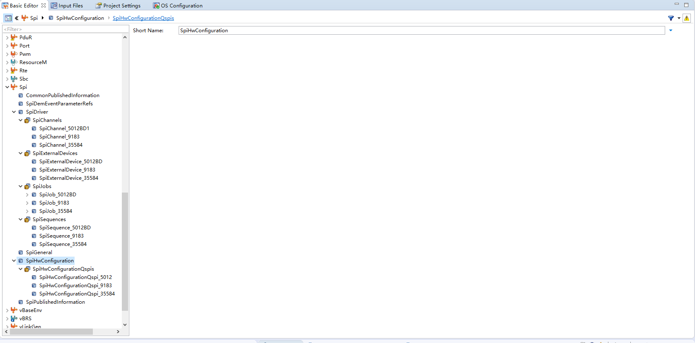
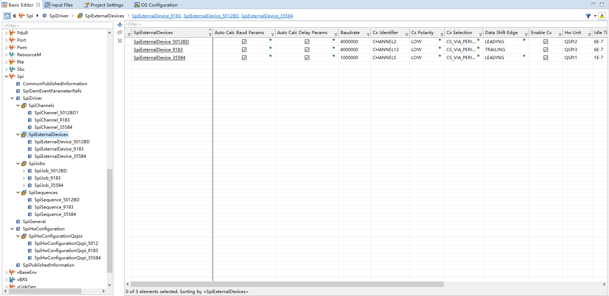
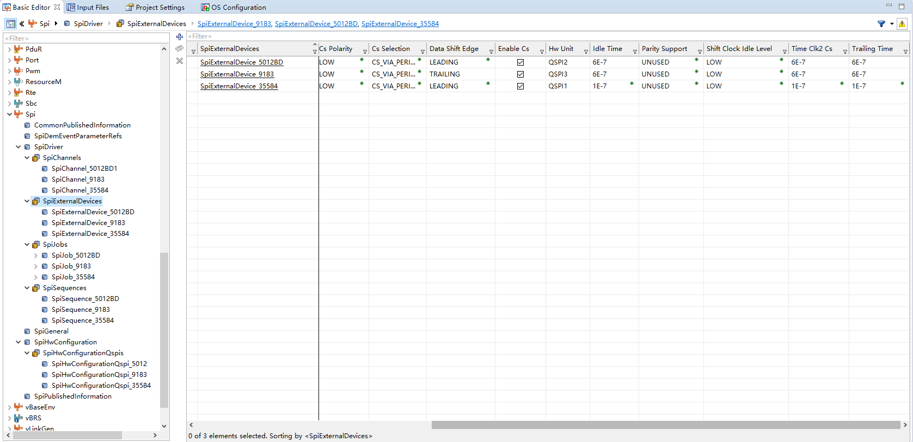
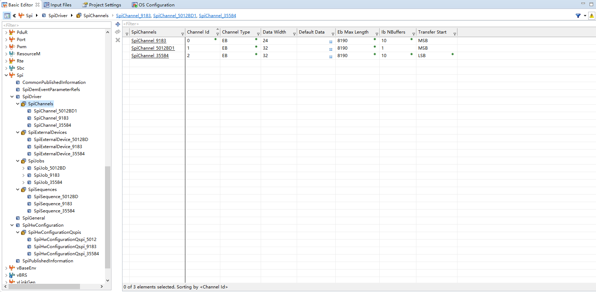
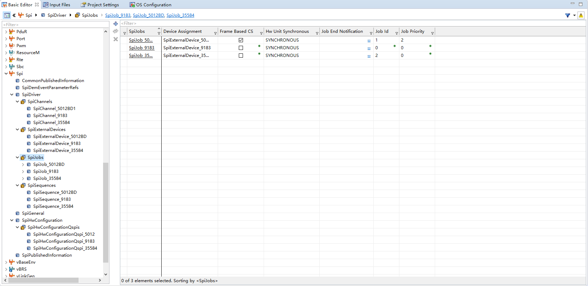
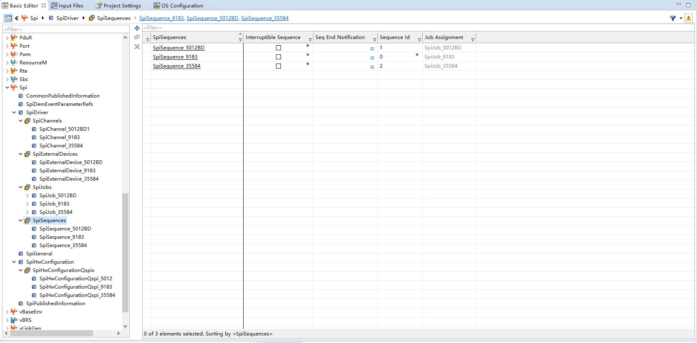

# DaVinci 配置：Spi 模块

> 工程：`last364.dpa`（AURIX TC364 + Vector MICROSAR 4.2.2 + Infineon MCAL 20.10.0）
> 模块类型：MCAL（QSPI）
> DaVinci 路径：`Spi > SpiDriver`
> 配置源文件：`Config/ECUC/last364_Spi_Spi_ecuc.arxml`
> 从属：[返回模块索引](README.md) · [模块参数总指南](../../Config/DaVinci_Motor_Config_Guide.md) · [架构文档](../../Config/DaVinci_Config_Architecture.md)

---

## 1. 模块作用

三个 QSPI 通道各管一路外设：

- **QSPI1 → SBC TLF35584**：1 MHz，32-bit LSB，电源管理；
- **QSPI2 → TLE5012B 角度传感器**：32-bit MSB，4 MHz。应用层**绕过 MCAL**，直接操作 QSPI2 SFR 直读，Spi 配置的作用是让 `Spi_Init` 把 QSPI2 硬件配成与应用常量一致；
- **QSPI3 → TLE9180 栅极驱动**：24-bit MSB，4 MHz，应用层 `Spi_SetupEB + Spi_SyncTransmit` 直发。

---

## 2. 配置步骤

### 2.1 打开模块

BSW Editor → 模块树选择 `Spi` → `SpiDriver`。

📷 图片位 S1：模块树选中 `Spi` 的截图。

### 2.2 通道 / 外设 / Job / Sequence

| 对象 | 参数 | 值 |
| --- | --- | --- |
| `SpiChannel_9183` | `SpiDataWidth` | 24（MSB 先发） |
| `SpiExternalDevice_9183` | `SpiHwUnit` | QSPI3 |
| | `SpiBaudrate` | 4000000（4 MHz） |
| | `SpiCsIdentifier` | `CHANNEL12`（QSPI3 SLSO0，P22.2） |
| | `SpiCsPolarity` | LOW |
| | `SpiDataShiftEdge` | TRAILING |
| | `SpiIdleTime/TrailingTime/SpiTimeClk2Cs` | 6E-7（600 ns） |
| `SpiJob_9183` | `SpiJobId` 0、优先级 0、`SYNCHRONOUS`、非帧基 CS | 挂 `SpiChannel_9183` |
| `SpiSequence_9183` | `SpiSequenceId` 0、不可中断 | 挂 `SpiJob_9183` |
| `SpiChannel_5012BD1` | `SpiDataWidth` | 32（MSB 先发） |
| `SpiExternalDevice_5012BD` | `SpiHwUnit` | QSPI2 |
| | `SpiBaudrate` | 4000000 |
| | `SpiCsIdentifier` | `CHANNEL2`（QSPI2 SLSO2，P14.6） |
| | `SpiCsPolarity` | LOW |
| | `SpiDataShiftEdge` | LEADING |
| | 各延时 | 6E-7 |
| `SpiJob_5012BD` | `SpiJobId` 1、优先级 2、`SpiFrameBasedCS = true` | 挂 `SpiChannel_5012BD1` |
| `SpiSequence_5012BD` | `SpiSequenceId` 1 | 挂 `SpiJob_5012BD` |
| `SpiChannel_35584` | `SpiDataWidth` | 32（LSB 先发） |
| `SpiExternalDevice_35584` | `SpiHwUnit` | QSPI1 |
| | `SpiBaudrate` | 1000000（1 MHz） |
| | `SpiCsIdentifier` | `CHANNEL5`（QSPI1 SLSO，P03.2） |
| | `SpiDataShiftEdge` | LEADING |
| | 各延时 | 1E-7 |
| `SpiJob_35584` | `SpiJobId` 2、优先级 0 | 挂 `SpiChannel_35584` |
| `SpiSequence_35584` | `SpiSequenceId` 2 | 挂 `SpiJob_35584` |

📷 图片位 S2：3 个 `SpiExternalDevice` 列表截图。

📷 图片位 S3：`SpiChannel`（9183/5012BD1/35584）截图。

📷 图片位 S4：`SpiJob` / `SpiSequence` 列表截图。

### 2.3 硬件配置（`SpiHwConfiguration`）

| QSPI | 参数 | 值 |
| --- | --- | --- |
| QSPI1 | `SpiHWPinMRSTQspix` | `MRST1B_PORT11_PIN3` |
| QSPI2 | `SpiHWPinMRSTQspix` | `MRST2B_PORT15_PIN7` |
| QSPI3 | `SpiHWPinMRSTQspix` | `MRST3D_PORT22_PIN1` |
| 全部 | `SpiJobQueueLengthQspix` = 2、`SpiSLSO0StrobeDelay` = 2 | — |

📷 图片位 S5：`SpiHwConfiguration` 截图。

---

## 3. 与其它模块的引用关系

| 引用 | 方向 | 说明 |
| --- | --- | --- |
| CS/引脚 | Spi ↔ Port | QSPI1→P03.2-7、QSPI2→P14.6/P15.5-7、QSPI3→P22.0-3，与 Port ALT 一致 |
| `SpiChannel_35584` | Spi → Sbc | Sbc 模块 `SbcSpiChannelRef` / `SbcSpiSequenceRef` |
| QSPI2/QSPI3 归属 | Spi ↔ ResourceM | Core1；QSPI1 归 Core0 |
| `Spi_Init` 调用 | Spi ↔ EcuM | Core0/Core1 的 `EcuM_AL_DriverInitOne` 各调用一次 |

---

## 4. 注意事项 / 使用方式

- TLE9180：应用层 `Tle9180_Port_SpiExchange()` 用 `Spi_SetupEB(SpiChannel_9183) + Spi_SyncTransmit(SpiSequence_9183)`，24-bit 帧（掩码 0x00FFFFFF）。
- TLE5012B：应用层 `Tle5012bd_Spi.c` **绕过 MCAL**，直接操作 QSPI2 SFR（BACON：32-bit、MSB、CS=SLSO2、LAST=1、8 MHz 时序）。`SpiJob_5012BD` 的作用是让 `Spi_Init` 把 QSPI2 的 ECON/SSOC/GLOBALCON 配置成与直读代码一致（应用层再按 `TLE5012BD_QSPI2_`* 常量校验/重写）。
- SBC TLF35584：`SpiSequence_35584`（QSPI1，1 MHz，32-bit LSB）。
- 多核：ResourceM 中 QSPI2/QSPI3 归属 Core1，QSPI1 归属 Core0；`Spi_Init` 在 Core0 与 Core1 的 `EcuM_AL_DriverInitOne` 中各调用一次。
- `SpiLevelDelivered = 0`，`SpiSyncTransmitTimeoutDuration = 65535`。
- 角度读不到时：查 QSPI2 CS 极性/32-bit BACON（CS=SLSO2、LAST=1）；`Spi_Init` 后应用重写 ECON/SSOC；P14.6 是否 ALT3 且初始 HIGH。

---

## 5. 截图清单（用户自插）

| 图片位 | 建议文件名 | 截图内容 |
| --- | --- | --- |
| S1 | `05_spi_module_tree.png` | 模块树选中 Spi |
| S2 | `05_spi_external_devices.png` | 3 个 SpiExternalDevice |
| S3 | `05_spi_channels.png` | SpiChannel 9183/5012BD1/35584 |
| S4 | `05_spi_job_sequence.png` | SpiJob/SpiSequence |
| S5 | `05_spi_hw_config.png` | SpiHwConfiguration |

## 6. 相关文档

- [DaVinci_Port.md](DaVinci_Port.md)（QSPI 引脚）
- [DaVinci_ResourceM.md](DaVinci_ResourceM.md)（核归属）
- [DaVinci_Sbc.md](DaVinci_Sbc.md)（`SpiChannel_35584` 引用）
- [DaVinci_Motor_Config_Guide.md 第 5 节](../../Config/DaVinci_Motor_Config_Guide.md)
