# DaVinci 配置：Adc 模块

> 工程：`last364.dpa`（AURIX TC364 + Vector MICROSAR 4.2.2 + Infineon MCAL 20.10.0）
> 模块类型：MCAL（EVADC）
> DaVinci 路径：`Adc > AdcConfigSet`
> 配置源文件：`Config/ECUC/last364_Adc_Adc_ecuc.arxml`
> 从属：[返回模块索引](README.md) · [模块参数总指南](../DaVinci_Motor_Config_Guide%20copy.md) · [架构文档](../DaVinci_Config_Architecture.md)

---

## 1. 模块作用

Adc 模块是 10 kHz 电机快速环的“采样入口”：

- EVADC G0/G2/G3 同步组：相电流（VO1/VO2/VO3）与母线电压（VRO/VINV）采样；
- GTM ATOM0 CH7 硬件触发（10000 ticks @100 MHz = 10 kHz）；
- 转换完成走 ADC0 SR0 中断（CAT1，优先级 83，CPU1）→ 通知函数 `Adc_9183SenseVo1andVro_Notification` → `MotorCdd_AdcRunFastLoop`；
- ADC8（G8CH3）做 SBC 电池电压周期性检测（软件触发，Core0）。

---

## 2. 配置步骤

### 2.1 打开模块

BSW Editor → 模块树选择 `Adc` → `AdcConfigSet`。

📷 图片位 A1：模块树选中 `Adc` 的截图。

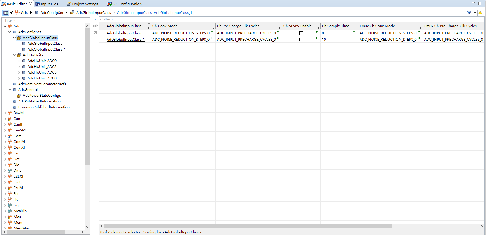

### 2.2 硬件单元

`AdcConfigSet > AdcHwUnit*`：

| 硬件单元 | 同步角色 | `AdcPrescale` | 用途 |
| --- | --- | --- | --- |
| `AdcHwUnit_ADC0` | `ADC_SYNC_MASTER` | 4 | 相电流 VO1 + 母线 VRO（G0） |
| `AdcHwUnit_ADC2` | `ADC_SYNC_SLAVE` | 4 | 相电流 VO2 + VINV（G2） |
| `AdcHwUnit_ADC3` | `ADC_SYNC_SLAVE` | 4 | 相电流 VO3（G3） |
| `AdcHwUnit_ADC8` | `ADC_STAND_ALONE` | 4 | SBC 电池检测（G8CH3，软件触发） |

输入类（`AdcGlobalInputClass_1` / 各 `AdcHwUnitInputClass`）：

| 参数 | 值 |
| --- | --- |
| `AdcChSampleTime` | 10 |
| `AdcChPreChargeClkCycles` | `ADC_INPUT_PRECHARGE_CYCLES_0` |
| `AdcChConvMode` | `ADC_NOISE_REDUCTION_STEPS_0` |

📷 图片位 A2：硬件单元（ADC0/2/3/8）截图。

AdcHwUnit_ADC0:
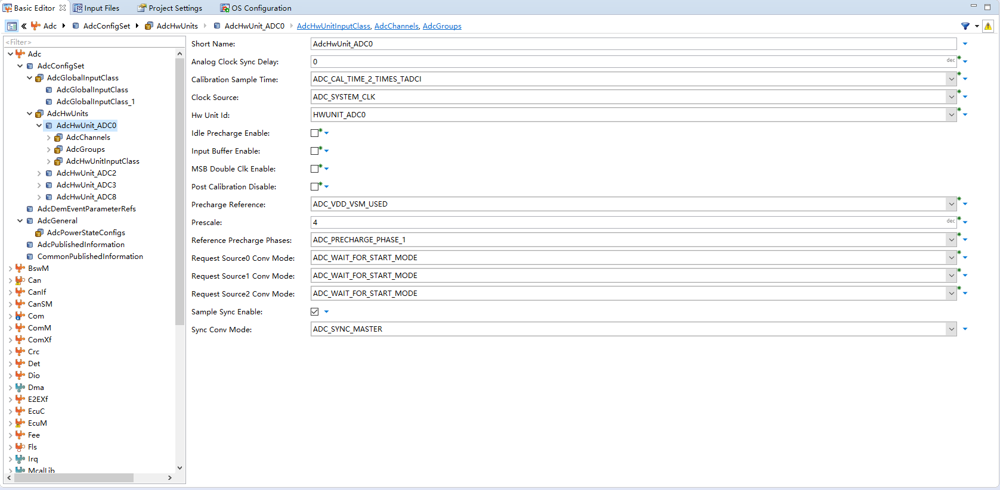

AdcChannels:
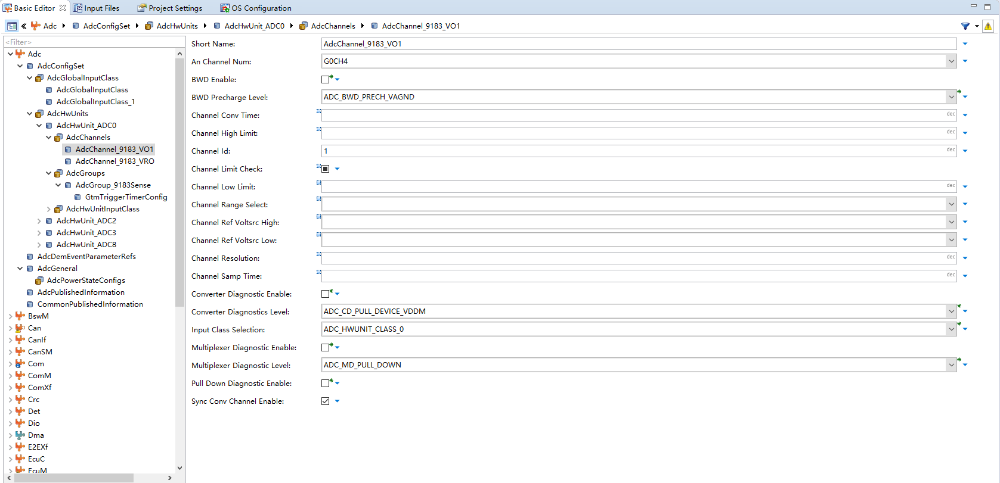
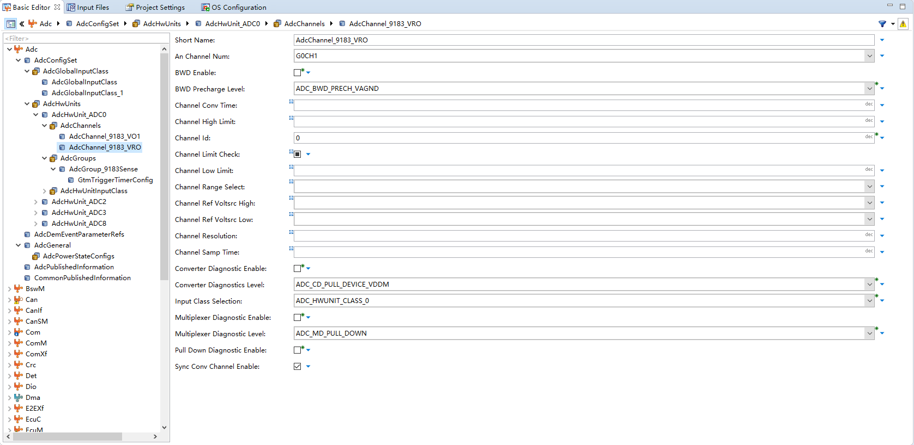

AdcGroups:
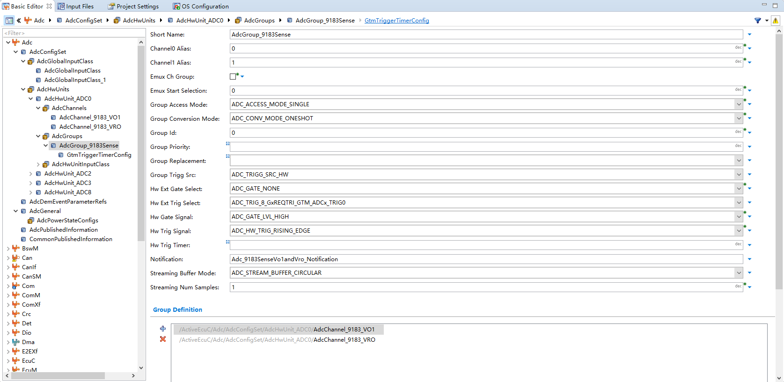

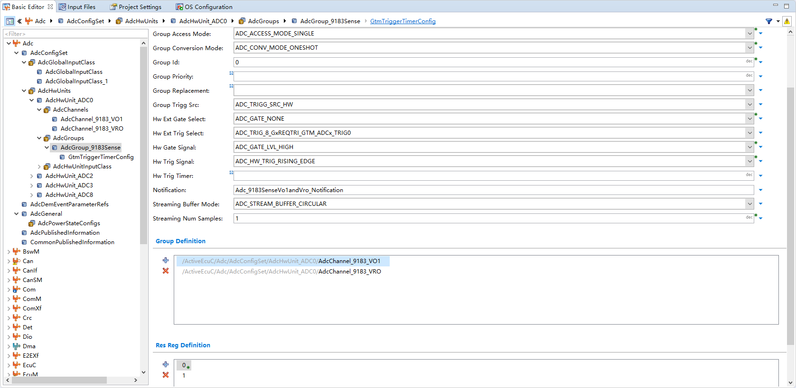

AdcHwUnit_ADC2:
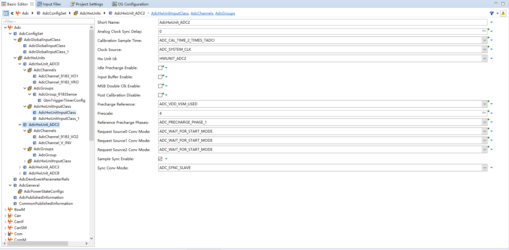
AdcChannels:
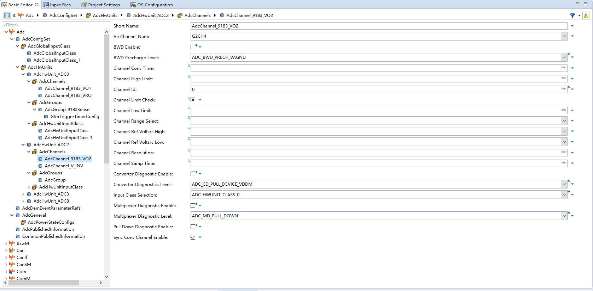
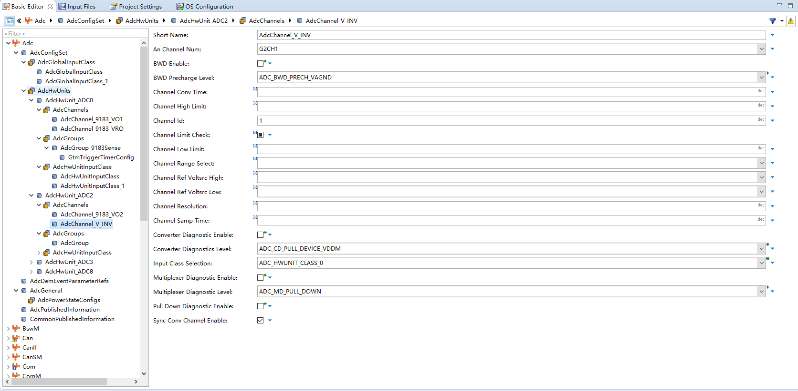
AdcGroups:
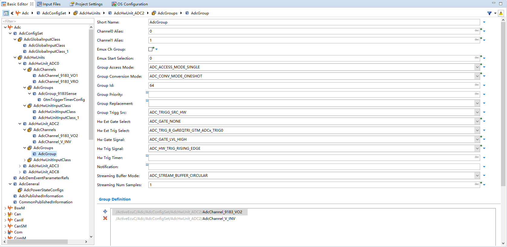

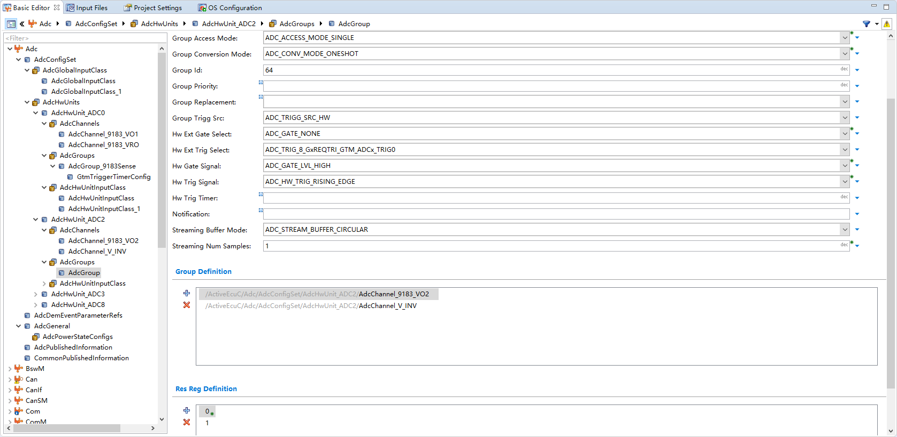
AdcHwUnit_ADC3:
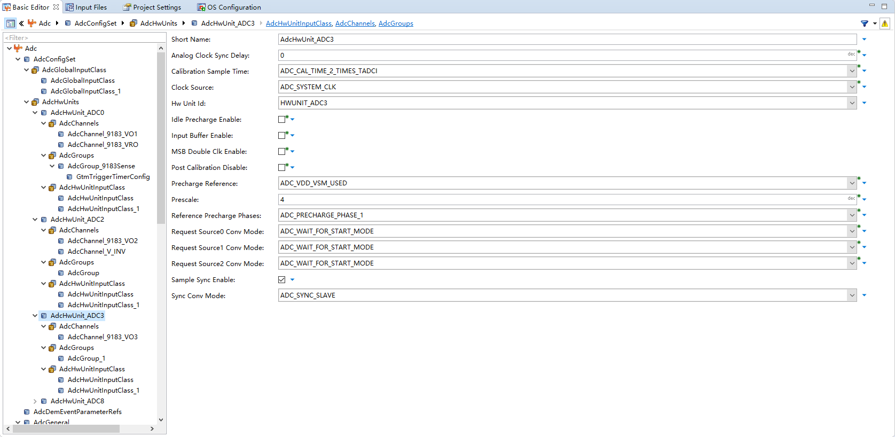
AdcChannels:
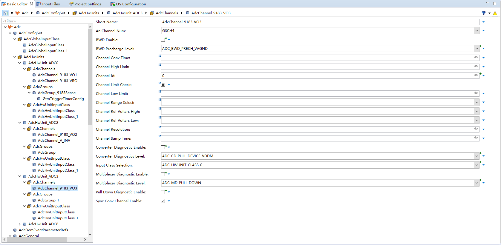
AdcGroups:
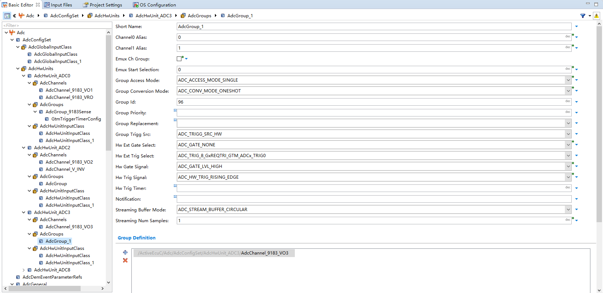

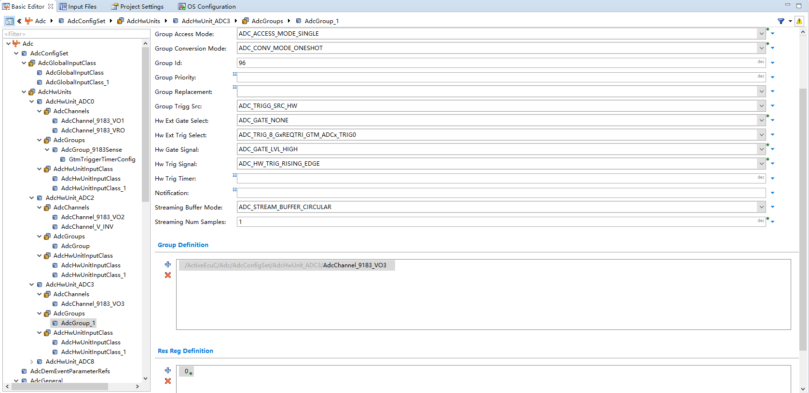
📷 图片位 A3：输入类参数截图。

其他组类似ADC0:
AdcHwUinitInputClass:
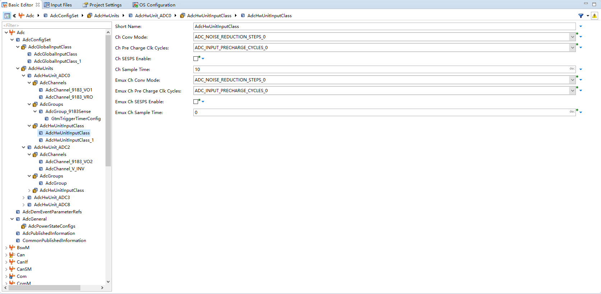

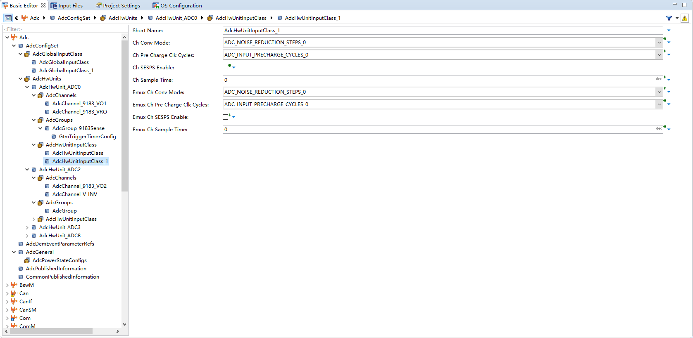

### 2.3 采样组

#### G0：`AdcGroup_9183Sense`（主组，groupId 0）

| 参数 | 值 |
| --- | --- |
| `AdcGroupTriggSrc` | `ADC_TRIGG_SRC_HW` |
| `AdcHwExtTrigSelect` | `ADC_TRIG_8_GxREQTRI_GTM_ADCx_TRIG0` |
| `AdcHwTrigSignal` | `ADC_HW_TRIG_RISING_EDGE` |
| `AdcNotification` | `Adc_9183SenseVo1andVro_Notification` |
| `AdcGroupAccessMode` | `ADC_ACCESS_MODE_SINGLE` |
| `AdcGroupConversionMode` | `ADC_CONV_MODE_ONESHOT` |
| 通道 | `AdcChannel_9183_VO1`（G0CH4，chId1）、`AdcChannel_9183_VRO`（G0CH1，chId0） |
| 结果寄存器 | RES0=VO1、RES1=VRO（`AdcResRegDefinition` 0/1） |

`GtmTriggerTimerConfig`（挂在 G0 组下）：

| 参数 | 值 |
| --- | --- |
| `GtmTimerClockSelect` | `GTM_CONFIGURABLE_CLOCK_0` |
| `GtmTimerTimePeriod` | 100（µs，周期 100 µs） |
| `GtmTimerCM0Ticks` | 10000 |
| `GtmTimerUsed` | `McuGtmAtomChannelAllocationConf_7`（ATOM0 CH7） |

#### G2：`AdcGroup`（groupId 64，同步从机）

- 通道：`AdcChannel_9183_VO2`（G2CH4）、`AdcChannel_V_INV`（G2CH1）
- 硬件触发同上（`ADC_TRIG_8_GxREQTRI_GTM_ADCx_TRIG0`），与主组同步转换。

#### G3：`AdcGroup_1`（groupId 96，同步从机）

- 通道：`AdcChannel_9183_VO3`（G3CH4）

#### G8：`AdcGroup_2`（groupId 256）

- 通道：`AdcChannel_SS_BatteryCheck`（G8CH3）
- `AdcGroupTriggSrc = ADC_TRIGG_SRC_SW`（软件触发，周期性检测）

📷 图片位 A4：G0 组 + `GtmTriggerTimerConfig` 截图。

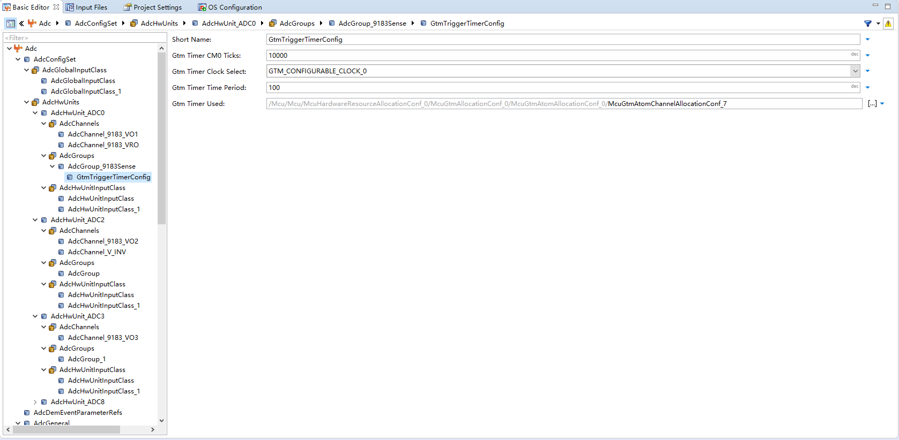
📷 图片位 A5：G2/G3/G8 组截图。

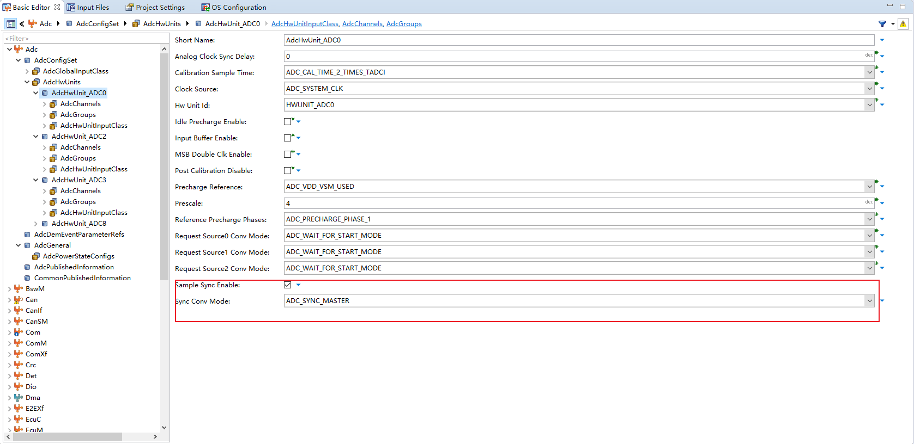
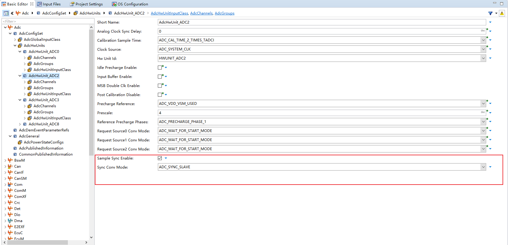
其他组类似

### 2.4 公共参数

| 参数 | 值 |
| --- | --- |
| `AdcSyncConvEnable` | true（G0/G2/G3 同步） |
| `AdcResultHandlingImplementation` | `ADC_INTERRUPT_MODE_RESULT_HANDLING` |
| `AdcResultAlignment` | `ADC_ALIGN_RIGHT` |
| `AdcGrpNotifCapability` / `AdcHwTriggerApi` / `AdcReadGroupApi` | true |
| `AdcMaxChannelResolution` | 12 |
| `AdcRuntimeApiMode` / `AdcInitDeInitApiMode` | `ADC_MCAL_SUPERVISOR` |

📷 图片位 A6：`AdcGeneral` 公共参数截图。

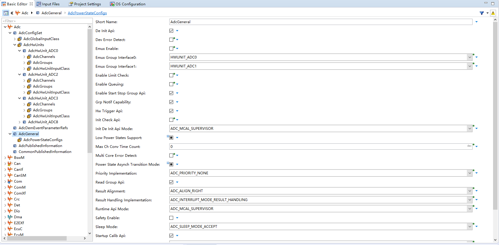

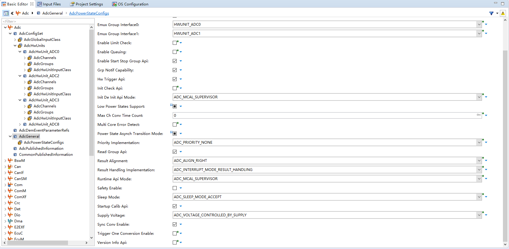
---

## 3. 与其它模块的引用关系

| 引用 | 方向 | 说明 |
| --- | --- | --- |
| `GtmTriggerTimerConfig` | Adc → Mcu | `GtmTimerUsed = McuGtmAtomChannelAllocationConf_7`（ATOM0 CH7） |
| `ADC_TRIG_8` | Adc ↔ Mcu | 与 `GtmTriggerForAdc_0 = TRIG_8` 对应 |
| `AdcNotification` | Adc ↔ 应用 | 通知函数名必须与应用实现一致（`Adc_9183SenseVo1andVro_Notification`） |
| ADC0 SR0 中断 | Adc ↔ Irq ↔ Os | Irq 配 CAT1/83/CPU1，Os 登记 `AdcIsr_G0` |
| G0/G2/G3 归属 | Adc ↔ ResourceM | ResourceM 归 Core1；G8 归 Core0 |
| 周期 10000 | Adc ↔ Pwm | 与 Pwm 周期严格一致 |

---

## 4. 注意事项 / 多核初始化（关键！）

- `ResourceM` 中 G0/G2/G3 归属 **Core1**，G8 归属 **Core0**。
- Core0 的 `EcuM_AL_DriverInitOne` 只初始化 ADC8（`Adc_Init` + `IrqAdc_Init` + `SRC_VADC_G0_SR0.SRE=1` + `Adc_TriggerStartupCal`）。
- Core1 的 `MotorCdd_AdcInit()` 会**再次**调用 `Adc_Init(&Adc_Config)`（否则 Core1 侧运行 `Adc_`* 会报 ADC_UNINIT），然后：
  1. `Adc_SetupResultBuffer(AdcGroup_9183Sense, buf, 6)`（MCAL ISR 用 6 slot）
  2. `Adc_EnableHardwareTrigger(AdcGroup_9183Sense)`
  3. `Adc_EnableGroupNotification(AdcGroup_9183Sense)`
- ADC0 SR0 中断：`Irq` 模块 `IrqAdc0SR0Cat=CAT1`、`Prio=83`、`Tos=CPU1`，OS 中登记为 `AdcIsr_G0`。
- 采样点默认 5000 ticks（周期中心，避开开关沿），可用 UDE 通过 `MotorCdd_AdcSetTriggerTick()` 调整（限幅 400~9600）。
- 常见故障“ADC 无数据/无中断”：查 ResourceM 归属、Core1 二次初始化、`SRC_VADC_G0_SR0.SRE=1`、CH7 `USED_BY_ADC`、通知名一致。

---

## 5. 应用层换算（了解即可）

- 电流：`i = (VRO − VOx − offset) × 0.0310885`（分流电阻+增益）
- 母线：`VINV × 0.0095238`，`VRO × 0.0012210`
- 零位 offset：PWM 关断时累计 100 拍平均值（`MotorCdd_AdcCurrentOffsetReady`）

---

## 6. 截图清单（用户自插）

| 图片位 | 建议文件名 | 截图内容 |
| --- | --- | --- |
| A1 | `04_adc_module_tree.png` | 模块树选中 Adc |
| A2 | `04_adc_hw_units.png` | 硬件单元 ADC0/2/3/8 |
| A3 | `04_adc_input_class.png` | 输入类参数 |
| A4 | `04_adc_group_g0.png` | G0 组 + GtmTriggerTimer |
| A5 | `04_adc_g2_g3_g8.png` | G2/G3/G8 组 |
| A6 | `04_adc_general.png` | 公共参数 |

## 7. 相关文档

- [DaVinci_Mcu.md](DaVinci_Mcu.md)（GTM 触发与 ATOM CH7）
- [DaVinci_Pwm.md](DaVinci_Pwm.md)（周期一致）
- [DaVinci_Irq.md](DaVinci_Irq.md)（ADC0 SR0 中断）
- [DaVinci_ResourceM.md](DaVinci_ResourceM.md)（核归属）
- [DaVinci_Motor_Config_Guide copy.md 第 4 节](../DaVinci_Motor_Config_Guide%20copy.md)
