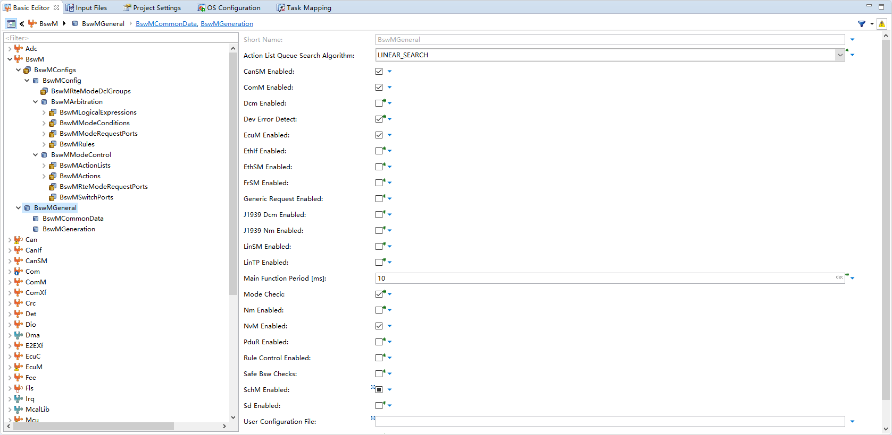
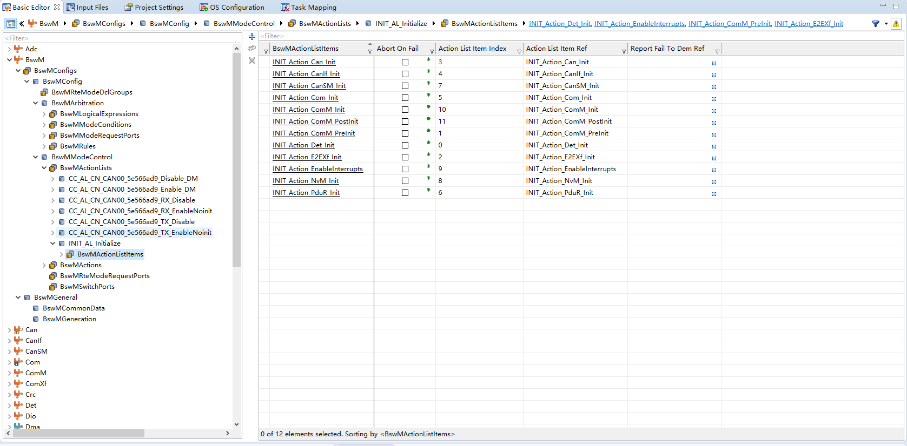
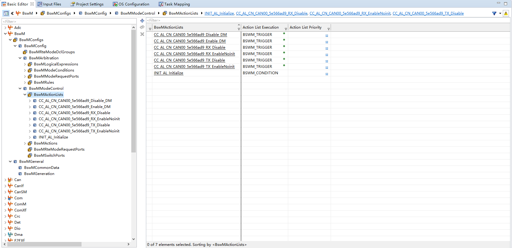

<!--
 * @Author: qinXiong
 * @Date: 2026-08-05 11:34:06
 * @LastEditors: xiong&&2307975018@qq.com
 * @LastEditTime: 2026-08-05 16:09:18
 * @Description: 
-->
# DaVinci 配置：BswM 模块

> 工程：`last364.dpa`（AURIX TC364 + Vector MICROSAR 4.2.2 + Infineon MCAL 20.10.0）
> 模块类型：BSW（模式管理）
> DaVinci 路径：`BswM`
> 配置源文件：`Config/ECUC/last364_BswM_BswM_ecuc.arxml`
> 从属：[返回模块索引](README.md) · [模块参数总指南](../DaVinci_Motor_Config_Guide%20copy.md) · [架构文档](../DaVinci_Config_Architecture.md)

---

## 1. 模块作用

BswM 做两件事：

1. **初始化动作表**：按顺序调用各 BSW 模块的 Init；
2. **CAN 通道规则**：根据 `CanSMIndication` 使能/停止 Com 的 IPdu 组（TX/RX/诊断）。

---

## 2. 配置步骤

### 2.1 打开模块

BSW Editor → 模块树选择 `BswM` → `BswMModeControl`。

📷 图片位 B1：模块树选中 `BswM` 的截图。

### 2.2 初始化动作表

`BswMModeControl > BswMInitActionListRef = INIT_AL_Initialize`，`BswMActionListExecution = BSWM_CONDITION`，动作顺序：

`Det_Init → EnableInterrupts → ComM_PreInit → E2EXf_Init → Can_Init → CanIf_Init → Com_Init → PduR_Init → CanSM_Init → ComM_Init → ComM_PostInit → NvM_Init`

📷 图片位 B2：`INIT_AL_Initialize` 动作表截图。

### 2.3 CAN 通道规则

| 规则 | 条件 | 动作 |
| --- | --- | --- |
| `CC_CN_CAN00_5e566ad9_RX` | `CanSMIndication ≠ NO_COMMUNICATION` | 使能 `MyECU_oCAN00_Rx` PDU 组 |
| `CC_CN_CAN00_5e566ad9_TX` | `CanSMIndication = FULL_COMMUNICATION` | 使能 `MyECU_oCAN00_Tx` PDU 组 |
| `CC_CN_CAN00_5e566ad9_RX_DM` | `CanSMIndication = FULL_COMMUNICATION` | 使能 RX 诊断（DM） |

📷 图片位 B3：CAN 通道规则截图。

---

## 3. 与其它模块的引用关系

| 引用 | 方向 | 说明 |
| --- | --- | --- |
| 初始化动作表 | BswM → BSW | Det/ComM/E2EXf/Can/CanIf/Com/PduR/CanSM/NvM 的 Init 调用 |
| `CanSMIndication` | BswM ↔ CanSM | 规则条件 |
| IPdu 组 | BswM ↔ Com | 使能 `MyECU_oCAN00_Rx/Tx` 组 |

---

## 4. 注意事项

- 电机调试帧（0x511）不走 Com 发送：`MotorFoc_OpenLoopCan_Init/Transmit()` 中先 `Com_IpduGroupStop(MyECU_oCAN00_Tx_1ae5d671)` 停掉 Com 组，再 `CanIf_Transmit` 直发，避免与 Com 的 0x511 PDU 冲突。
- 因此 BswM 的 TX PDU 组使能规则主要服务于 Com 组内的其他报文（0x200 等）。
- 若 0x511 与 Com 周期发送冲突（丢帧/发不出），先查 `Com_IpduGroupStop` 是否执行、PDU 组名字是否一致。

---

## 5. 截图清单（用户自插）

| 图片位 | 建议文件名 | 截图内容 |
| --- | --- | --- |
| B1 | `10_bswm_module_tree.png` | 模块树选中 BswM |
| B2 | `10_bswm_init_action.png` | 初始化动作表 |
| B3 | `10_bswm_can_rules.png` | CAN 通道规则 |

## 6. 相关文档

- [DaVinci_Can.md](DaVinci_Can.md) / [DaVinci_CanIf.md](DaVinci_CanIf.md) / [DaVinci_Com.md](DaVinci_Com.md)（CAN 链路）
- [DaVinci_Motor_Config_Guide copy.md 第 10 节](../DaVinci_Motor_Config_Guide%20copy.md)
