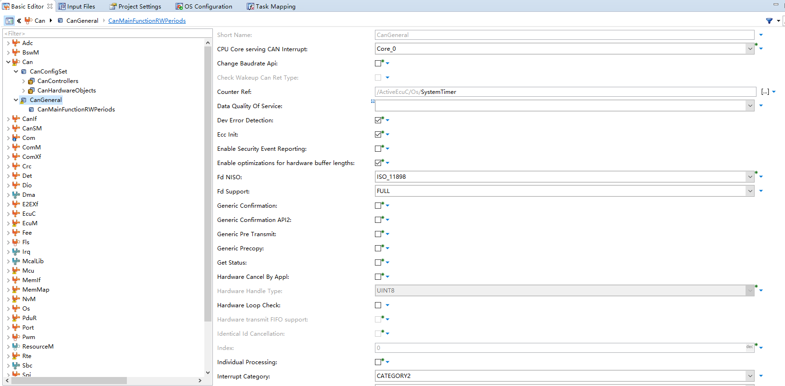
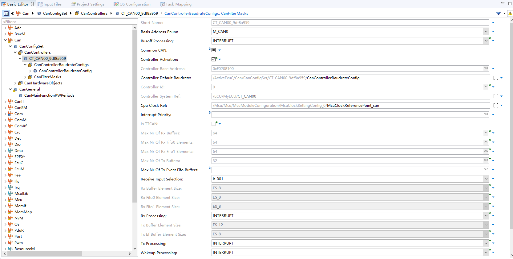
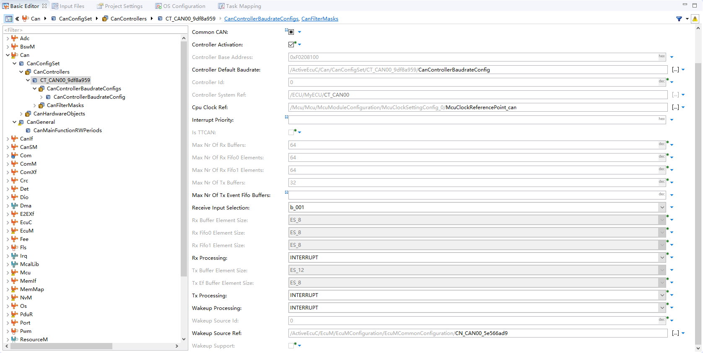
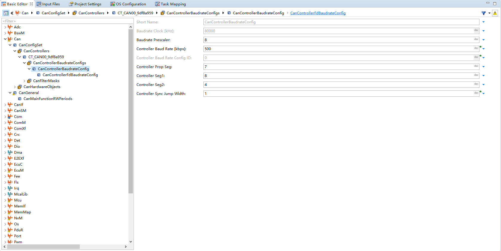
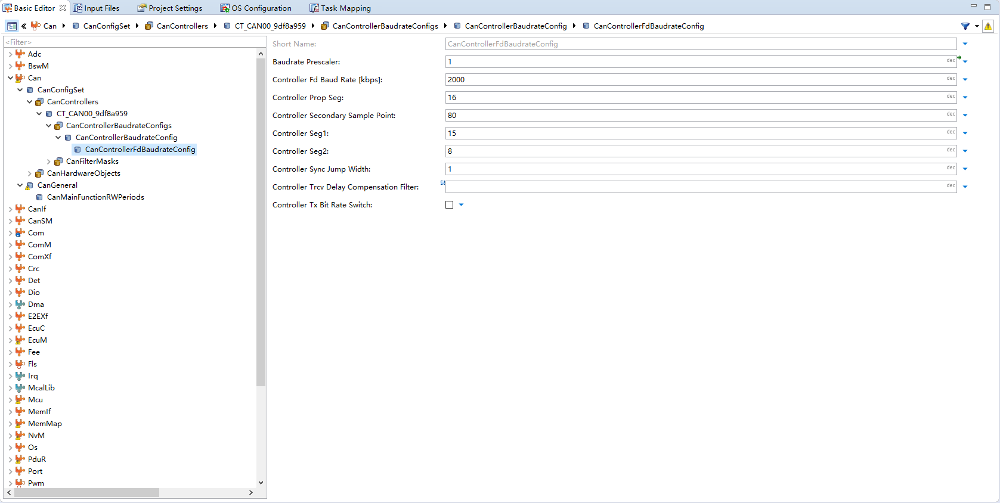

<!--
 * @Author: qinXiong
 * @Date: 2026-08-05 11:34:44
 * @LastEditors: xiong&&2307975018@qq.com
 * @LastEditTime: 2026-08-05 16:13:12
 * @Description: 
-->
# DaVinci 配置：Can 模块

> 工程：`last364.dpa`（AURIX TC364 + Vector MICROSAR 4.2.2 + Infineon MCAL 20.10.0）
> 模块类型：BSW（MCAN 驱动）
> DaVinci 路径：`Can > CanConfigSet`
> 配置源文件：`Config/ECUC/last364_Can_Can_ecuc.arxml`
> 从属：[返回模块索引](README.md) · [模块参数总指南](../DaVinci_Motor_Config_Guide%20copy.md) · [架构文档](../DaVinci_Config_Architecture.md)

---

## 1. 模块作用

Can 模块配置 MCAN0 控制器：基地址、波特率（经典 500 k / FD 2 M）、收发处理方式（中断）、核归属。上层由 CanIf/Com 承载 0x511 调试帧与 0x200/0x210 报文。

---

## 2. 配置步骤

### 2.1 打开模块

BSW Editor → 模块树选择 `Can` → `CanConfigSet > CT_CAN00_9df8a959`。

📷 图片位 C1：模块树选中 `Can` 的截图。

### 2.2 控制器参数

| 参数 | 值 |
| --- | --- |
| `CanControllerBaseAddress` / `CanBasisAddressEnum` | 4028662016 / `M_CAN0` |
| 波特率 | 500 kbps（`CanControllerBaudRate=500`，时钟 80 MHz，Prescaler=8，PropSeg=7，Seg1=8，Seg2=4，SJW=1） |
| FD 波特率 | 2000 kbps（Prescaler=1，PropSeg=16，Seg1=15，Seg2=8，SSP=80） |
| `CanFdSupport` | `FULL` |
| Rx/Tx/Busoff 处理 | INTERRUPT |
| `CanUseCore` | `Core_0` |

📷 图片位 C2：控制器 `CT_CAN00_9df8a959` 参数截图。

📷 图片位 C3：经典/FD 波特率位时间参数截图。

---

## 3. 与其它模块的引用关系

| 引用 | 方向 | 说明 |
| --- | --- | --- |
| `CanCpuClockRef` | Can → Mcu | 80 MHz 时钟参考点（`McuClockReferencePoint_can`） |
| PDU 路由 | Can ↔ CanIf ↔ PduR ↔ Com | 0x511/0x200/0x210 报文链路 |
| CAN0 SR0 中断 | Can ↔ Irq ↔ Os | `CanIsr_0`（CPU0，OS 优先级 60） |

---

## 4. 注意事项

- 0x511 是 CAN FD（DLC 32），总线另一端必须支持 FD 且仲裁波特率 500 k、数据段 2 M。
- 若总线收发器未使能（NSTB/EN 脚初始电平不对），CAN 收发会失败，先查 Port/Dio 的 P20.6/P20.9。
- 改波特率后要同步检查 CanIf/Com 侧的时序与对端总线配置。

---

## 5. 截图清单（用户自插）

| 图片位 | 建议文件名 | 截图内容 |
| --- | --- | --- |
| C1 | `11_can_module_tree.png` | 模块树选中 Can |
| C2 | `11_can_controller.png` | 控制器参数 |
| C3 | `11_can_fd.png` | 波特率/FD 位时间 |

## 6. 相关文档

- [DaVinci_CanIf.md](DaVinci_CanIf.md) / [DaVinci_Com.md](DaVinci_Com.md)（PDU/信号）
- [DaVinci_Irq.md](DaVinci_Irq.md)（CAN0 中断）
- [DaVinci_Mcu.md](DaVinci_Mcu.md)（`McuClockReferencePoint_can`）
- [DaVinci_Motor_Config_Guide copy.md 第 11 节](../DaVinci_Motor_Config_Guide%20copy.md)
