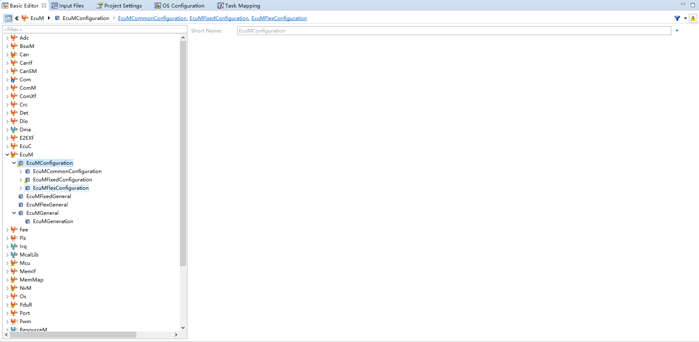
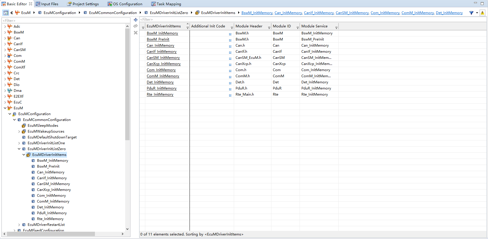
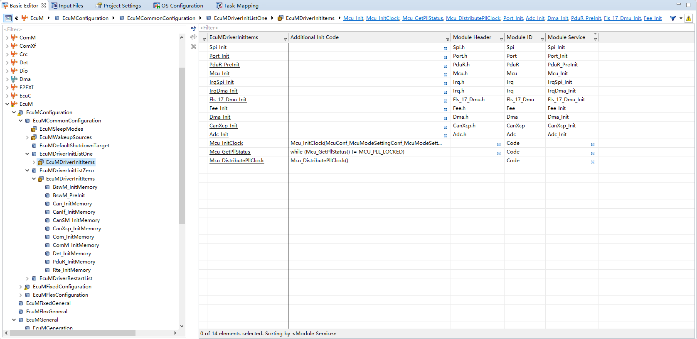
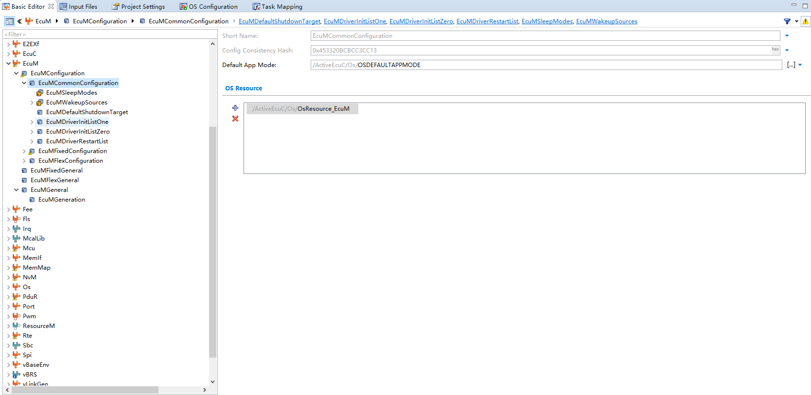
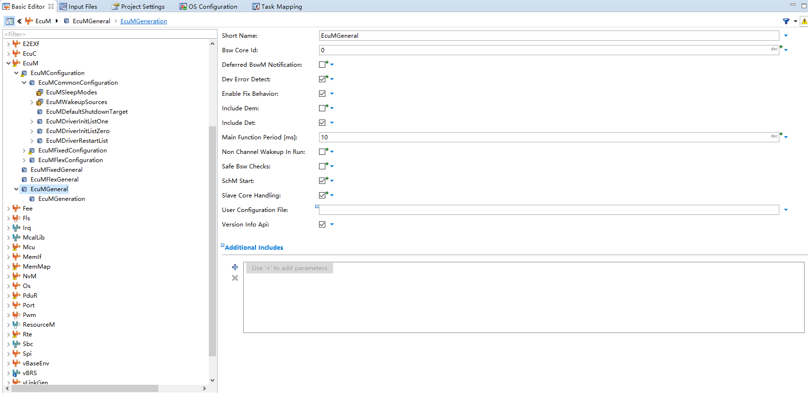

# DaVinci 配置：EcuM 模块

> 工程：`last364.dpa`（AURIX TC364 + Vector MICROSAR 4.2.2 + Infineon MCAL 20.10.0）
> 模块类型：BSW（ECU 状态管理）
> DaVinci 路径：`EcuM`
> 配置源文件：`Config/ECUC/last364_EcuM_EcuM_ecuc.arxml`
> 从属：[返回模块索引](README.md) · [模块参数总指南](../DaVinci_Motor_Config_Guide%20copy.md) · [架构文档](../DaVinci_Config_Architecture.md)

---

## 1. 模块作用

EcuM 决定启动序列：初始化哪些模块、按什么顺序、双核各自执行哪些驱动初始化（callout），以及 RUN 请求的进入方式。

---

## 2. 配置步骤

### 2.1 打开模块

BSW Editor → 模块树选择 `EcuM` → `EcuMCommonConfiguration`。

📷 图片位 E1：模块树选中 `EcuM` 的截图。


<!--  -->

### 2.2 驱动初始化列表

`EcuMDriverInitListZero`（按序执行，内存类初始化）：

`BswM_InitMemory → Can_InitMemory → CanIf_InitMemory → CanSM_InitMemory → Com_InitMemory → ComM_InitMemory → Det_InitMemory → PduR_InitMemory → Rte_InitMemory → BswM_PreInit → IpduM_InitMemory`

`EcuMDriverInitListOne`（按序执行，驱动初始化）：

`Mcu_Init → Mcu_InitClock → Mcu_GetPllStatus → Mcu_DistributePllClock → Port_Init → Adc_Init → Dma_Init → IpduM_Init → PduR_PreInit → Fls_17_Dmu_Init → Fee_Init → IrqDma_Init → IrqSpi_Init → Spi_Init`

📷 图片位 E2：`EcuMDriverInitListZero` 截图。

<!--  -->

📷 图片位 E3：`EcuMDriverInitListOne` 截图。

<!--  -->


### 2.3 多核 Callout（`EcuM_AL_DriverInitOne`）

| 核 | 额外执行 |
| --- | --- |
| Core0（BSW） | `IrqAdc_Init()`、`SRC_VADC_G0_SR0.SRE=1`、`Adc_TriggerStartupCal()` 等待校准完成 |
| Core1 | `Spi_Init(&Spi_Config)`、`IrqGtm_Init()`、`Pwm_17_GtmCcu6_Init()` |

> 实现在 `Appl/Source/EcuM_Callout_Stubs.c`，按 `GetCoreID()` 分核执行；**重新生成不会覆盖它**，但改配置后要复查。

📷 图片位 E4：`EcuM_Callout_Stubs.c` 中分核初始化代码截图。
EcuM_AL_DriverInitZero
``` 
FUNC(void, ECUM_CODE) EcuM_AL_DriverInitZero(void) 
{
  if(GetCoreID() == ECUM_CORE_ID_BSW)
  {
    BswM_InitMemory();
    Can_InitMemory();
    CanIf_InitMemory();
    CanSM_InitMemory();
    Com_InitMemory();
    ComM_InitMemory();
    Det_InitMemory();
    PduR_InitMemory();
    Rte_InitMemory();
    BswM_PreInit( BswM_Config_Ptr );
    CanXcp_InitMemory();
  }

/**********************************************************************************************************************
 * DO NOT CHANGE THIS COMMENT!           <USERBLOCK EcuM_AL_DriverInitZero>                 DO NOT CHANGE THIS COMMENT!
 *********************************************************************************************************************/
/* Add implementation of EcuM_AL_DriverInitZero  */

  return;
/**********************************************************************************************************************
 * DO NOT CHANGE THIS COMMENT!           </USERBLOCK>                                       DO NOT CHANGE THIS COMMENT!
 *********************************************************************************************************************/
}
```
EcuM_AL_DriverInitOne
```  
FUNC(void, ECUM_CODE) EcuM_AL_DriverInitOne(void) 
{
  if(GetCoreID() == ECUM_CORE_ID_BSW)
  {
    Mcu_Init( &Mcu_Config );
    Mcu_InitClock(McuConf_McuModeSettingConf_McuModeSettingConf_0);
    while (Mcu_GetPllStatus() != MCU_PLL_LOCKED);
    Mcu_DistributePllClock();
    Port_Init( &Port_Config );
    Adc_Init( &Adc_Config );
    Dma_Init( &Dma_Config );
    PduR_PreInit( PduR_Config_Ptr );
    Fls_17_Dmu_Init( &Fls_17_Dmu_Config );
    Fee_Init( &Fee_Config );
    IrqDma_Init();
    IrqSpi_Init();
    Spi_Init( &Spi_Config );
    CanXcp_Init( NULL_PTR );
  }

/**********************************************************************************************************************
 * DO NOT CHANGE THIS COMMENT!           <USERBLOCK EcuM_AL_DriverInitOne>                  DO NOT CHANGE THIS COMMENT!
 *********************************************************************************************************************/
  /* Spi_Init does not drain QSPI2 RX FIFO; stale entries block Async+DMA (RXFIFOLEVEL=4). */
//  Appl_Qspi2FlushRxFifo();

  /* Level-2: Spi_Init leaves POLLING; interrupt mode required for DMA complete IRQ. */
//  (void)Spi_SetAsyncMode(SPI_INTERRUPT_MODE);

  /* Irq*_Init clears SRE ??? enable QSPI2 DMA request + DMA/PT/ERR service requests. */
//  SRC_QSPI2TX.B.SRE = 1U;
//  SRC_QSPI2RX.B.SRE = 1U;
//  SRC_QSPI2ERR.B.SRE = 1U;
//  SRC_QSPI2PT.B.SRE = 1U;
//  SRC_DMACH4.B.SRE = 1U;
//  SRC_DMACH5.B.SRE = 1U;
  /* ADC is owned by BSW core (Core0): Adc_Init runs only when GetCoreID()==ECUM_CORE_ID_BSW.
     Do not call Adc_* from Core1 ??? Adc_ConfigPtr is NULL there ??? MPU null-address trap (0x10006). */
  if (GetCoreID() == ECUM_CORE_ID_BSW)
  {
    IrqAdc_Init();
    SRC_VADC_G0_SR0.B.SRE = 1U;
#if (ADC_STARTUP_CALIB_API == STD_ON)
    (void)Adc_TriggerStartupCal();
    while (Adc_GetStartupCalStatus() != ADC_STARTUP_CALIB_OVER)
    {
      /* Keep the ADC result path inactive until calibration has completed. */
    }
#endif
  }
  if(GetCoreID() == 1U)
  {
    /* QSPI2/QSPI3 (9183/5012) owned by Core1 in ResourceM; Spi_Init is per-core. */
    Spi_Init(&Spi_Config);
    IrqGtm_Init();
    Pwm_17_GtmCcu6_Init(&Pwm_17_GtmCcu6_Config);
  }


  return;
/**********************************************************************************************************************
 * DO NOT CHANGE THIS COMMENT!           </USERBLOCK>                                       DO NOT CHANGE THIS COMMENT!
 *********************************************************************************************************************/
}  
```

### 2.4 其它参数

| 参数 | 值 |
| --- | --- |
| `EcuMMainFunctionPeriod` | 0.01（10 ms） |
| `EcuMDefaultAppMode` | `OSDEFAULTAPPMODE` |
| `EcuMFlexConfiguration` | Partition core0 + core1 |
| 唤醒源 | `CN_CAN00_5e566ad9`（CAN 唤醒，id 5）、RESET/POWER/WDG 等 |
| `EcuMIncludeComM` / `EcuMIncludeRte` | true |
| RUN 请求 | 应用 `StartApp_Init()` 调 `EcuM_RequestRUN(EcuMFixedUserConfig)` |

📷 图片位 E5：`EcuMCommonConfiguration` 其它参数截图。


<!--  -->

<!--  -->

---

## 3. 与其它模块的引用关系

| 引用 | 方向 | 说明 |
| --- | --- | --- |
| DriverInitList | EcuM → MCAL/BSW | 决定初始化顺序（Mcu/Port/Adc/Spi/Fls/Fee…） |
| `EcuM_AL_DriverInitOne` | EcuM ↔ 应用 | callout 按核初始化 |
| RUN 请求 | EcuM ↔ 应用 | `EcuM_RequestRUN` |
| 启动竞态 | EcuM ↔ Os | Core0 等 Core1 `Rte_InitState_1` |

---

## 4. 注意事项

- 双核下 `Adc_Init`/`Spi_Init` 会在两个核各执行一次，callout 必须按 `GetCoreID()` 区分，避免 Core1 调用只在 Core0 初始化的外设（历史问题 C4：MPU 空指针）。
- 生成后手工维护位（会被覆盖）：`EcuM_Callout_Stubs.c` 在 `Appl/Source`，一般不被覆盖，但 `SRC_VADC_G0_SR0.SRE=1` 等补丁要保留。
- 改 DriverInitList 顺序要谨慎：`Fee_Init` 必须在 `NvM` 使用前完成。

---

## 5. 截图清单（用户自插）

| 图片位 | 建议文件名 | 截图内容 |
| --- | --- | --- |
| E1 | `09_ecum_module_tree.png` | 模块树选中 EcuM |
| E2 | `09_ecum_driver_init_list0.png` | DriverInitListZero |
| E3 | `09_ecum_driver_init_list1.png` | DriverInitListOne |
| E4 | `09_ecum_callout.png` | 多核 callout 代码 |
| E5 | `09_ecum_general.png` | 其它参数 |

## 6. 相关文档

- [DaVinci_Os.md](DaVinci_Os.md)（启动顺序）
- [DaVinci_Adc.md](DaVinci_Adc.md)（二次初始化）
- [DaVinci_BswM.md](DaVinci_BswM.md)（初始化动作表）
- [DaVinci_Motor_Config_Guide copy.md 第 9 节](../DaVinci_Motor_Config_Guide%20copy.md)
