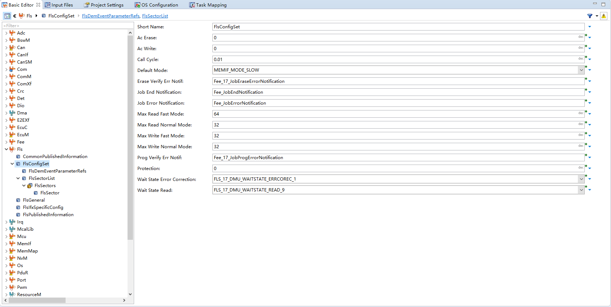
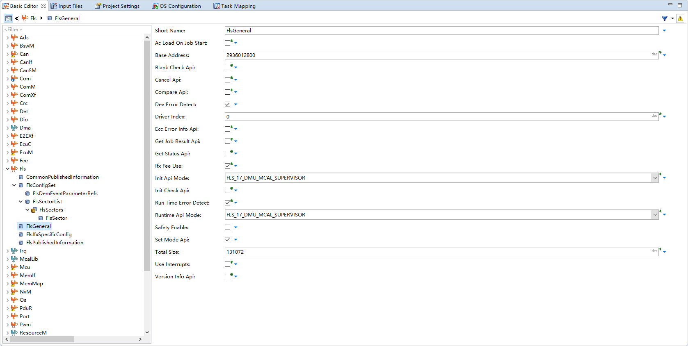

<!--
 * @Author: qinXiong
 * @Date: 2026-08-05 11:35:02
 * @LastEditors: xiong&&2307975018@qq.com
 * @LastEditTime: 2026-08-05 16:33:48
 * @Description: 
-->
# DaVinci 配置：Fls 模块（Fls_17_Dmu）

> 工程：`last364.dpa`（AURIX TC364 + Vector MICROSAR 4.2.2 + Infineon MCAL 20.10.0）
> 模块类型：MCAL（DFlash）
> DaVinci 路径：`Fls`
> 配置源文件：`Config/ECUC/last364_Fls_Fls_ecuc.arxml`
> 从属：[返回模块索引](README.md) · [模块参数总指南](../DaVinci_Motor_Config_Guide%20copy.md) · [零位标定文档](../MotorZeroCal_DFlash.md)

---

## 1. 模块作用

Fls 模块配置 DFlash 底层参数：基址、容量、扇区、页大小、工作模式。零位标定数据最终写在这块 DFlash 上。

---

## 2. 配置步骤

### 2.1 打开模块

BSW Editor → 模块树选择 `Fls`（`Fls_17_Dmu`）→ `FlsGeneral`。

📷 图片位 F1：模块树选中 `Fls` 的截图。

<!--  -->

### 2.2 参数

| 参数 | 值 |
| --- | --- |
| `FlsBaseAddress` | 2936012800（0xAF000000，DMU DFlash） |
| `FlsTotalSize` | 131072（128 KB），2 × 64 KB 扇区，页 8 B |
| `FlsDefaultMode` | `MEMIF_MODE_SLOW` |
| `FlsCallCycle` | 0.01 |
| 通知 | `Fee_JobEndNotification` / `Fee_JobErrorNotification` |

📷 图片位 F2：`FlsGeneral` 参数截图。

<!--  -->

---

## 3. 与其它模块的引用关系

| 引用 | 方向 | 说明 |
| --- | --- | --- |
| 底层存储 | Fls → 硬件 | DFlash 0xAF000000 |
| Fee 通知 | Fls → Fee | `Fee_JobEndNotification` / `Fee_JobErrorNotification` |
| 初始化 | Fls ↔ EcuM | `Fls_17_Dmu_Init` 在 `EcuMDriverInitListOne` |

---

## 4. 注意事项

- `FlsBaseAddress` 必须落在 DMU DFlash 地址空间，且与链接脚本中的 DF 段一致。
- 扇区大小/页大小影响 Fee 的擦写策略，改动后要复查 Fee 配置。
- 若 DFlash 起始地址在链接脚本里被占用，擦写会破坏代码，改地址前先查 LSL。

---

## 5. 截图清单（用户自插）

| 图片位 | 建议文件名 | 截图内容 |
| --- | --- | --- |
| F1 | `16_fls_module_tree.png` | 模块树选中 Fls |
| F2 | `16_fls_general.png` | FlsGeneral |

## 6. 相关文档

- [DaVinci_Fee.md](DaVinci_Fee.md) / [DaVinci_NvM.md](DaVinci_NvM.md)（存储链路）
- [MotorZeroCal_DFlash.md](../MotorZeroCal_DFlash.md)
- [DaVinci_Motor_Config_Guide copy.md 第 12 节](../DaVinci_Motor_Config_Guide%20copy.md)
