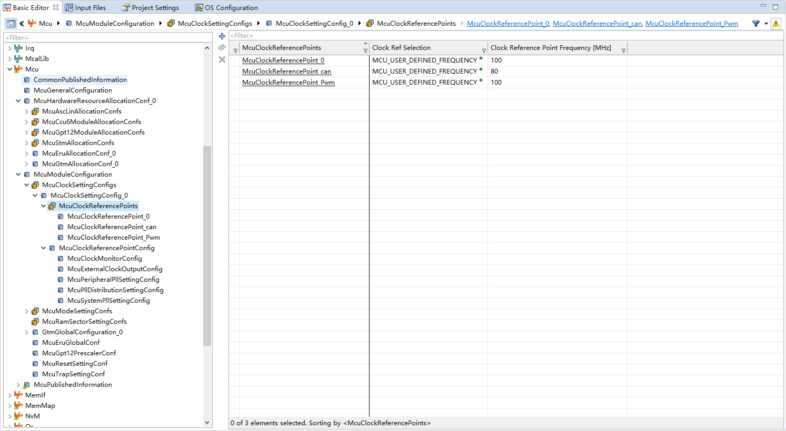
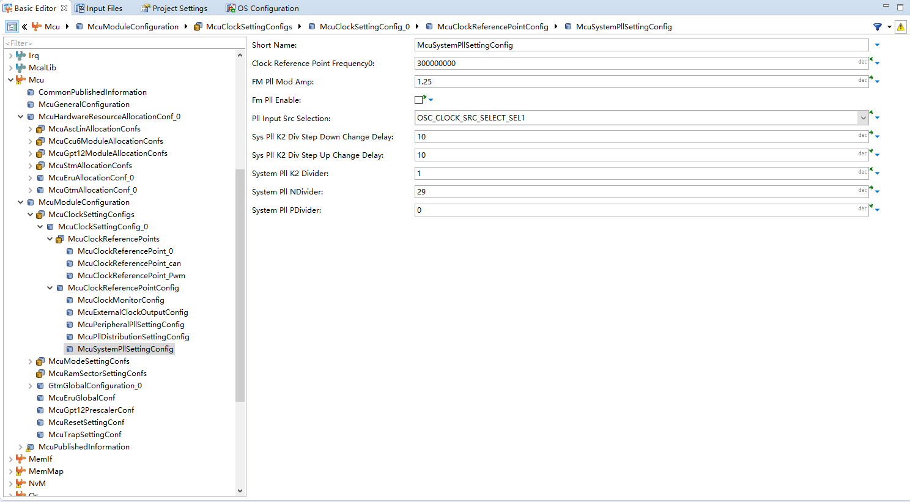
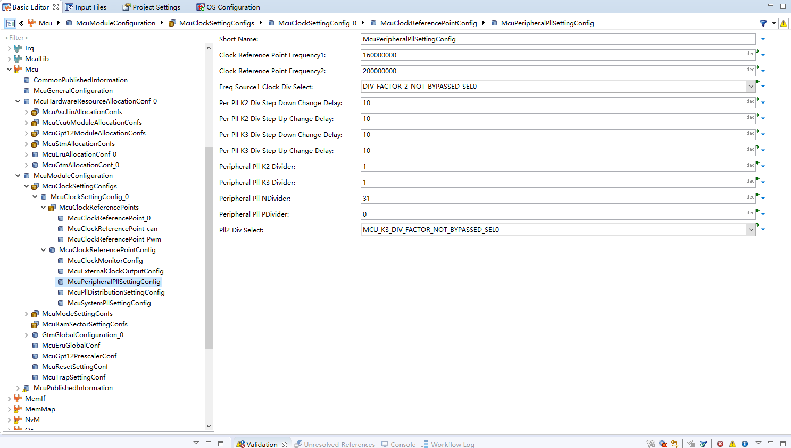
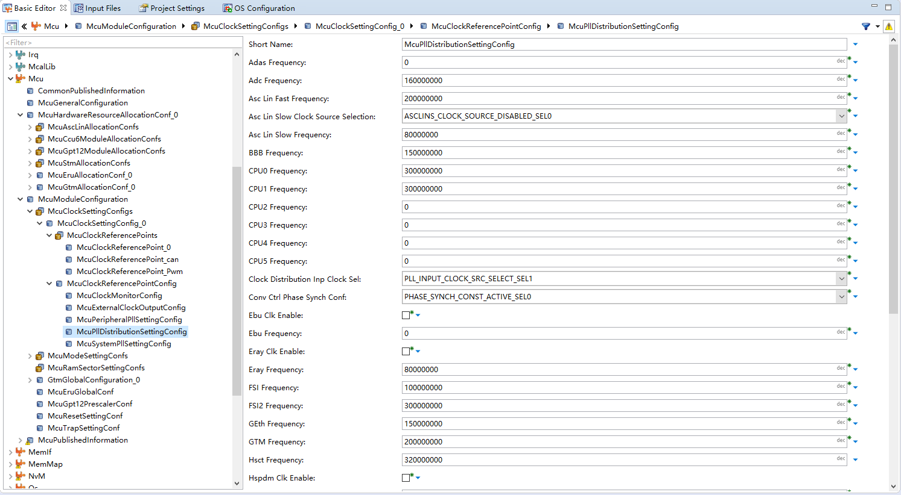
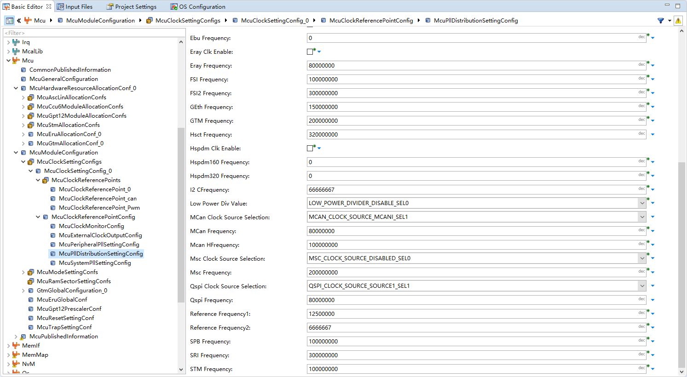
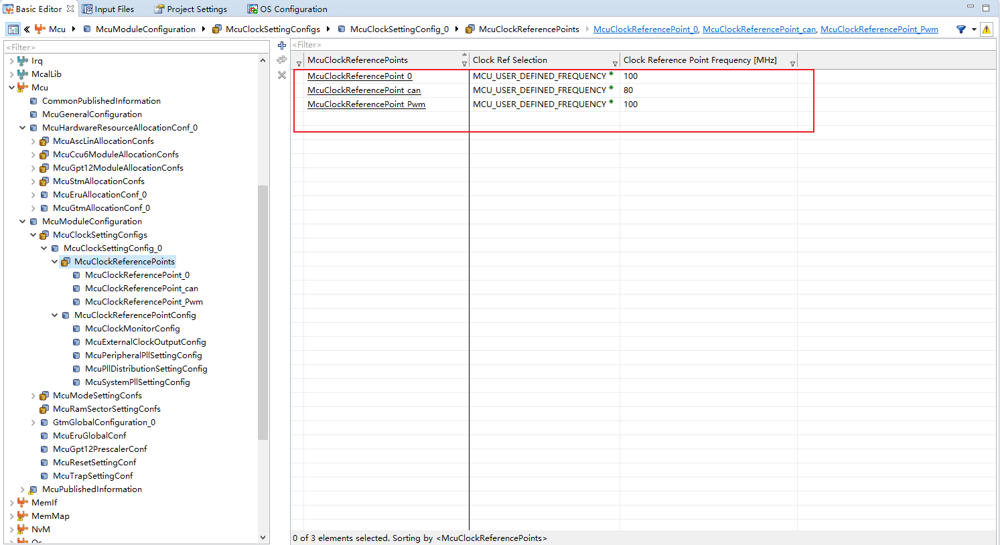
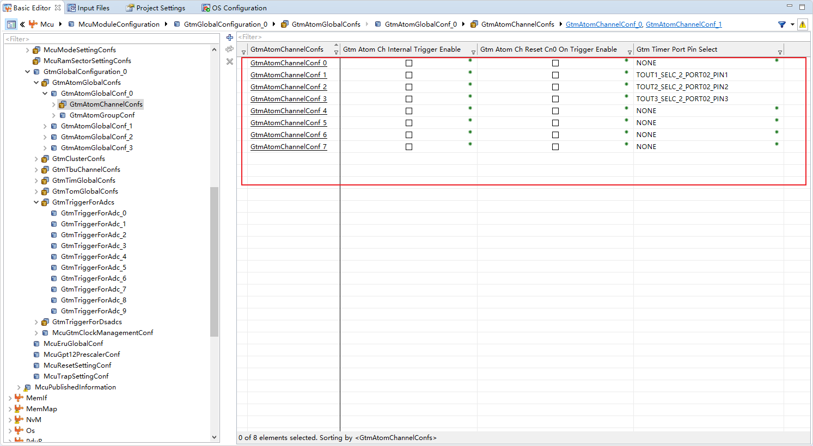
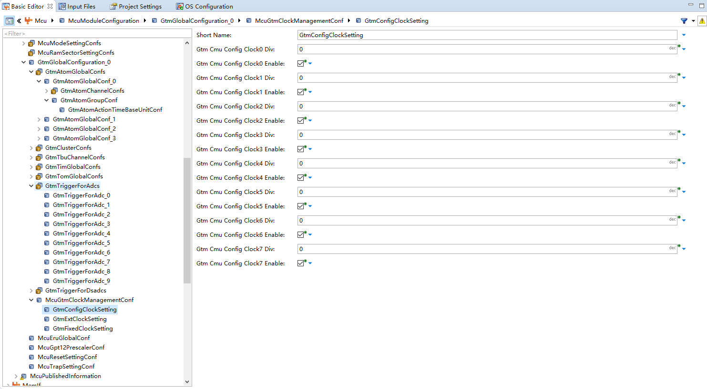
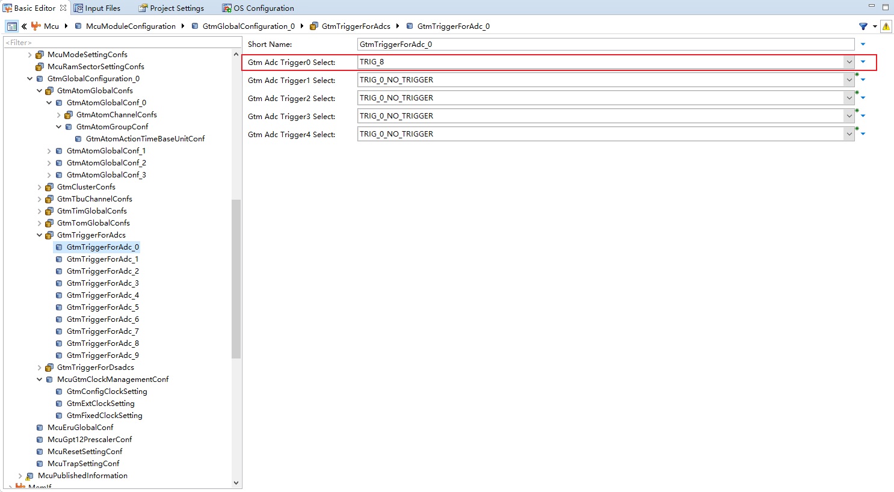
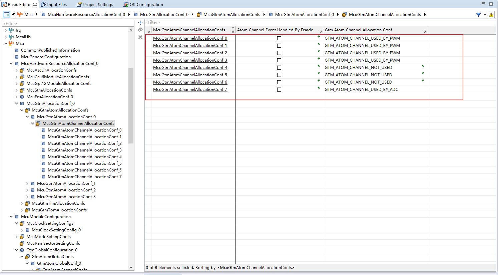

# DaVinci 配置：Mcu 模块

> 工程：`last364.dpa`（AURIX TC364 + Vector MICROSAR 4.2.2 + Infineon MCAL 20.10.0）
> 模块类型：MCAL（基础，最先配置）
> DaVinci 路径：`Mcu`
> 配置源文件：`Config/ECUC/last364_Mcu_Mcu_ecuc.arxml`
> 从属：[返回模块索引](README.md) · [模块参数总指南](../DaVinci_Motor_Config_Guide%20copy.md) · [架构文档](../DaVinci_Config_Architecture.md)

---

## 1. 模块作用

Mcu 模块是整个工程的“地基”，负责：

- 时钟树：System/Peripheral PLL、时钟分配（CPU/SPB/GTM/MCAN/QSPI/ADC/STM）；
- 时钟参考点：供 Pwm、Adc、Spi、Can 引用（改这里会连锁影响其它模块）；
- GTM 配置：ATOM0 各通道用途、CMU 时钟、ADC 硬件触发（`GtmTriggerForAdc`）；
- 硬件资源分配：`McuGtmAtomAllocationConf` 决定 ATOM 通道归属 Pwm 还是 Adc。

> 电机工程关键结论：GTM 全局 200 MHz ÷2 = 100 MHz，PWM 周期 10000 ticks → 100 µs → 10 kHz；ADC 触发同源同频。

---

## 2. 配置步骤

### 2.1 打开模块

DaVinci Configurator 打开 `last364.dpa` → 进入 **BSW Editor** → 左侧模块树选择 `Mcu`。所有配置项都在 `McuModuleConfiguration` 容器下。

模块树中选中 `Mcu` 的截图。

<!-- 自插图片：取消注释并放入图片后删除本占位

-->

<!--  -->

### 2.2 时钟设置（McuClockSettingConfig_0）

进入 `McuModuleConfiguration > McuClockSettingConfig_0`（`McuClockSettingId = 0`）：

| 参数 | 当前值 | 说明 |
| --- | --- | --- |
| `McuSystemPllSettingConfig` | N=29、P=0、K2=1，输入 OSC | CPU0/1 = 300 MHz |
| `McuPeripheralPllSettingConfig` | N=31、P=0、K2=1 | 外设 PLL |
| `McuPllDistributionSettingConfig` | 见下表 | 各外设时钟分配 |

关键时钟分配（`McuPllDistributionSettingConfig`）：

| 时钟 | 值 |
| --- | --- |
| `McuCPU0Frequency` / `McuCPU1Frequency` | 300000000（300 MHz） |
| `McuSPBFrequency` | 100000000（100 MHz） |
| `McuGTMFrequency` | 200000000（200 MHz） |
| `McuMCanFrequency` / `McuMcanHFrequency` | 80000000 / 100000000 |
| `McuQspiFrequency` | 80000000 |
| `McuAdcFrequency` | 160000000 |
| `McuSTMFrequency` | 100000000 |

`McuClockSettingConfig_0` 整页截图（PLL 参数）。

<!--  -->

<!--  -->
`McuPllDistributionSettingConfig` 时钟分配截图。

<!--  -->

<!--  -->
### 2.3 时钟参考点（必须与各模块引用一致）

时钟参考点列表（电机相关）：

| 参考点 | 频率 | 被谁引用 |
| --- | --- | --- |
| `McuClockReferencePoint_Pwm` | 100 MHz | Pwm 通道 `PwmMcuClockReferencePoint` |
| `McuClockReferencePoint_0` | 100 MHz | Spi/Adc 的 `McuClockReferencePointConfig` 体系 |
| `McuClockReferencePoint_can` | 80 MHz | Can 控制器 `CanCpuClockRef` |

时钟参考点列表截图。

<!--  -->

### 2.4 GTM 通道配置

`McuModuleConfiguration > GtmGlobalConfiguration_0 > GtmAtomGlobalConf_0 > GtmAtomChannelConf_N`（ATOM0 各通道）：

| 通道 | `GtmTimerPortPinSelect` | 用途 |
| --- | --- | --- |
| CH0 | NONE | PWM 参考通道（`PwmChannel_9180REF`） |
| CH1 | `TOUT1_SELC_2_PORT02_PIN1` | IH1（U 相上桥） |
| CH2 | `TOUT2_SELC_2_PORT02_PIN2` | IH2（V 相上桥） |
| CH3 | `TOUT3_SELC_2_PORT02_PIN3` | IH3（W 相上桥） |
| CH4 | NONE | NONE |
| CH5 | NONE | NONE |
| CH6 | NONE | NONE |
| CH7 | NONE | ADC 触发（内部，无引脚） |

`McuGtmClockManagementConf`：

| 参数 | 当前值 | 说明 |
| --- | --- | --- |
| `GtmCmuConfigClock0Div` = 0、Enable = true | — | CMU0 使能 |
| `GtmCmuClusterInputClockDividerEnable` | `CLS_CLK_CFG_ENABLED_WITH_DIV_SEL2` | 集群时钟 ÷2 → 100 MHz |
| `GtmCmuGlobalClockNumerator/Denominator` | 1 / 1 | — |

`GtmTriggerForAdc_0`：

| 参数 | 当前值 | 说明 |
| --- | --- | --- |
| `GtmAdcTrigger0Select` | `TRIG_8` | ATOM0 CH7 → EVADC0 TRIG0 |
| `GtmAdcTrigger1..4Select` | `TRIG_0_NO_TRIGGER` | 其余不用 |

ATOM0 通道列表截图（CH0~CH7）。

<!--  -->
`McuGtmClockManagementConf` + `GtmTriggerForAdc_0` 截图。

<!--  -->

<!--  -->

### 2.5 硬件资源分配

`McuHardwareResourceAllocationConf_0 > McuGtmAllocationConf_0 > McuGtmAtomAllocationConf_0`：

| 分配项 | 值 |
| --- | --- |
| `McuGtmAtomChannelAllocationConf_0..3` | `GTM_ATOM_CHANNEL_USED_BY_PWM` |
| `McuGtmAtomChannelAllocationConf_4..6` | `GTM_ATOM_CHANNEL_NOT_USED`（应用层用 CDTM 做互补，不占 MCAL 通道） |
| `McuGtmAtomChannelAllocationConf_7` | `GTM_ATOM_CHANNEL_USED_BY_ADC` |

其余（CCU6、GPT12、ERU、TOM、TIM、DMA 通道等）均未分配。
`McuGtmAtomAllocationConf_0` 分配截图。

<!--  -->

---

## 3. 与其它模块的引用关系

| 引用 | 方向 | 说明 |
| --- | --- | --- |
| `McuClockReferencePoint_Pwm` | Mcu → Pwm | Pwm 通道 `PwmMcuClockReferencePoint` |
| `McuGtmAtomChannelAllocationConf_0..3` | Mcu → Pwm | Pwm 通道 `GtmTimerUsed` |
| `McuGtmAtomChannelAllocationConf_7` | Mcu → Adc | Adc 组 `GtmTriggerTimerConfig` 的 `GtmTimerUsed` |
| `GtmAdcTrigger0Select = TRIG_8` | Mcu → Adc | GTM ATOM0 CH7 → EVADC0 TRIG0 |
| `McuClockReferencePoint_can` | Mcu → Can | `CanCpuClockRef`（80 MHz） |
| ATOM CH4~CH6 | Mcu → 应用层 | 下桥互补由 `MotorCdd_PwmComplementaryInit()` 直接写 GTM 寄存器 |

---

## 4. 注意事项 / 常见错误

- 改 PWM 频率时，`PwmPeriodDefault`、ADC `GtmTimerCM0Ticks`、应用层 `MOTORCDD_ADC_TRIGGER_PERIOD_TICKS` 三处必须一致。
- ATOM 通道“USED_BY_PWM / USED_BY_ADC”分配冲突会导致生成报错；CH7 必须保持 `USED_BY_ADC`。
- `McuClockReferencePoint_Pwm` 决定 Pwm 模块周期换算，改成其它频率后 Pwm 模块里要同步改。
- 时钟参考点改名后，Pwm/Adc/Spi/Can 里引用会断链，Validate 会报错，先查引用再生成。
- GTM 集群时钟 ÷2 忘了配，PWM 会变成 5 kHz（200 MHz/10000）而非 10 kHz。

---

## 5. 相关文档

- [DaVinci_Pwm.md](DaVinci_Pwm.md)（引用 `McuClockReferencePoint_Pwm` 与 ATOM 分配）
- [DaVinci_Adc.md](DaVinci_Adc.md)（引用 ATOM0 CH7 触发）
- [DaVinci_ResourceM.md](DaVinci_ResourceM.md)（GTM/外设核归属）
- [DaVinci_Motor_Config_Guide copy.md 第 1 节](../DaVinci_Motor_Config_Guide%20copy.md)
