# DaVinci 配置：Os 模块

> 工程：`last364.dpa`（AURIX TC364 + Vector MICROSAR 4.2.2 + Infineon MCAL 20.10.0）
> 模块类型：BSW（Vector Os，2 核，SC1）
> DaVinci 路径：`Os`
> 配置源文件：`Config/ECUC/last364_Os_*_ecuc.arxml`
> 从属：[返回模块索引](README.md) · [模块参数总指南](../DaVinci_Motor_Config_Guide%20copy.md) · [架构文档](../DaVinci_Config_Architecture.md) · [双核总结](../DualCore_vLinkGen_MemMap_问题总结.md)

---

## 1. 模块作用

Os 模块承载双核调度：

- Core0：`SystemTimer`（STM0，1 ms）→ StartApp 周期任务、BSW 任务；
- Core1：`SystemTimer1`（STM1，1 ms）→ `MotorTask`（优先级 100）与 `BswCore1Task`；
- ISR：`AdcIsr_G0`（10 kHz，CAT1/83）、`CounterIsr_SystemTimer1` 等；
- 跨核：X-Signal 双向 Channel + ISR（`XSignalIsr_OsCore0/1`），供 Core0 跨核拉起 Core1 报警。

---

## 2. 配置步骤

### 2.1 打开模块

BSW Editor → 模块树选择 `Os`（Vector Os）。先配计数器/任务/ISR，再配 X-Signal 与 `OsCore0/OsCore1`。

📷 图片位 O1：模块树选中 `Os` 的截图。

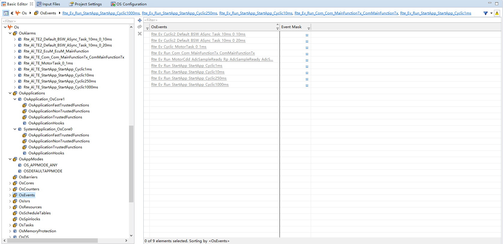

### 2.2 计数器

| 计数器 | 硬件 | tick |
| --- | --- | --- |
| `SystemTimer` | STM0 Ch0 | 1 ms（`OsSecondsPerTick=0.001`） |
| `SystemTimer1` | STM1 Ch0 | 1 ms |

> 关键：两个计数器都必须 `OsCounterTicksPerBase=100000`（不是 1！），否则 Core1 计数器异常、1 ms 事件错乱。

📷 图片位 O2：`SystemTimer` / `SystemTimer1` 计数器配置截图。

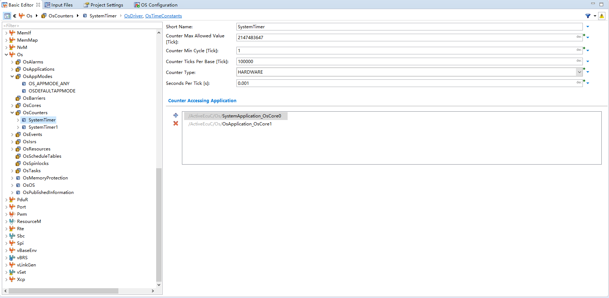

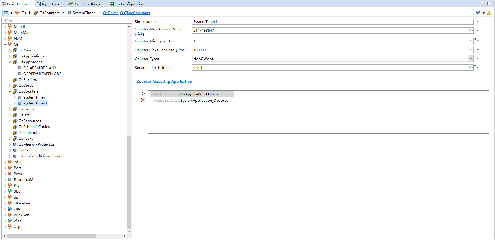
### 2.3 任务

| 任务 | 核 | 优先级 | 周期/事件 | 内容 |
| --- | --- | --- | --- | --- |
| `Default_Init_Task` | Core0 | 50 | 启动 | EcuM 初始化序列 |
| `Default_Init_Task_Trusted` | Core0 | 49 | 启动 | 可信初始化 |
| `Default_Appl_Init_Task` | Core0 | 45 | 启动 | RTE 启动（StartApp_Init 等） |
| `Default_BSW_ASync_Task_10ms` | Core0 | 30 | 10/20 ms 事件 | Com 主函数等 |
| `Default_Appl_Task` | Core0 | 5 | 1/10/250/1000 ms 事件 | StartApp 周期函数 |
| `Default_MotorInitTask` | Core1 | 0 | 自启动 | Core1 启动入口（`brsStartupEntry`） |
| `Default_Init_Task_Core1` | Core1 | 50 | 启动 | Core1 EcuM 初始化 |
| `Default_Init_Task_Core1_Trusted` | Core1 | 49 | 启动 | 可信初始化 |
| `BswCore1Task` | Core1 | 20 | 10 ms 事件（`Rte_Al_TE2_EcuM_EcuM_MainFunction`） | EcuM_MainFunction |
| `MotorTask` | Core1 | **100** | `Rte_Ev_Cyclic_MotorTask_0_1ms`（1 ms 报警）+ `Rte_Ev_Run_MotorCdd_AdcSampleReady...` | MotorControll 1 ms + MotorCdd 主函数 |

📷 图片位 O3：Core0 任务列表截图。
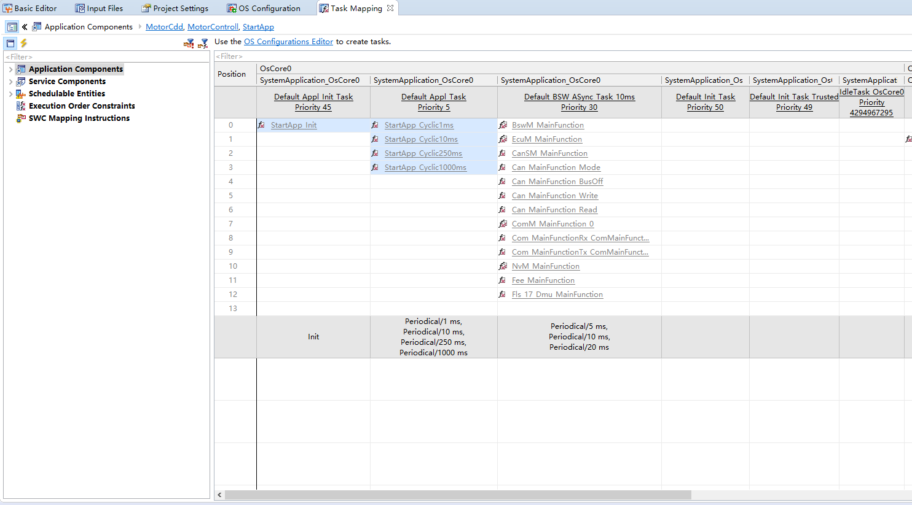
📷 图片位 O4：Core1 任务列表（MotorTask/BswCore1Task）截图。
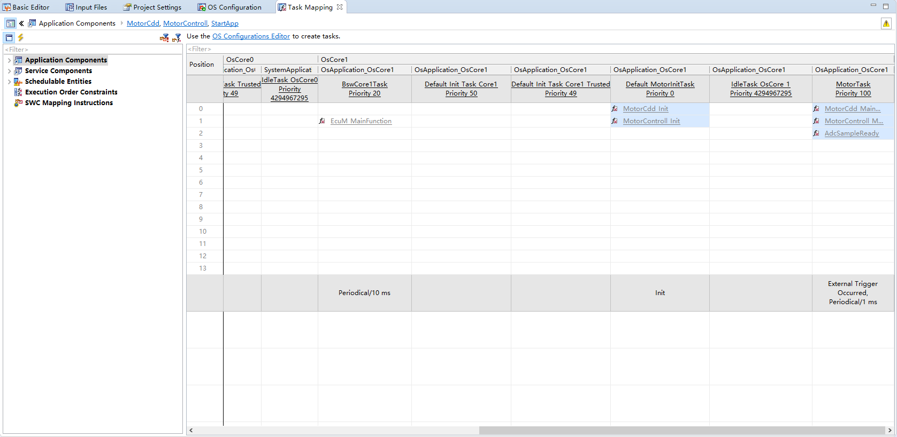

### 2.4 中断（ISR）

| ISR | 核 | 类别 | 优先级 | 源 |
| --- | --- | --- | --- | --- |
| `CounterIsr_SystemTimer` | Core0 | CAT2 | 80 | STM0 SR0（768） |
| `CounterIsr_SystemTimer1` | Core1 | CAT2 | 1 | STM1 SR0（776） |
| `AdcIsr_G0` | Core1 | **CAT1** | **83** | ADC0 SR0（1648），`ADC0SR0_ISR` |
| `AdcIsr_G8` | Core0 | CAT2 | 78 | ADC8 SR0（1776） |
| `CanIsr_0` | Core0 | CAT2 | 60 | CAN0 SR0（1456） |
| `XSignalIsr_OsCore0/1` | 各核 | CAT2 | 70 | 核间信号 |

📷 图片位 O5：ISR 列表（含 `AdcIsr_G0`、`CounterIsr_SystemTimer1`）截图。
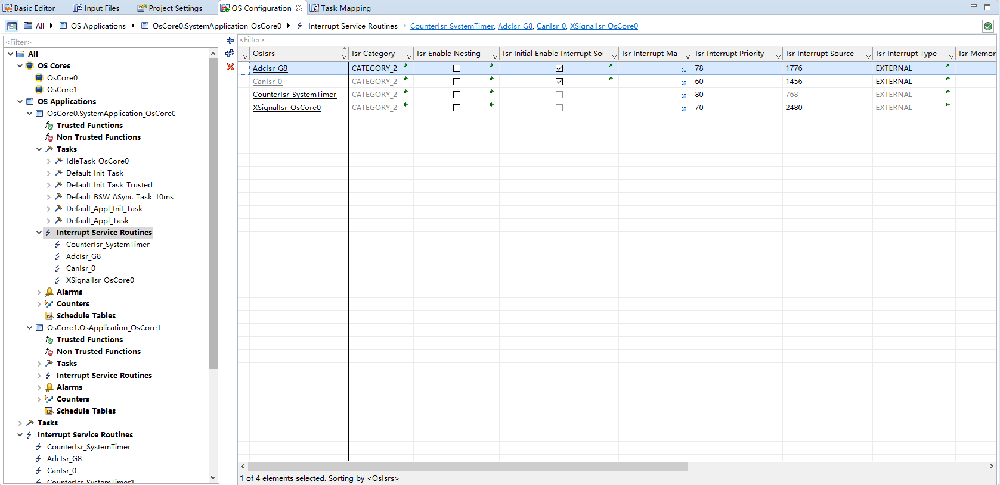

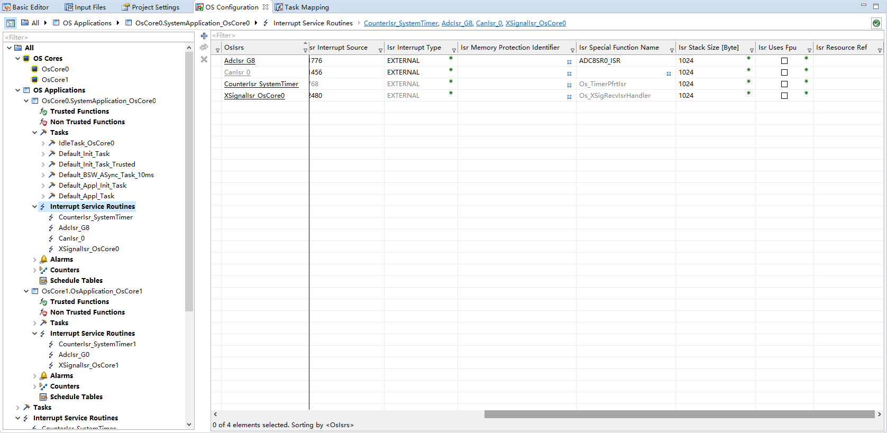

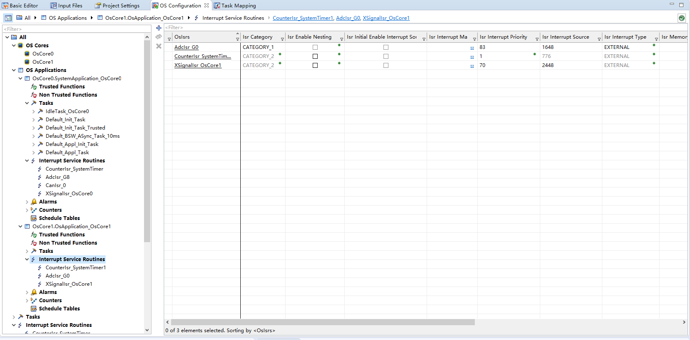

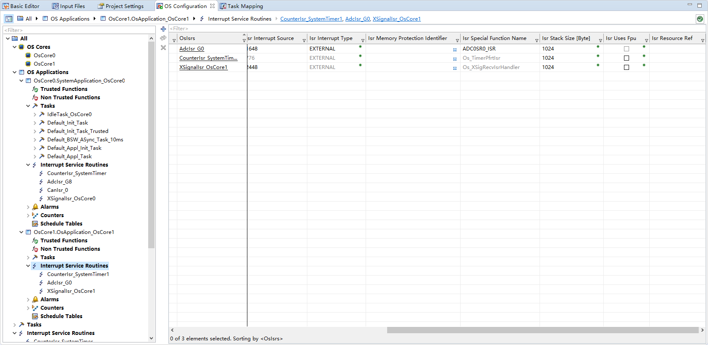
### 2.5 X-Signal（跨核）

| 对象 | 方向 | 说明 |
| --- | --- | --- |
| `XSignalChl_OsCore1` → `XSignalIsr_OsCore1` | Core0 → Core1 | GPSR0 SR0，源 2448 |
| `XSignalChl_OsCore0` → `XSignalIsr_OsCore0` | Core1 → Core0 | GPSR1 SR0，源 2480 |

- Os 配置需开启 X-Signal（`OS_CFG_XSIGNAL=STD_ON`）并勾选 `SetRelAlarm` API，否则跨核 `SetRelAlarm` 返回 `E_OS_SYS_FUNCTION_UNAVAILABLE`。
- 中断源必须用 GPSR 源（2480/2448），**不能**写成 `OsIsrInterruptSource=1`（会写坏 SRC，Trap Class 3）。

📷 图片位 O6：X-Signal Channel/ISR 配置截图。

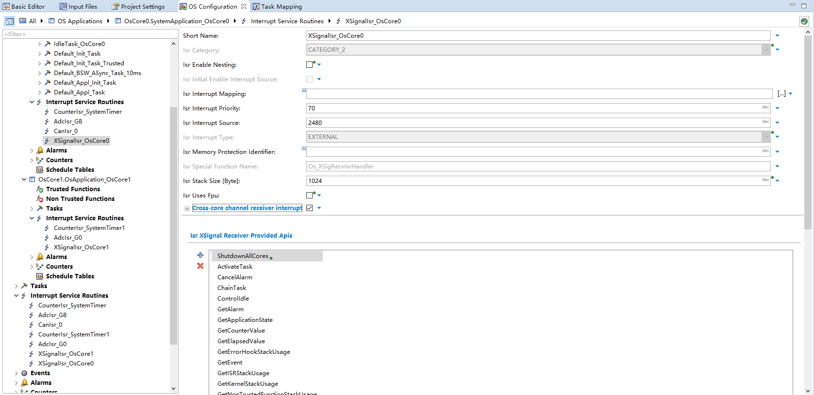

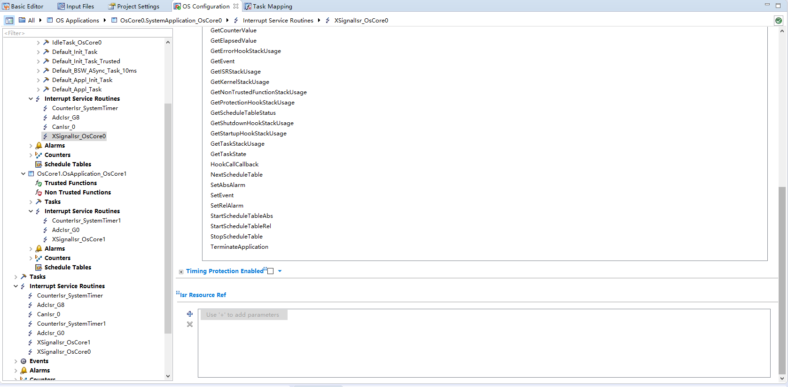

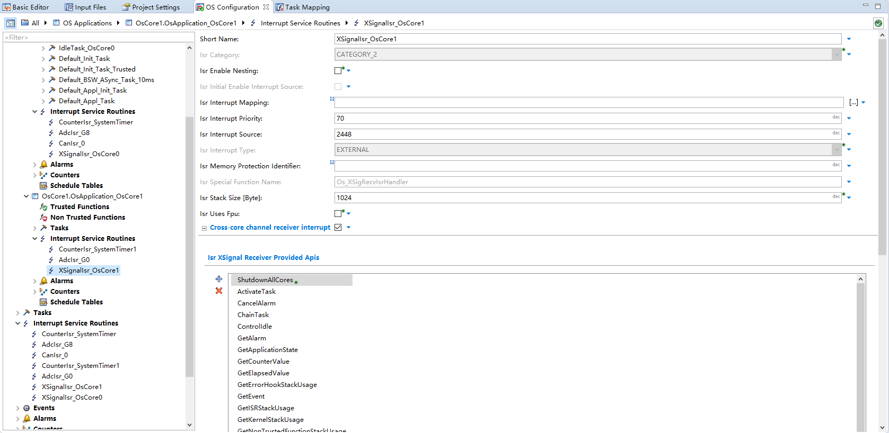
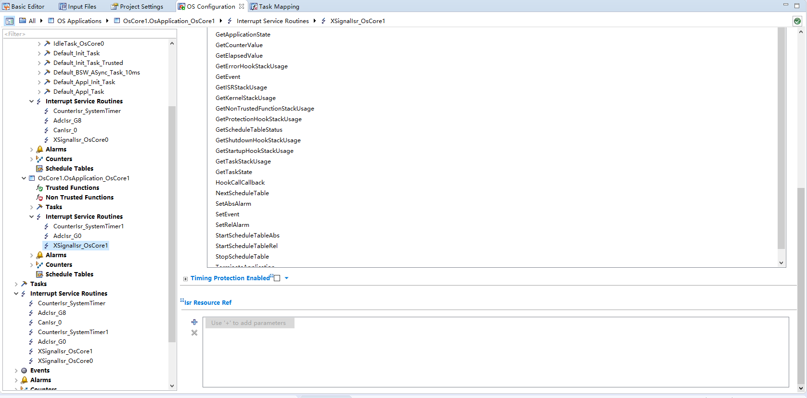
### 2.6 核与启动

- `OsCore0`：入口 `_start_tc0`（自启动）；`OsCore1`：入口 `brsStartupEntry`（非自启动，由 Core0 通过 XSignal/启动流程拉起）。
- Core0 `Default_Init_Task` 需等 Core1 的 `Rte_InitState_1 == INIT`，且 `OsTaskSchedule = FULL`（抢占），避免 Alarm 对 SUSPENDED 任务 SetEvent 报 `E_OS_STATE(7)`。

---

## 3. 与其它模块的引用关系

| 引用 | 方向 | 说明 |
| --- | --- | --- |
| 报警/事件 | Os ↔ Rte | `Rte_Al_TE_MotorTask_0_1ms` ↔ `Rte_Ev_Cyclic_MotorTask_0_1ms` ↔ `MotorTask` |
| ISR 源 | Os ↔ Irq | `AdcIsr_G0` 与 Irq 的 CAT1/83/CPU1 一致 |
| 计数器 | Os ↔ Mcu | STM0/STM1 时钟来自 Mcu |
| X-Signal | Os ↔ EcuM | Core0 跨核拉起 Core1 报警 |

---

## 4. 注意事项 / 常见错误

- MotorTask 优先级 100 最高，保证 1 ms 电机主循环不被 BSW 任务抢占（快速环在 CAT1 ISR 里，天然最高）。
- Core1 的 1 ms 报警 `Rte_Al_TE_MotorTask_0_1ms` 挂在 `SystemTimer1` 上；Core0 的 StartApp 周期挂在 `SystemTimer` 上。
- `SystemTimer1 OsCounterTicksPerBase` 配成 1 会导致 Counter 百万级、`WaitEvent` 不阻塞（历史问题 A4）。
- Trusted 任务里不要再 ActivateTask/SetRelAlarm，只做 `Os_InitialEnableInterruptSources`（历史问题 C3）。
- 生成后检查 `Os_Hal_Cfg.h`：`OSTICKSPERBASE_SystemTimer/SystemTimer1 = 100000`；检查 `Os_Hal_Interrupt_Lcfg.c`：XSignal Source = `0x990`/`0x9B0`（不是 `0x1`）。

---

## 5. 截图清单（用户自插）

| 图片位 | 建议文件名 | 截图内容 |
| --- | --- | --- |
| O1 | `08_os_module_tree.png` | 模块树选中 Os |
| O2 | `08_os_counters.png` | SystemTimer/SystemTimer1 |
| O3 | `08_os_tasks_core0.png` | Core0 任务列表 |
| O4 | `08_os_tasks_core1.png` | Core1 任务列表 |
| O5 | `08_os_isr.png` | ISR 列表 |
| O6 | `08_os_xsignal.png` | X-Signal 配置 |

## 6. 相关文档

- [DaVinci_Irq.md](DaVinci_Irq.md)（中断源）
- [DaVinci_EcuM.md](DaVinci_EcuM.md)（初始化顺序）
- [DaVinci_Rte.md](DaVinci_Rte.md)（报警/事件）
- [DualCore_vLinkGen_MemMap_问题总结.md](../DualCore_vLinkGen_MemMap_问题总结.md)
- [DaVinci_Motor_Config_Guide copy.md 第 8 节](../DaVinci_Motor_Config_Guide%20copy.md)
