# DaVinci 配置：Port 模块

> 工程：`last364.dpa`（AURIX TC364 + Vector MICROSAR 4.2.2 + Infineon MCAL 20.10.0）
> 模块类型：MCAL（基础）
> DaVinci 路径：`Port > PortConfigSet`（按 `PortContainer_N` 分组，端口号以 `PortPinId/16` 为准）
> 配置源文件：`Config/ECUC/last364_Port_Port_ecuc.arxml`
> 从属：[返回模块索引](README.md) · [模块参数总指南](../DaVinci_Motor_Config_Guide%20copy.md) · [架构文档](../DaVinci_Config_Architecture.md)

---

## 1. 模块作用

Port 模块配置所有数字功能脚的复用模式（ALT/GPIO）、方向、初始电平。电机工程中最重要的几类：

- 三相 PWM 六根脚（P02.1~P02.6）必须是 `PORT_PIN_MODE_ALT1`（对应 GTM TOUT）；
- QSPI1/2/3 的 MTSR/SCLK/CS 按 ALT3/ALT4/ALT5 复用；
- 9183 控制脚（SOFF/INH/ENA/ERR）与 CAN 收发器、LED/测试点走 GPIO。

> EVADC 模拟输入（VO1/VO2/VO3/VRO/VINV/G8CH3）不需要建 Port 引脚，DaVinci 只配置数字功能脚。

---

## 2. 配置步骤

### 2.1 打开模块与引脚容器

BSW Editor → 模块树选择 `Port` → `PortConfigSet`。工程按 `PortContainer_N` 分组（同一端口一组），每组里是 `PortPin`。

📷 图片位 P1：`PortConfigSet` 容器/引脚列表截图。

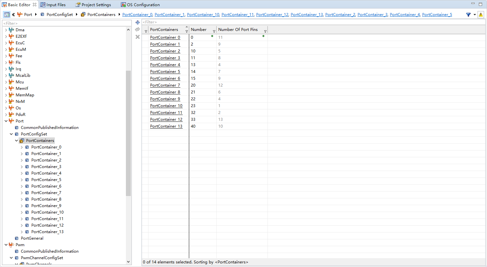
<!--  -->

### 2.2 电机相关引脚参数表

逐条检查（或新建）以下引脚：

| 引脚名（DaVinci 容器） | 端口.引脚 | 方向 | 模式 | 初始电平 | 用途 |
| --- | --- | --- | --- | --- | --- |
| `PortPin_9183IH1` | P02.1 | OUT | `PORT_PIN_MODE_ALT1` | LOW | GTM ATOM0 CH1（U 上桥） |
| `PortPin_9183IH2` | P02.2 | OUT | `PORT_PIN_MODE_ALT1` | LOW | GTM ATOM0 CH2（V 上桥） |
| `PortPin_9183IH3` | P02.3 | OUT | `PORT_PIN_MODE_ALT1` | LOW | GTM ATOM0 CH3（W 上桥） |
| `PortPin_9183IL1` | P02.4 | OUT | `PORT_PIN_MODE_ALT1` | LOW | GTM 互补（U 下桥） |
| `PortPin_9183IL2` | P02.5 | OUT | `PORT_PIN_MODE_ALT1` | LOW | GTM 互补（V 下桥） |
| `PortPin_9183IL3` | P02.6 | OUT | `PORT_PIN_MODE_ALT1` | LOW | GTM 互补（W 下桥） |
| `PortPin_9183SOFF` | P00.2 | OUT | `PORT_PIN_MODE_GPIO` | HIGH | 9183 Safe-Off（低有效） |
| `PortPin_9183ERR` | P00.4 | IN | `PORT_PIN_MODE_ALL` | LOW | 9183 错误标志（高有效） |
| `PortPin_19183INH` | P00.12 | OUT | `PORT_PIN_MODE_GPIO` | LOW | 9183 Inhibit |
| `PortPin_9183ENA` | P02.8 | OUT | `PORT_PIN_MODE_GPIO` | LOW | 9183 输出使能 |
| `PortPin_9183PFB1/2/3` | P00.0/1/3 | IN | GPIO | LOW | 9183 反馈（备选） |
| `PortPin_5012CSN` | P14.6 | OUT | `PORT_PIN_MODE_ALT3` | HIGH | QSPI2 SLSO2（TLE5012 CS） |
| `PortPin_5012MTSR` | P15.5 | OUT | `PORT_PIN_MODE_ALT3` | LOW | QSPI2 MTSR |
| `PortPin_5012CLK` | P15.6 | OUT | `PORT_PIN_MODE_ALT5` | LOW | QSPI2 SCLK |
| `PortPin_5012MRST` | P15.7 | IN | GPIO | LOW | QSPI2 MRST |
| `PortPin_9183Qspi3MTSR` | P22.0 | OUT | `PORT_PIN_MODE_ALT3` | LOW | QSPI3 MTSR |
| `PortPin_9183Qspi3MRST` | P22.1 | IN | ALL | LOW | QSPI3 MRST |
| `PortPin_9183QspiCSN` | P22.2 | OUT | `PORT_PIN_MODE_ALT3` | LOW | QSPI3 SLSO0（9183 CS） |
| `PortPin_9183Qspi3CLK` | P22.3 | OUT | `PORT_PIN_MODE_ALT3` | LOW | QSPI3 SCLK |
| `PortPin_tle35584_CSN` | P11.2 | OUT | `PORT_PIN_MODE_ALT4` | LOW | QSPI1 SLSO（SBC CS） |
| `PortPin_tle35584_Clk` | P11.6 | OUT | `PORT_PIN_MODE_ALT3` | LOW | QSPI1 SCLK |
| `PortPin_tle35584_MTSR` | P11.7 | OUT | `PORT_PIN_MODE_ALT3` | LOW | QSPI1 MTSR |
| `PortPin_tle35584_MRST` | P11.3 | IN | ALL | LOW | QSPI1 MRST |
| `PortPin_CAN1Tx/Rx` | P20.8 / P20.7 | OUT / IN | ALL | LOW | MCAN0 |
| `PortPin_CAN1Nstb` | P20.6 | OUT | ALL | HIGH | 收发器 STB |
| `PortPin_CAN1EN` | P20.9 | OUT | ALL | HIGH | 收发器使能 |
| `PortPin_CAN1NERR` | P20.10 | IN | ALL | LOW | 收发器错误 |
| `PortPin_test` / `PortPin_test2` | P15.2 / P15.3 | OUT | ALL / GPIO | LOW | 示波器测试点 |
| `PortPin_led1` / `PortPin_Led2` | P33.0 / P33.1 | OUT | ALL | LOW | 状态灯 |

📷 图片位 P2：9183 三相 PWM + 控制脚引脚（P00/P02 组）截图。
p00
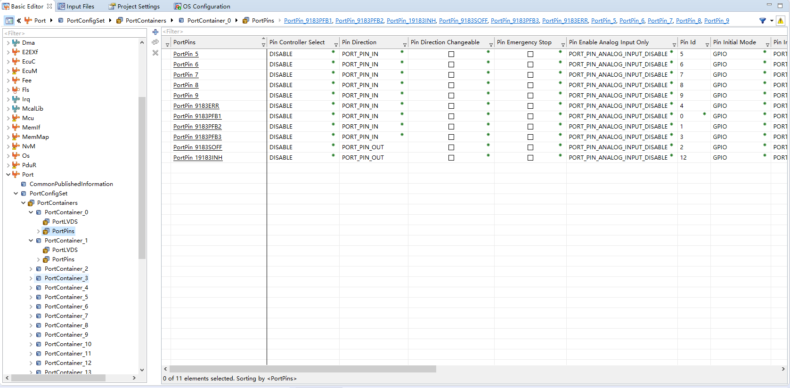
<!--  -->
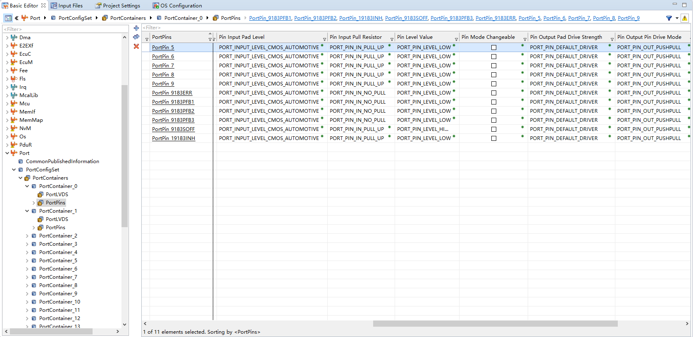
<!--  -->
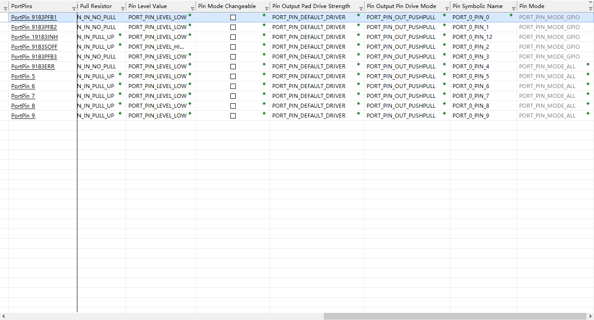
<!--  -->
p02
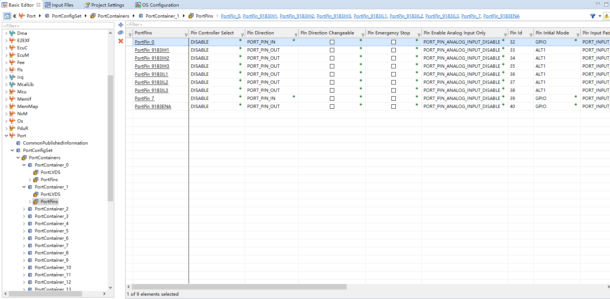
<!--  -->
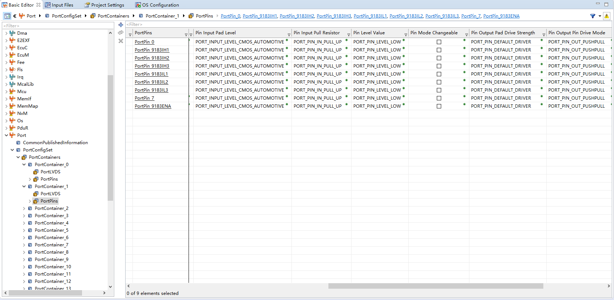

<!--  -->

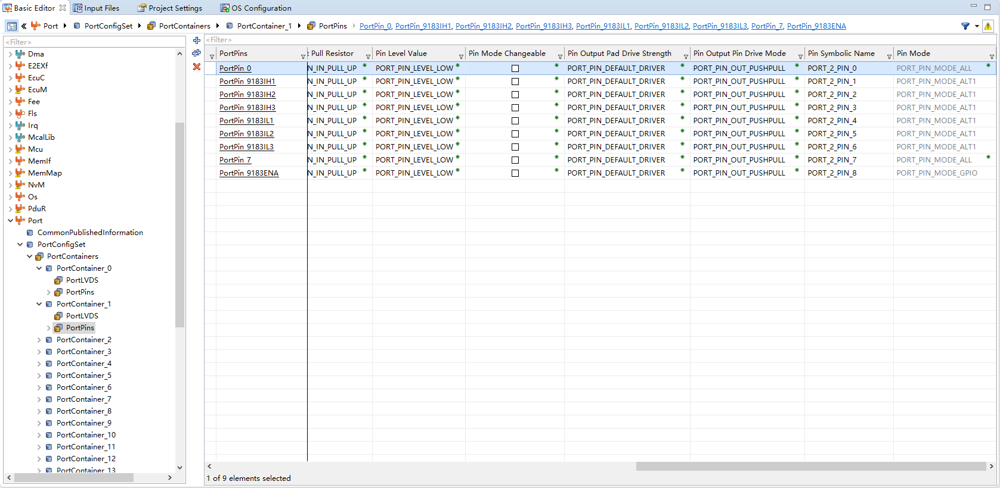
<!--  -->

📷 图片位 P3：QSPI2/3 与 SBC（P14/P15/P22/P03 组）截图。
tle35584 SPI Port:
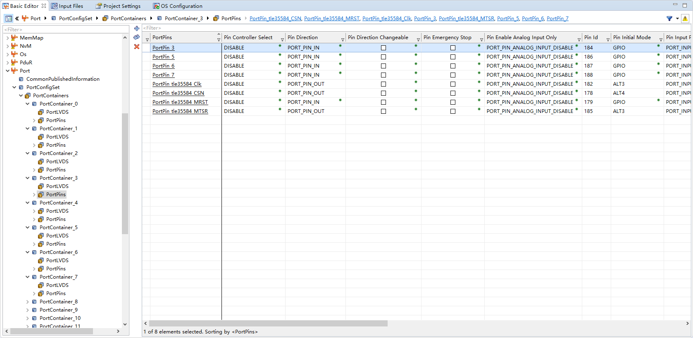
<!--  -->

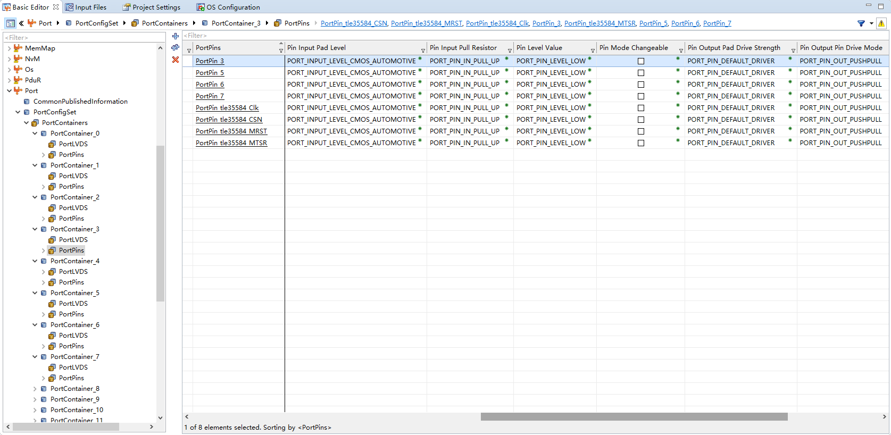
<!--  -->

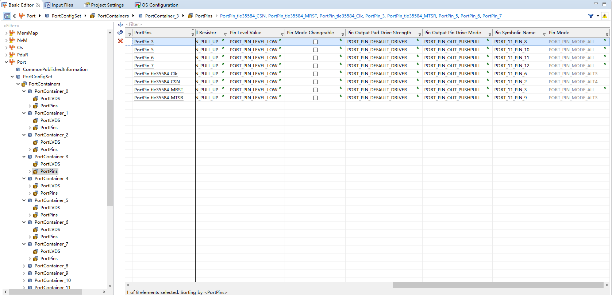
<!--  -->

tle5012 SPI Port And Can2 Port:

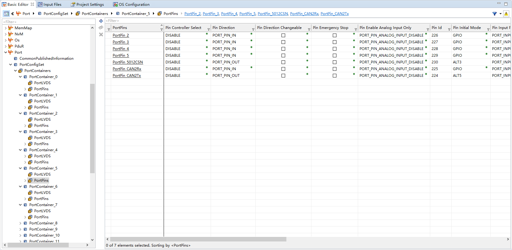
<!--  -->

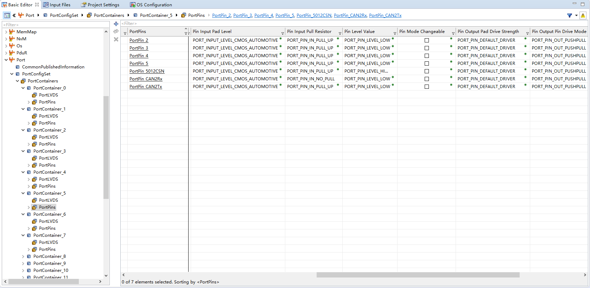
<!--  -->

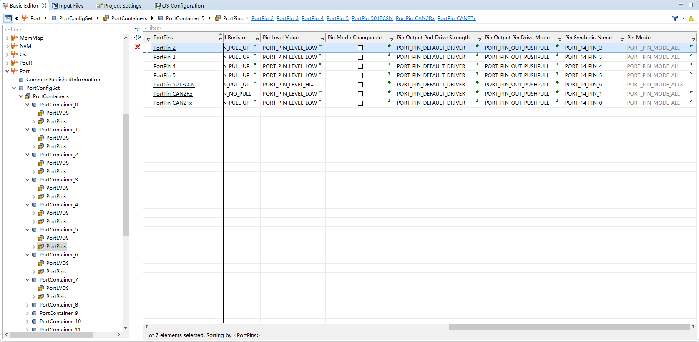
<!--  -->

9183 SPI port:
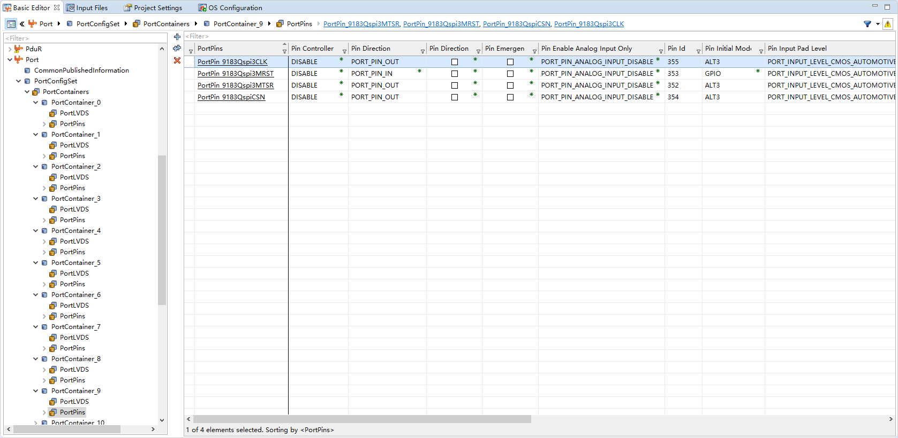
<!--  -->

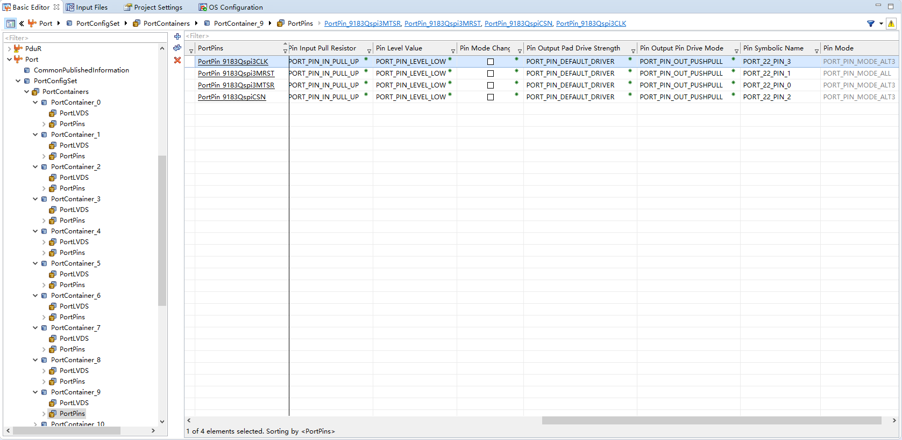
<!--  -->
📷 图片位 P4：CAN 收发器与 LED/测试点（P20/P33/P15）截图。

can1 Port:
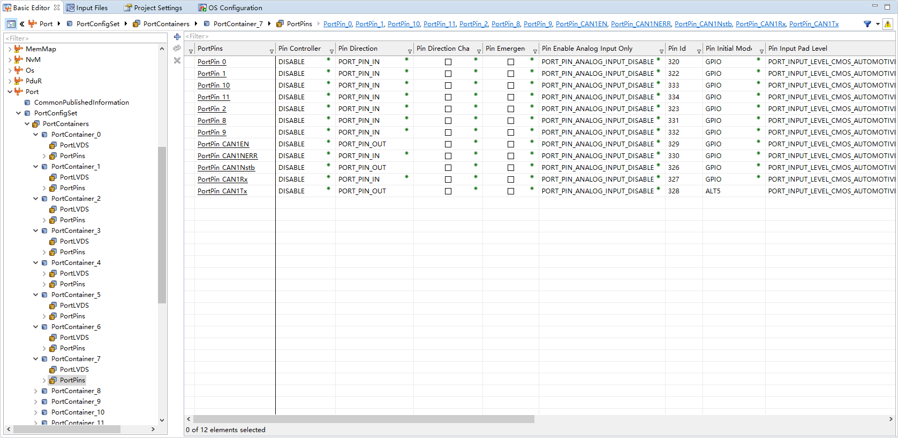
<!--  -->

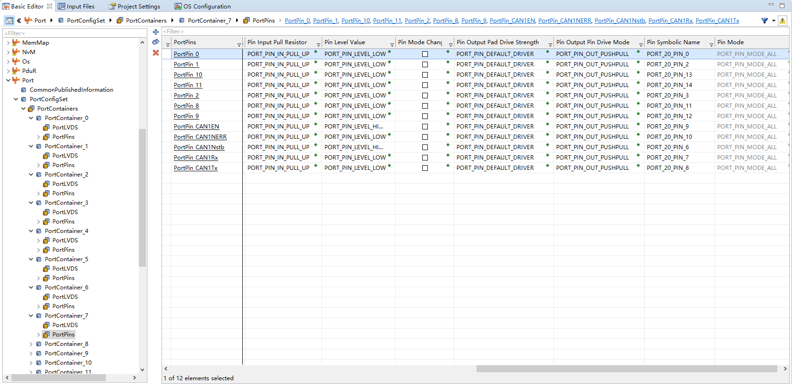
<!--  -->
Led Port:
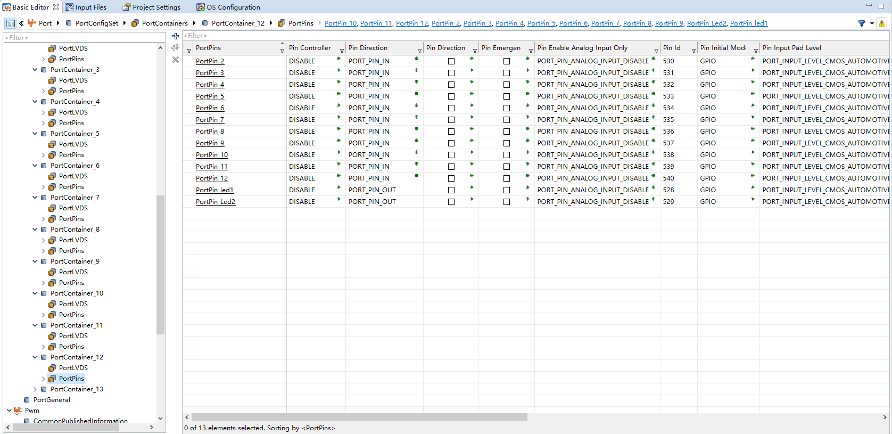
<!--  -->

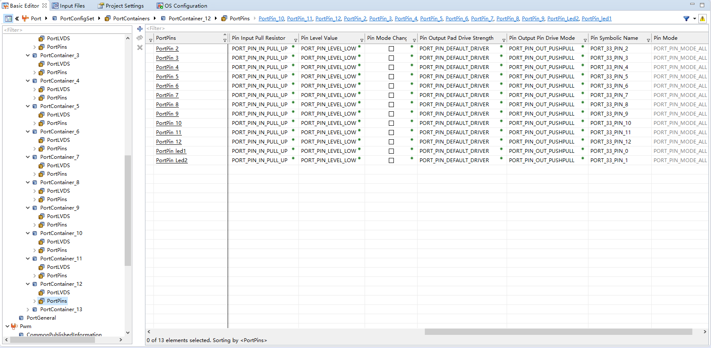
<!--  -->
---

## 3. 与其它模块的引用关系

| 引用 | 方向 | 说明 |
| --- | --- | --- |
| ALT1（P02.1~6） | Port ↔ Mcu/Pwm | 对应 GTM ATOM0 TOUT，与 Mcu GTM 通道 `GtmTimerPortPinSelect` 一致 |
| ALT3/ALT4/ALT5（QSPI 脚） | Port ↔ Spi | 与 Spi 外设 CS/引脚一致（QSPI2→P14.6/P15.5-7，QSPI3→P22.0-3，QSPI1→P03.2-7） |
| GPIO（9183 控制脚/CAN/LED） | Port ↔ Dio | 同一引脚在 Dio 模块建通道 |

---

## 4. 注意事项 / 常见错误

- IH/IL 六根脚必须都是 `ALT1`；IL 的互补信号由应用层 `MotorCdd_PwmComplementaryInit()` 通过 GTM CDTM 生成（`TOUTSEL0=0x28882222`、死区 200 ticks）。
- `PortPin_5012MRST` 在 Port 里是 GPIO 输入，但 QSPI2 硬件接收走 MRST（`SpiHWPinMRSTQspix = MRST2B_PORT15_PIN7`），以 SPI 配置为准。
- 初始电平很关键：SOFF 上电必须 HIGH（安全关断无效），INH 低、ENA 低，由驱动初始化后再拉高。
- PWM 无输出先查 P02.1/2/3 是否 ALT1、端口容器是否在正确的 `PortContainer`。

---

## 5. 截图清单

| 图片位 | 建议文件名 | 截图内容 |
| --- | --- | --- |
| P1 | `02_port_configset.png` | `PortConfigSet` 容器结构 |
| P2 | `02_port_9183.png` | P00/P02 组：9183 三相 + 控制脚 |
| P3 | `02_port_qspi_sbc.png` | P03/P14/P15/P22 组：QSPI1/2/3 |
| P4 | `02_port_can_led.png` | P20/P33/P15：CAN/LED/测试点 |

## 6. 相关文档

- [DaVinci_Mcu.md](DaVinci_Mcu.md)（GTM 通道 `GtmTimerPortPinSelect` 与 Port ALT1 对应）
- [DaVinci_Spi.md](DaVinci_Spi.md)（QSPI 引脚一致性）
- [DaVinci_Dio.md](DaVinci_Dio.md)（GPIO 通道）
- [DaVinci_Motor_Config_Guide copy.md 第 2 节](../DaVinci_Motor_Config_Guide%20copy.md)
