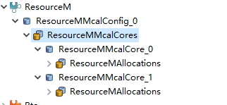
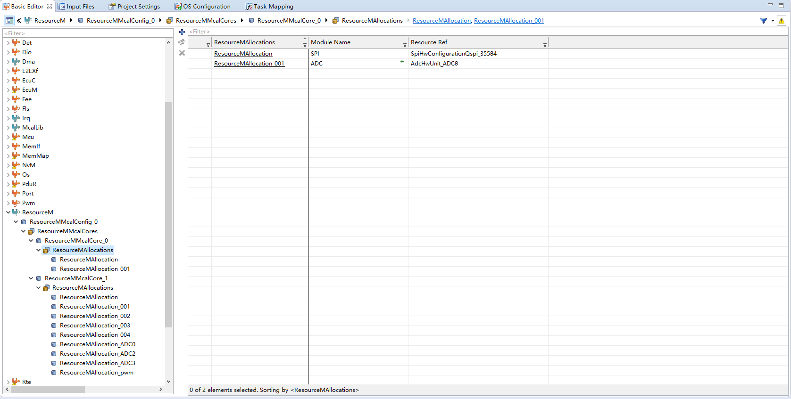
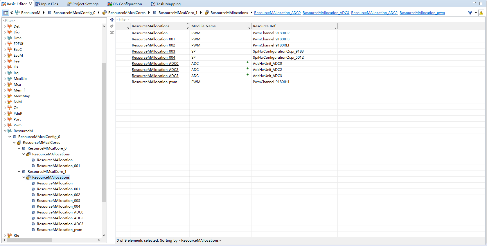

<!--
 * @Author: qinXiong
 * @Date: 2026-08-05 11:35:26
 * @LastEditors: xiong&&2307975018@qq.com
 * @LastEditTime: 2026-08-05 16:35:54
 * @Description: 
-->
# DaVinci 配置：ResourceM 模块（多核归属）

> 工程：`last364.dpa`（AURIX TC364 + Vector MICROSAR 4.2.2 + Infineon MCAL 20.10.0）
> 模块类型：MCAL（多核资源管理）
> DaVinci 路径：`ResourceM > ResourceMMcalConfig_0`
> 配置源文件：`Config/ECUC/last364_ResourceM_*_ecuc.arxml`
> 从属：[返回模块索引](README.md) · [模块参数总指南](../DaVinci_Motor_Config_Guide%20copy.md) · [架构文档](../DaVinci_Config_Architecture.md)

---

## 1. 模块作用

ResourceM 决定每个 MCAL 资源（ADC 单元、PWM 通道、QSPI 模块）归属哪个核。MCAL 的 `Init` 按核执行，生成代码会做核间一致性检查。

> 设计原则：**电机相关外设全部在 Core1，BSW（CAN/COM）留在 Core0。**

---

## 2. 配置步骤

### 2.1 打开模块

BSW Editor → 模块树选择 `ResourceM` → `ResourceMMcalConfig_0`。

📷 图片位 R1：模块树选中 `ResourceM` 的截图。

### 2.2 核归属表

| 核 | 模块 | 资源 |
| --- | --- | --- |
| Core0 | SPI | `SpiHwConfigurationQspi_35584`（SBC） |
| Core0 | ADC | `AdcHwUnit_ADC8` |
| Core1 | ADC | `AdcHwUnit_ADC0`、`AdcHwUnit_ADC2`、`AdcHwUnit_ADC3` |
| Core1 | PWM | `PwmChannel_9180IH1/IH2/IH3/REF` |
| Core1 | SPI | `SpiHwConfigurationQspi_9183`、`SpiHwConfigurationQspi_5012` |

📷 图片位 R2：`ResourceMMcalConfig_0` 归属列表截图。

---

## 3. 与其它模块的引用关系

| 引用 | 方向 | 说明 |
| --- | --- | --- |
| ADC 归属 | ResourceM ↔ Adc | G0/G2/G3 → Core1；G8 → Core0 |
| PWM 归属 | ResourceM ↔ Pwm | 4 个通道 → Core1 |
| SPI 归属 | ResourceM ↔ Spi | QSPI2/3 → Core1；QSPI1 → Core0 |
| 分核 Init | ResourceM ↔ EcuM | `EcuM_AL_DriverInitOne` 按核执行对应 Init |

---

## 4. 注意事项

- 归属配错（例如 ADC0 留在 Core0）会导致 Core1 的 `Adc_`* 调用报 ADC_UNINIT、快速环不跑。
- 修改归属后，EcuM callout 里的分核初始化代码要同步（Core1 侧需二次 `Adc_Init`、`Spi_Init` 等）。
- 生成后 Validate 会检查核间资源冲突，有红字先看这里。

---

## 5. 截图清单（用户自插）

| 图片位 | 建议文件名 | 截图内容 |
| --- | --- | --- |
| R1 | `17_resourcem_module_tree.png` | 模块树选中 ResourceM |
| R2 | `17_resourcem_mcal.png` | 资源→核归属列表 |

## 6. 相关文档

- [DaVinci_Adc.md](DaVinci_Adc.md) / [DaVinci_Spi.md](DaVinci_Spi.md) / [DaVinci_Pwm.md](DaVinci_Pwm.md)（各资源配置）
- [DaVinci_EcuM.md](DaVinci_EcuM.md)（分核初始化）
- [DaVinci_Motor_Config_Guide copy.md 第 13 节](../DaVinci_Motor_Config_Guide%20copy.md)
