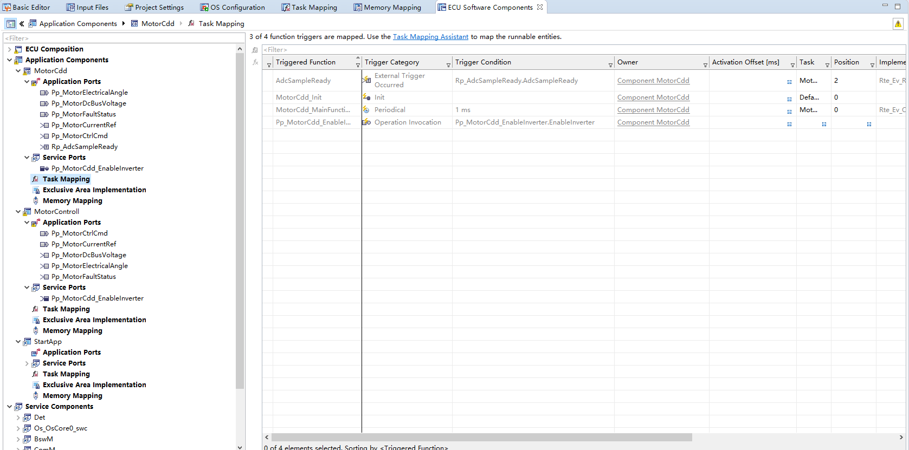
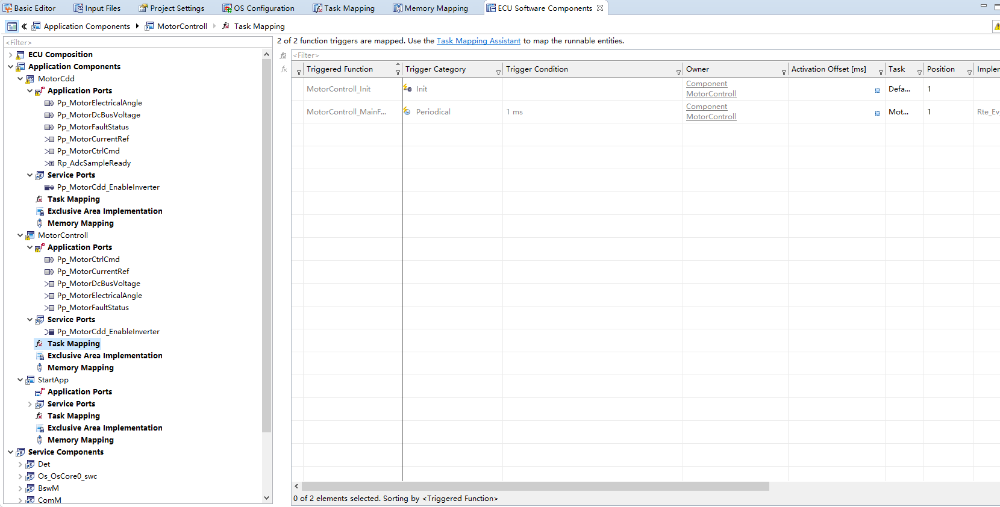
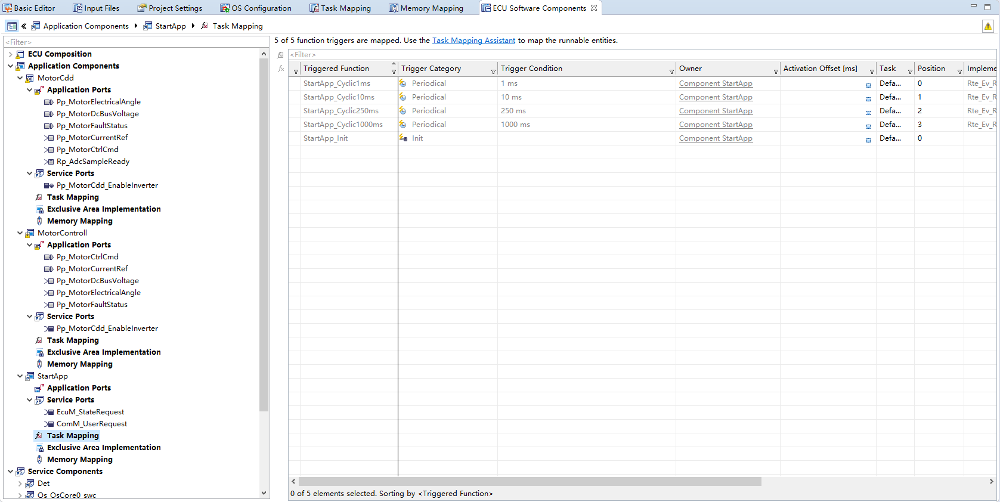
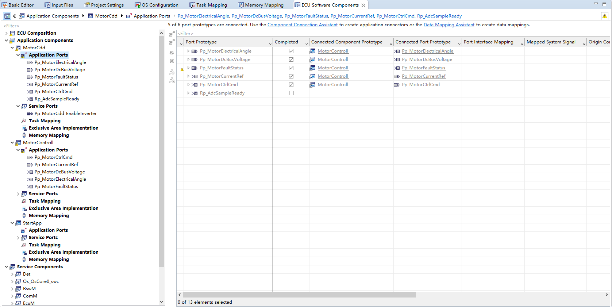
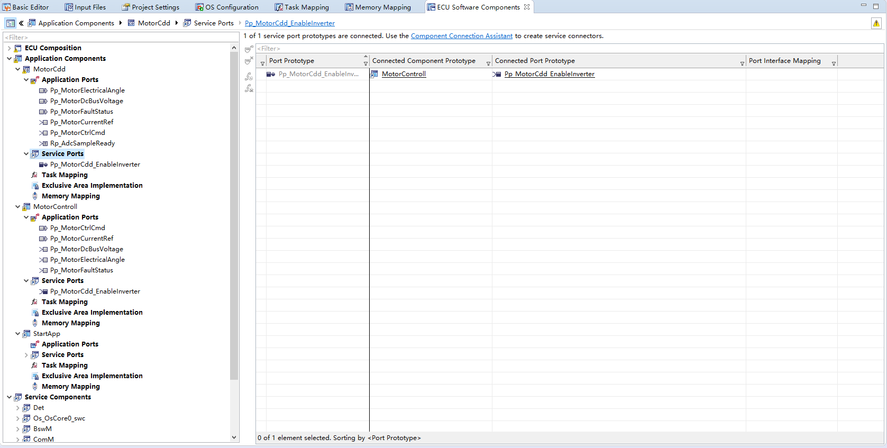
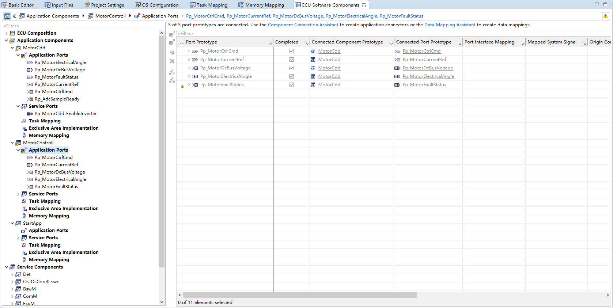
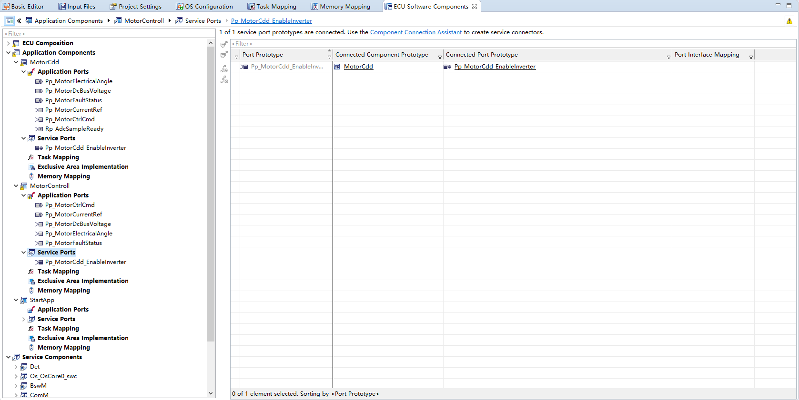
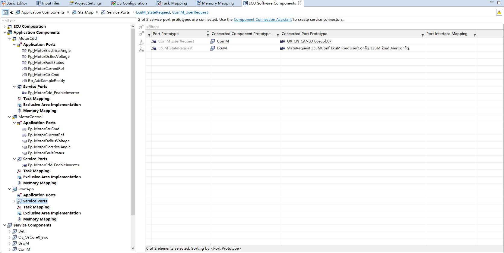
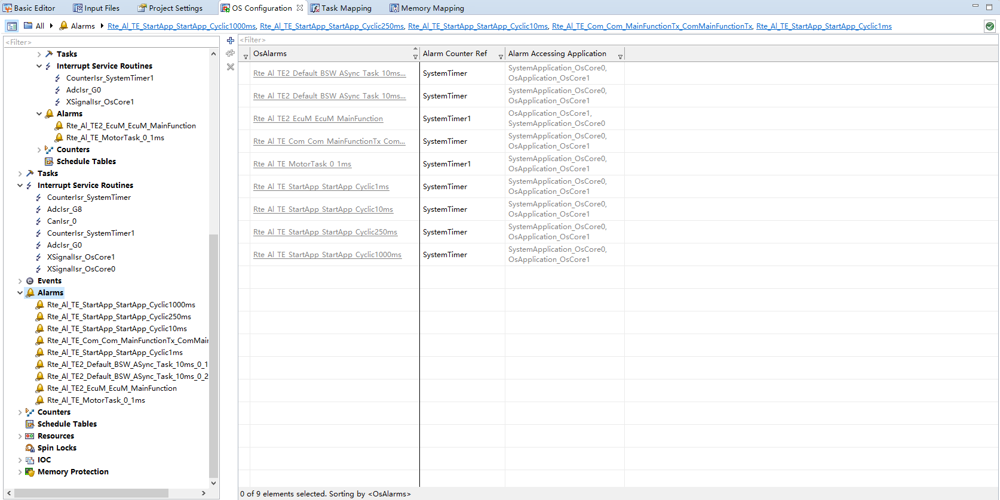

<!--
 * @Author: qinXiong
 * @Date: 2026-08-05 11:35:32
 * @LastEditors: xiong&&2307975018@qq.com
 * @LastEditTime: 2026-08-05 16:58:51
 * @Description: 
-->
# DaVinci 配置：Rte 模块（应用 SW-C 映射）

> 工程：`last364.dpa`（AURIX TC364 + Vector MICROSAR 4.2.2 + Infineon MCAL 20.10.0）
> 模块类型：RTE（运行环境）
> DaVinci 路径：`Rte`（SW-C 映射见 DaVinci Developer / Rte 编辑器）
> 配置源文件：`Config/ECUC/last364_Rte_Rte_ecuc.arxml`、`Config/ApplicationComponents`、`Config/InternalBehavior`
> 从属：[返回模块索引](README.md) · [模块参数总指南](../DaVinci_Motor_Config_Guide%20copy.md) · [RTE 专题文档](../DaVinci_RTE_Guide.md) · [EcuM RUN 请求文档](../DaVinci_EcuM_RequestRUN_RTE_Guide.md)

---

## 1. 模块作用

Rte 把应用 SW-C（StartApp / MotorControll / MotorCdd）与 RTE 事件、端口数据连接起来，并生成 `Rte_*.c/h`。本工程约定：

- **10 kHz 快速环不直接经 RTE**，而是挂在 ADC 中断里，读 `MotorCdd_CmdMirror`（volatile 镜像，由 1 ms 任务写入），避免 RTE 开销与锁问题；
- RTE 只承载 1 ms 慢环（MotorControll ↔ MotorCdd 数据镜像）与 Core0 周期任务。

---

## 2. 配置步骤

### 2.1 SW-C 与运行实体

| SW-C | 核 | 运行实体（Runnable） | 触发 |
| --- | --- | --- | --- |
| `StartApp` | Core0 | `StartApp_Cyclic1ms/10ms/250ms/1000ms`、`StartApp_Init` | RTE TimingEvent（1/10/250/1000 ms） |
| `MotorControll` | Core1 | `MotorControll_Init`、`MotorControll_MainFunction` | `Rte_Ev_Cyclic_MotorTask_0_1ms`（1 ms） |
| `MotorCdd` | Core1 | `MotorCdd_Init`、`MotorCdd_MainFunction`、`AdcSampleReady`、`Pp_MotorCdd_EnableInverter_EnableInverter` | 1 ms 事件 / ADC 事件 / 服务调用 |

📷 图片位 R1：Rte 中 SW-C 与 Runnable 列表截图。
MotorCdd

MotorControll

StartAPP

### 2.2 关键 RTE 数据

| 数据 | 方向 | 说明 |
| --- | --- | --- |
| `Pp_MotorCtrlCmd_MotorMode` | MotorControll → MotorCdd | 模式（IDLE/OPEN_LOOP/CALIBRATION/CLOSED_LOOP…） |
| `Pp_MotorCurrentRef_Id_Ref / Iq_Ref` | MotorControll → MotorCdd | Id/Iq 电流参考 |
| `Pp_MotorElectricalAngle_ElectricAngle` | MotorCdd → MotorControll | 电角度反馈 |
| `Pp_MotorCdd_EnableInverter_EnableInverter` | 服务端 | 逆变器使能门控（依赖 ADC offset ready） |

📷 图片位 R2：端口/数据映射截图。

MotorCdd：
Application Ports

Service Ports

MotorControll：
Application Ports

Service Ports

StartApp
Service Ports

### 2.3 事件与报警

- 1 ms 事件 `Rte_Ev_Cyclic_MotorTask_0_1ms` ↔ 报警 `Rte_Al_TE_MotorTask_0_1ms`（SystemTimer1，Core1）；
- Core0 周期事件 `Rte_Ev_Cyclic_StartApp_*` ↔ `Rte_Al_TE_*`（SystemTimer，Core0）。

📷 图片位 R3：RTE 事件/报警对应截图。

---

## 3. 与其它模块的引用关系

| 引用 | 方向 | 说明 |
| --- | --- | --- |
| 事件/报警 | Rte ↔ Os | `Rte_Al_*` ↔ `Rte_Ev_*` ↔ Task 一一对应 |
| MainFunction | Rte ↔ BSW | EcuM/Com 等主函数挂到 Os 任务 |
| 数据镜像 | Rte ↔ 应用 | `MotorCdd_CmdMirror` 由 1 ms 任务写、快速环读 |

---

## 4. 注意事项

- `Os` 与 `Rte` 相互引用（事件/报警），需成对生成；只生成其中一个会导致报警/事件对不上。
- 快速环不要新增 RTE 调用（每拍 10 kHz 会有开销和锁风险），数据走 volatile 镜像。
- 生成产物：`Appl/GenData/Rte_*.c/h`、`Rte_Needs.ecuc.arxml`。
- 修改 SW-C 端口后重新生成，若通知名/事件名拼写不一致，Validate 会报错。

---

## 5. 截图清单（用户自插）

| 图片位 | 建议文件名 | 截图内容 |
| --- | --- | --- |
| R1 | `19_rte_mapping.png` | SW-C 与 Runnable |
| R2 | `19_rte_data.png` | 端口数据映射 |
| R3 | `19_rte_events.png` | 事件/报警 |

## 6. 相关文档

- [DaVinci_Os.md](DaVinci_Os.md)（事件/报警/任务）
- [DaVinci_RTE_Guide.md](../DaVinci_RTE_Guide.md)
- [DaVinci_EcuM_RequestRUN_RTE_Guide.md](../DaVinci_EcuM_RequestRUN_RTE_Guide.md)
- [DaVinci_Motor_Config_Guide copy.md 第 15 节](../DaVinci_Motor_Config_Guide%20copy.md)
