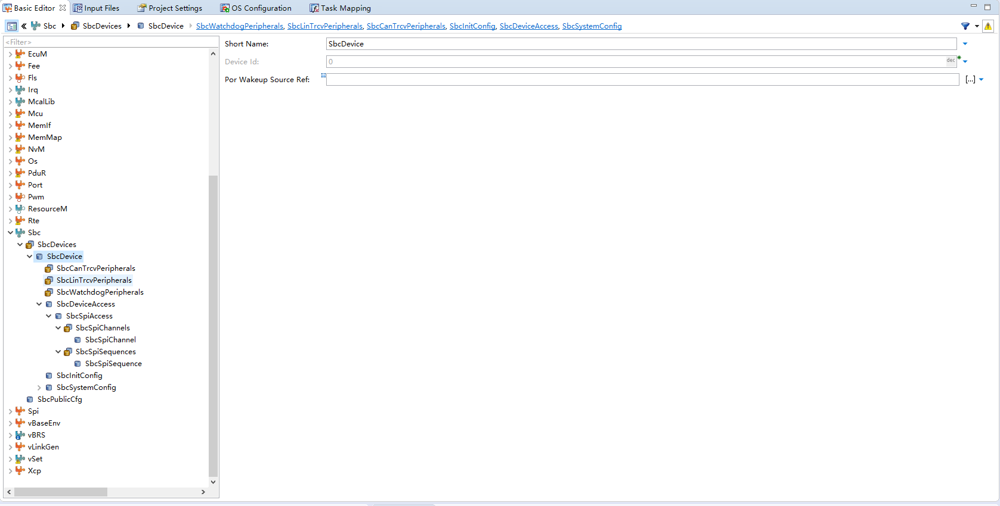
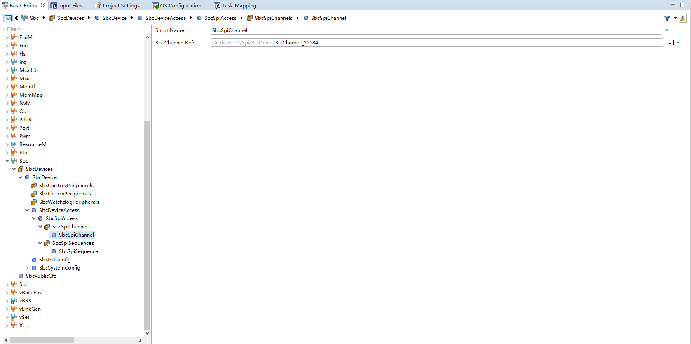
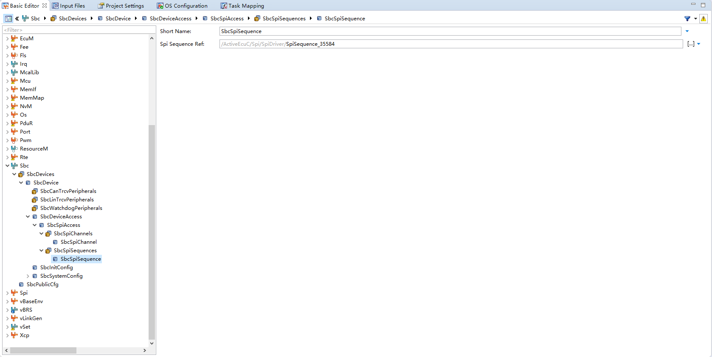

<!--
 * @Author: qinXiong
 * @Date: 2026-08-05 11:35:29
 * @LastEditors: xiong&&2307975018@qq.com
 * @LastEditTime: 2026-08-05 16:38:09
 * @Description: 
-->
# DaVinci 配置：Sbc 模块（TLF35584）

> 工程：`last364.dpa`（AURIX TC364 + Vector MICROSAR 4.2.2 + Infineon MCAL 20.10.0）
> 模块类型：BSW（电源管理）
> DaVinci 路径：`Sbc`（`Sbc_30_Tlf35584`）
> 配置源文件：`Config/ECUC/last364_Sbc_30_Tlf35584_*_ecuc.arxml`
> 从属：[返回模块索引](README.md) · [模块参数总指南](../DaVinci_Motor_Config_Guide%20copy.md) · [SBC 修复记录](../Sbc_30_Tlf35584_Fix.md)

---

## 1. 模块作用

Sbc 模块配置 TLF35584 电源管理芯片（QSPI1 通信）：SPI 通道引用、ERR 引脚监控、上电输出。该工程中 SBC 的初始化/配置写入在 `Sbc_30_Tlf35584` 驱动 + `Tle9180` 电源时序里完成，DaVinci 侧只需保证 SPI 通道引用正确。

---

## 2. 配置步骤

### 2.1 打开模块

BSW Editor → 模块树选择 `Sbc`（`Sbc_30_Tlf35584`）。

📷 图片位 S1：模块树选中 `Sbc` 的截图。

### 2.2 参数

| 参数 | 值 |
| --- | --- |
| `SbcSpiChannelRef` | `SpiChannel_35584` |
| `SbcSpiSequenceRef` | `SpiSequence_35584` |
| `SbcErrPinMonitor` | true |
| `SbcErrPinRecoveryTime` | `ERREC_1_MS` |
| 上电输出（`SbcEnableSupplyNormal`） | LDO_Stby、Tracker1/2、LDO_Com、VoltRef 全使能 |

📷 图片位 S2：Sbc 参数（SPI 引用/ERR 监控/上电输出）截图。

---

## 3. 与其它模块的引用关系

| 引用 | 方向 | 说明 |
| --- | --- | --- |
| `SbcSpiChannelRef` | Sbc → Spi | 必须指向 `SpiChannel_35584`（QSPI1） |
| `SbcSpiSequenceRef` | Sbc → Spi | 指向 `SpiSequence_35584` |
| QSPI1 归属 | Sbc ↔ ResourceM | Core0 |
| 生成后补丁 | Sbc ↔ 手工维护 | `_MemMap.h` / `_Compiler_Cfg.h` / `Sbc_30_Tlf35584.c` 的 SBC 兼容补丁（重生成后复查） |

---

## 4. 注意事项

- SBC 模块是“生成后手工补丁”重灾区（历史问题 A7/B4）：
  - `BSW364/_Common/Implementation/_MemMap.h`（SBC_30_TLF35584 段映射）
  - `BSW364/_Common/Implementation/_Compiler_Cfg.h`（SBC memory class）
  - `BSW364/Sbc_30_Tlf35584/Implementation/Sbc_30_Tlf35584.c`（`Spi_DataBufferType`）
- 每次重新生成后必须复查上述补丁，否则报 `#error No MemMap section found` 或语法错误。
- SPI 通道引用改错（例如指向 9183 的通道）会导致 SBC 通信失败、电源时序异常。

---

## 5. 截图清单（用户自插）

| 图片位 | 建议文件名 | 截图内容 |
| --- | --- | --- |
| S1 | `18_sbc_module_tree.png` | 模块树选中 Sbc |
| S2 | `18_sbc_general.png` | Sbc 参数 |
| S3 | `18_sbc_spi_ref.png` | SPI 通道引用 |

## 6. 相关文档

- [DaVinci_Spi.md](DaVinci_Spi.md)（`SpiChannel_35584`）
- [Sbc_30_Tlf35584_Fix.md](../Sbc_30_Tlf35584_Fix.md)
- [DaVinci_Motor_Config_Guide copy.md 第 14 节](../DaVinci_Motor_Config_Guide%20copy.md)
