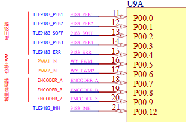

<!--
 * @Author: qinXiong
 * @Date: 2026-07-02 18:49:59
 * @LastEditors: Qxiong&&2307975018@qq.com
 * @LastEditTime: 2026-07-09 15:15:18
 * @Description: 
-->
# tc364电机autosar配置操作

# port 配置
原理图引脚 

# spi 配置
 

 # motor Controll 分层
